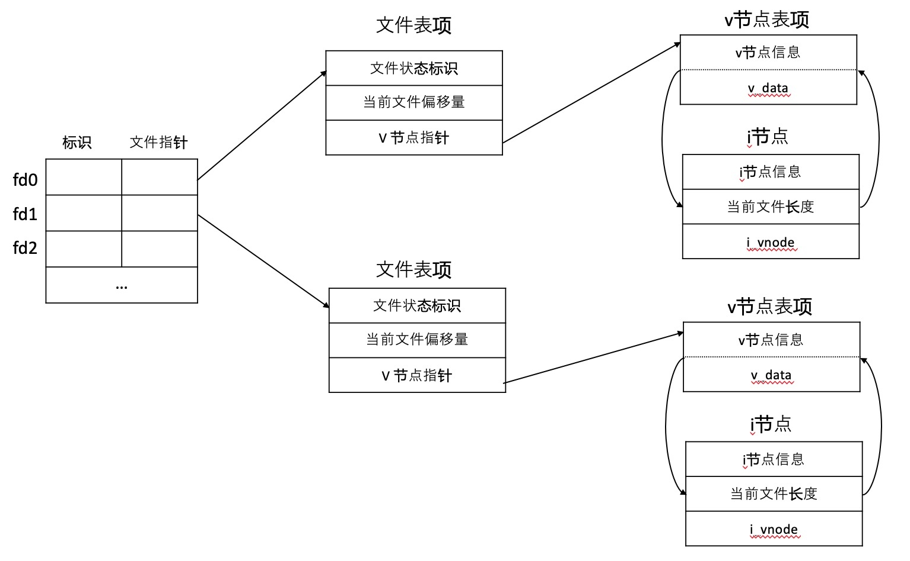
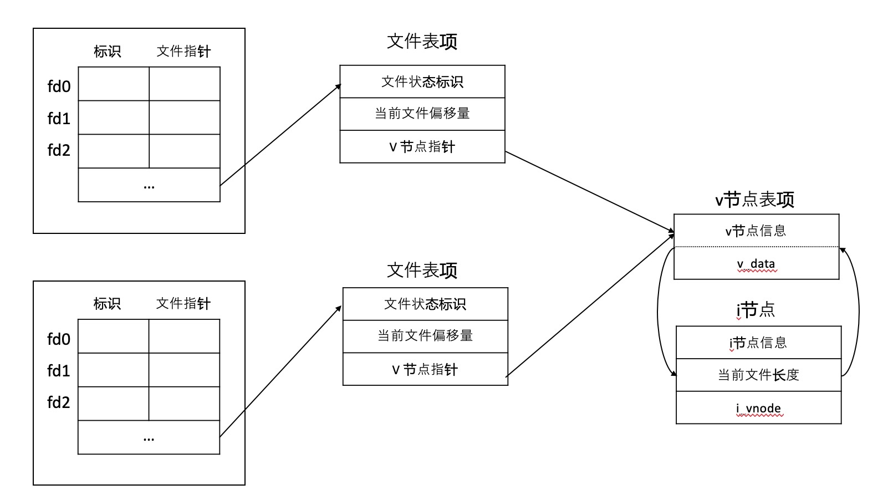
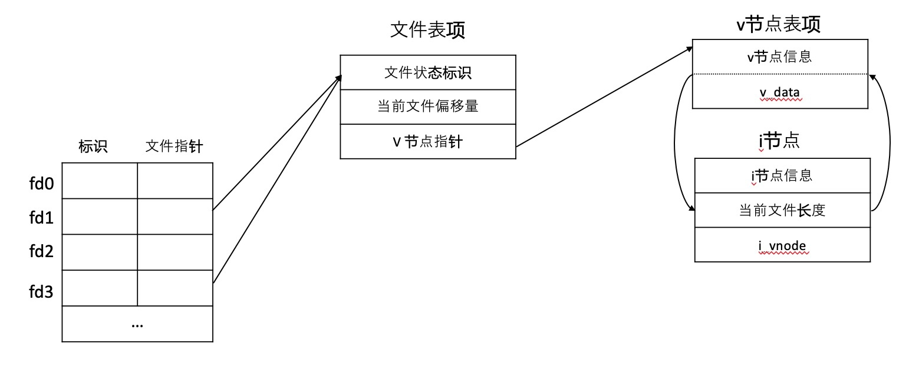

[APUE(01)](https://gaufung.com/post/ji-zhu/apue-01)

# 1 前言
 `Unix` 系统中涉及到大多数文件 `I/O` 只需要涉及到 5 个函数：
- open
- read
- write
- lseek
- close
这些函数都是不带缓冲的 `I/O`，每个 `read` 和 `write` 都调用内核中的一个系统调用。

# 2 文件描述符
对内核而言，所有打开的文件都通过文件描述符引用。在打开现有文件或者创建新的文件，内核向进程返回一个文件描述符。
文件描述符是一个非负整数，按照惯例 `0` 与进程的标准输入关联，`1` 与标准输出关联，`2` 与标准错误关联，这些在 `<unistd.h>` 定义为 `STDIN_FILENO, STDOUT_FILENO, STDERR_FILENO` 。

# 3 `open` 和 `openat` 函数
函数签名
```c
# include <fcntl.h>
int open(const char *path, int oflag, ...);
int openat(int fd, const char *path, int oflag, ... );
```
`path` 为打开或者创建的文件名，`oflag` 设置文件打开或者创建的选项：
- O_RDONLY: 只读打开
- O_WRONLY: 只写打开
- O_RDWR: 学习打开
- O_APPEND: 追加到文件末尾
- ...

这两个函数都返回最小未被使用的文件描述符，`fd` 参数是两个函数的不同，主要区别有三种可能
- `path` 指定参数为绝对路径，`fd` 参数被忽略，`openat` 函数与 `open` 函数相同；
- `path` 为相对路径，`fd` 指出了相对路径在文件系统中的开始位置，`fd` 通过打开相对路径名所在的目录打开；
- `path` 为相对路径名，`fd` 为特殊参数值 `AT_FDCWD`，路径名为当前工作目录。

# 4 `creat` 函数
函数签名
```c
#include <fcntl.h>
int creat(const char *path, mode_t mode);
```
如果成功，返回只写打开的文件描述符，等效于
```c
open(path, O_WRONLY | O_CREAT | O_TRUNC, mode)
```
# 4 `close` 函数
函数签名
```c
# include <unistd.h>
int close(int fd);
```
关闭一个文件并且释放进程在该文件上所有的记录锁。

# 5 `lseek` 函数
每个打开文件都有一个与其关联的*当前文件偏移量*（current file offset），度量从文件开始处计算的字节数，在打开文件的时候，除非指定 `O_APPEND` 选项，否则偏移量都是 `0`。
```c
#include <unistd.h>
off_t lseek(int fd, off_t offset, int whence);
```
-  *whence*  为 `SEEK_SET`： 将文件偏移量移动到 `offset` 位置；
- *whence* 为 `SEEK_CUR`:  将文件偏移量设置当前值加上 `offset`; 
-  *whence* 为 `SEEK_END`: 将文件偏移量设置为文本长度加上 `offset` 

`lseek` 仅仅将当前文件偏移量记录在内核中，不引起任何 `I/O` 操作，仅仅用在下一次读写操作。
# 6 `read` 函数
函数签名
```c
# include <unistd.h>
ssize_t read(int fd, void *buf, size_t nbytes);
```
如果 `read` 成功，则返回读到的字节数；如果到达文件的尾端，返回 `0`;
# 7 `write` 函数
函数签名
```c
# include <unistd.h>
ssize_t write(int fd, const void *buf, size_t nbytes);
```
返回值与参数 `nbytes` 相同，否则表示出错。

# 8 文件共享

内核使用三种数据结构表示打开的文件
-  每个进程表中都有一个记录项，记录项中包含一张打开文件描述表；
    - 文件描述符标志
    -   指向一个文件表项的指针
- 文件表项
    - 文件状态标识（读、写、添写、同步和非阻塞）
    - 当前文件偏移
    - 指向文件 v 节点的指针
- v 节点
    - 文件各种操作函数的指针
    - i 节点
        - 文件所有者
        - 文件长度
        - 磁盘位置指针

如果两个独立进程各自打开了同一文件，进程各自拥有进程表项和文件表项，但是同时指向同一个 `v` 节点表项。

补充说明：
- 每次完成 `write` 操作后，文件表项中当前文件偏移量为增加写入的字节数目；
- 如果使用 `O_APPEND` 标志打开文件，则相应的标志也被设置到文件表项的文件文件状态中，每次写操作，文件偏移量都设置为文件长度；
- 使用 `lseek` 定位到当前文件的尾端，文件偏移量设置为 `i` 节点表项中的文件长度；
- `lseek` 函数值修改文件表项中的当前文件表偏移量，不进行任何 `I/O` 操作。

# 9 `dup` 和 `dup2` 函数
函数原型
```c
#include <unistd.h>
int dup(int fd);
int dup2(int fd, int fd2);
```
这个两个函数都是用来复制现有的文件描述符，`dup` 返回新的文件描述符一定当前可用最小的描述符；而 `dup2` 函数可用 `fd2` 参数指定的描述符，如果 `fd2` 已经打开，则将其关闭，如果 `fd` 等于 `fd2`，则返回 `fd2` 而不关闭它，否则 `fd2` 的 `FD_CLOEXEC` 文件描述符就被清除。

# 10 `sync`, `fsync` 和 `fdatasync` 函数
在写文件的时候，内核通常将数据复制到缓冲区，然后排入队列，晚些时候再写入磁盘，称为延迟写（`delayed write`)。为了保证缓冲区和磁盘文件一致性，`UNIX` 系统提供 `sync`， `fsync` 和 `fdatasync` 函数
```c
# include <unistd.h>
int fsync(int fd);
int fdatasync(int fd);
void sync(void);
```
- `sync` 将所有修改过的缓冲区排入队列就返回，不等待实际完成；
- `fsync` 将文件描述符 `fd` 指定的一个文件起作用，等待磁盘操作结束后才返回；
- `fdatasync` 类似 `fsync`，但是只影响文件数据部分，而文件属性不同步。

# 11 `fcntl` 函数
函数原型
```c
# include <fcntl.h>
int fcntl(int fd, int cmd, ... /* int arg */);
```
`fcntl` 函数可以改变已经打开文件的属性，主要有一下 5 种功能
- 复制一个已有的描述符 （`cmd=F_DUPFD` 或者 `F_DUPFD_CLOEXEC`）
- 获取/设置文件描述符标志（`cmd=F_GETFD` 或者 `F_SETFD`)
- 获取/设置文件状态标志（`cmd=F_GETLFL` 或者 `F_SETFL`)
- 获取/设置异步 `I/O` 所有权 （`cmd=F_GETOWN` 或者 `F_SETOWN`)
- 获取/设置记录锁（`cmd=F_GETLK` 、`F_SETLK` 或者 `F_SETKW`)

# 12 /dev/fd
`/dev/fd` 目录下是 `0, 1, 2` 等文件，打开 `/dev/fn/n` 等效于复制描述符 `n`