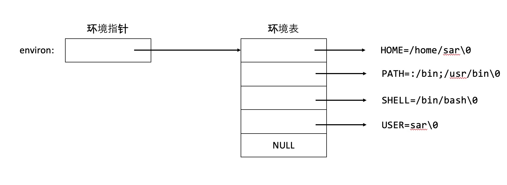
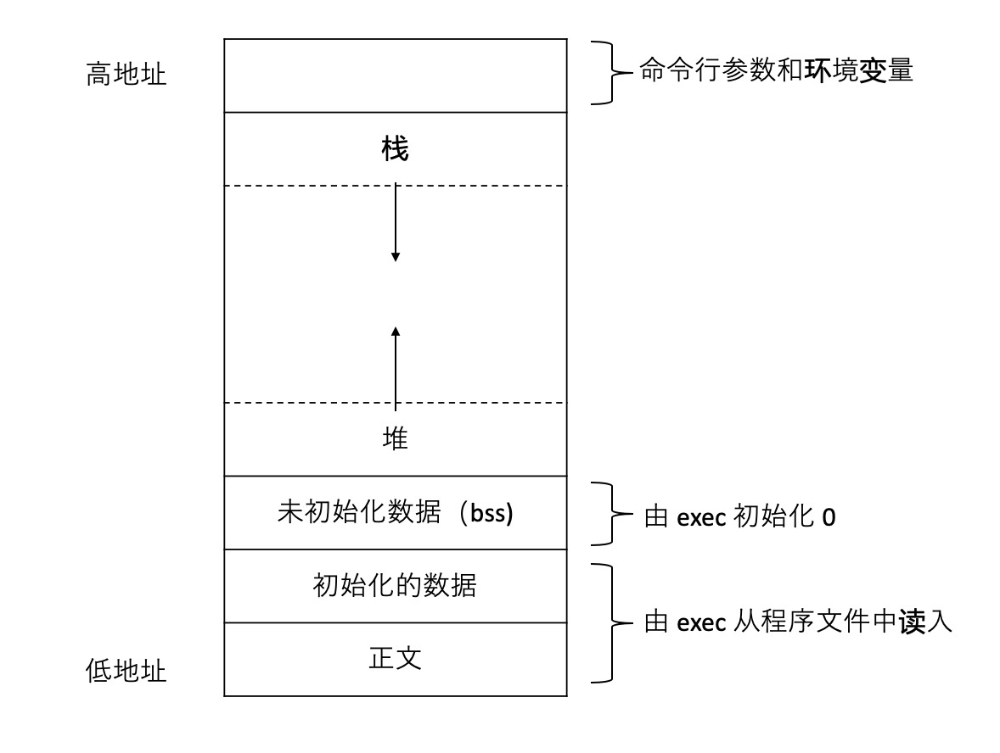

# 1 进程终止
1. 从 `main` 返回
2. 调用 `exit`
3. 调用 `_exit` 或者 `_Exit`
4. 最后一个线程从启动实例返回
5. 最后一个线程调用 `pthread_exit`
异常终止
1. 调用 `abort`
2. 接到一个信号
3. 最后一个线程对取消请求响应

函数原型
```c
# include <stdlib.h>
void exit(int status);
void _exit(int status);
#include <unistd.h>
void _Exit(int status);
```
`_exit` 和 `_Exit` 立即进入内核，而 `exit` 则先进行清理工作，比如标准 `I/O` 库的清理关闭操作。

一个进程可以登记 32 个函数，这些函数由 `exit` 时候自动调用，称为终止处理程序（exit handler)。
```c
# include <stdlib.h>
int atexit(void (*func)(void));
```
函数执行顺序与登记时候相反。

# 2 命令行参数
执行一个程序时候，调用 `exec` 的进程将命令行参数传递给新的应用程序。

# 3 环境表
每个程序都能接受到一张环境表，全局变量 `environ` 包含了该指针数组的地址。
```c
extern char **environ;
```



# 4 存储空间布局
- 正文段。`CPU` 执行代码部分，通常是只读的；
- 初始化数据段，程序中已经初始化的值；
- 未初始化数据段，称为 `bss` ；
- 栈：自动变量和每次函数调用时候需要保存的信息；
- 堆：动态分配存储分配。



# 5 存储空间分配
有三个用于存储空间分配的函数
1. `malloc` 分配指定字节的存储区， 此存储区中的初始值不确定；
2. `calloc` 指定数量长度的对象和分配存储空间，该空间中的每一位bit 初始化为 0；
3. `realloc` 增加和减少之前分配区的长度。

函数原型
```c
# include <stdlib.h>
void *malloc(size_t  size);
void *calloc(size_t nobj, size_t size);
void *realloc(void *ptr, size_t newsize);

void free(void *ptr);
```
这些分配例程都是有系统 `sbrk` 调用完成，虽然 `sbrk` 可以扩大和缩小进程的存储空间，但是 `malloc` 和 `free` 实现都不减少存储空间，而是保持在 `malloc` 池中而不是返回内核。大部分实现锁分配的存储空间比要求的稍大，额外的空间用来记录额外的信息—分配块的长度、指向下一个分配块的指针等。

# 6 `setjmp` 和 `longjmp` 函数
在 `C` 中， `goto` 语句不能跨函数调用，而执行这种类型的跳转函数 `setjmp` 和 `longjump`。
函数原型
```c
# include <setjump.h>
int setjmp(jmp_buf env);
void longjmp(jmp_buf env, int val);
```
`setjmp` 在需要返回的位置，参数 `env` 类型是 `jmp_buf`，数据类型是某种形式的数组，用来保存 `longjmp` 时候恢复栈状态的信息。在需要跳转的地方调用 `longjmp`，第一个参数是 `setjmp` 的参数，第二个参数是非 0 的值，该值是 `setjmp` 函数的返回值。

# 7 `getrlimit` 和 `setrlimit` 函数
每个进程都有一组资源限制，其中一些可以用 `getrlimit` 和 `setrlimit` 函数查询和更改
```c
# include <sys/resource.h>
int getrlimit(int resource,  struct rlimit *rlptr);
int setlimti(int resource, const struct rlimit *rrlptr);
struct rlimit {
    rlim_t rlim_cur; // soft limit: current limit
    rlim_t rlim_max; // hard limit: maximum value for rlim_cur
}
```
在更改资源限制的时候，须遵循下面 3 个限制
- 任何一个进程都可以将其软限制修改为小于或者等于硬限制
- 任何进程都可以降低其硬限制，但是必须大于或者等于软限制
- 只有超级用户可以提高硬限制；

对于 `resource` 主要有一下
- RLIMIT_AS 进程可用存储空间最大值
- RLIMIT_CORE core 文件的最大字节数
- RLIMIT_CPU CPU时间最大值
- RLIMIT_DATA 数据段的最大字节数
- RLIMIT_FSIZE 创建文件的最大直接输
- RLIMIT_MEMELOCK 进程使用 `mlock` 锁定的最大存储空间字节数
- RLIMIT_MSGQUEUE 消息队列中最大存储字节数
- RLIMIT_NICE 进程调度的优先级
- RLIMIT_NOFILE 进程打开最多的文件数
- RLIMIT_NPROC 用户ID 拥有的最大的子进程数
- RLIMIT_NPTS 用户打开的伪终端的数量
- RLIMIT_RSS  最大贮存内存的字节长度
- RLIMT_SBSIZE 套字节缓冲区最大字节数
- RLIMIT_SIGPENDING 进程排队信号最大值
- RLIMIT_STACK 栈最大字节
- RLIMIT_SWAP 交换空间最大字节数
- RLIMIT_VMEM 同 RLIMIT_AS


