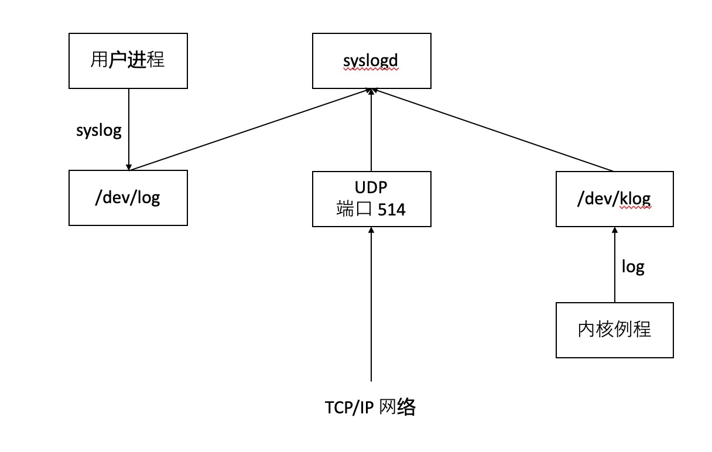

# 1 守护进程特征
使用 `ps -axj` 显示所有进程
```shell
USER               PID  PPID  PGID   SESS JOBC STAT   TT       TIME COMMAND
root                 1     0     1      0    0 Ss     ??   69:07.76 /sbin/launchd
root                46     1    46      0    0 Ss     ??    3:36.34 /usr/sbin/syslogd
root                47     1    47      0    0 Ss     ??    0:46.01 /usr/libexec/UserEventAgent (System)
root                50     1    50      0    0 Ss     ??    0:49.47 /System/Library/PrivateFrameworks/Uninstall.framework/Resources/uninstal
```
父进程为 `0` 的进程都是内核进程， `init` （或者 `launchd`) 除外。内核守护进程出现在方括号中，而且守护进程的终端都是 `?`，表明以无控制终端的方式启动。
- `rpcbind` 守护进程提供远程调用程序号映射为网络端口号。
- `rsyslogd` 守护进程可以有管理员启动将系统的消息记录到日志的任何程序使用
- `inetd` 侦听网络接口
- `nfsd, nfsiod, lockd, rpciod, rpc.idmapd, rpc.statd` 提供网络文件系统。
- `cron` 守护进程在定期安排的日期和时间执行命令

# 2 创建守护进程的规则
1. 调用 `umask` 将文件模式创建屏蔽字设置为一个已知值。
2. 调用 `fork` 然后使父进程 `exit`.
3. 调用 `setsid` 创建新的会话。
4. 将当前的工作目录修改为根目录。
5. 关闭不在需要的文件描述符
6. 某些守护进程打开 `/dev/null` 使其文件描述符为 `0, 1, 2`。

# 3 出错记录


- 内核例程可以调用 `log` 函数。
- 大多数用户进程（守护进程）调用 `syslog` 函数来产生日志消息，这类消息被发送至 `UNIX` 域数据报套字节 `/dev/log` 中。
- 无论一个用户进程在此主机还是通过 `TCP/IP` 网络连接到此主机的其他主机上，都可以将消息发送个 `UDP` 端口 514。

`syslogd` 守护进程读取 `/etc/syslog.conf` 文件，决定不同种类的消息应要发送到何处，函数接口如下：
```c
# include <syslog.h>
void openlog(const char *ident, int option, int facility);
void syslog(int priority, const char* format...);
void closelog(void);
int setlogmask(int maskpri);
```
直接调用 `syslog` 即可，其中 `priority` 是 `facility` 和 `level` 的组合。

# 4 守护进程惯例
- 若守护进程使用锁文件，则该文件通常存储在 `/var/run` 目录中，通常锁文件的名称为 `name.pid`。
- 若守护进程支持配置文件，那么配置文件通常放在 `/etc` 目录中，而且名称 `name.conf`。
- 守护进程可以用命令行启动，通常为初始化脚本为 `/etc/rc*` 或者 `/etc/init.d/*`
- 如果守护进程有一个配置文件，只在启动的时候查看，之后将不会再读取。