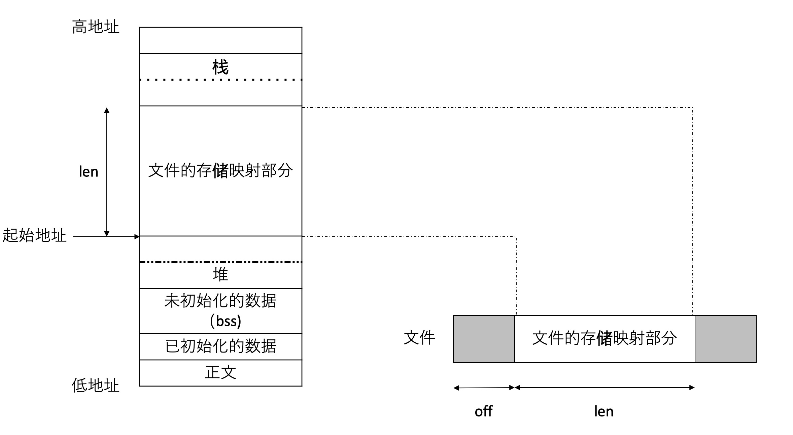

# 1 非阻塞 `I/O`
进程可能永远阻塞的**低速**系统调用
- 某些文件类型的数据并不存在，读操作可能导致会使使用者永远阻塞；
- 数据不能被相同类型的文件类型立即接受，写操作可能被调用者永远阻塞；
- 在某种条件发生之前打开某些文件类型发生阻塞；
- 对已经加上强制性锁的文件进行读写；
- 某些 `ioctl` 操作；
- 某些进程间通信函数。

非阻塞的 `i/o` 可以发出非阻塞的 `open`, `read` 和 `write` 这样 `I/O` 操作。
- 使用使用 `open` 获得文件描述符，可以指定 `O_NOBLOCK` 标志；
- 对于已经打开的标识符，使用 `fcntl` 函数打开。

# 2 记录锁
记录锁（`record locking`）功能是：当第一个进程正在读或者修改文件的某个部分时，使用记录锁可能阻止其他进程修改同一个文件区。
```c
# include <fcntl.h>
int fcntl(int fd, int cmd, .../* struct flock *flockptf */);
```
`cmd` 可以是 `F_GETLK`, `F_SETLK` 和 `F_SETLKW`, 第三个参数是指向 `flock` 结构的指针
```c
struct flock {
  short l_type;
  short l_whence;
  off_t l_start;
  off_t l_len;
  pid_t l_pid;  
};
```
- `l_type` 所希望的锁类型；
- `l_start` 要加锁的或者解锁的起始字节偏移量；
- `l_len` 区域的字节长度；
- `l_pid` 持有锁能阻塞当前的进程。

上述的锁类型可以分为：共享读锁和独占性写锁。如果进程对一个文件区间已经有一把锁，那么后来进程又企图在同一文件区间再加一把锁，那么新的锁将替换已有的锁。
记录锁自动继承和释放的 3 条规则
1. 锁与进程和文件两者关联，当一个进程终止的时，它所建立的锁全部释放；无论一个描述符何时关闭，该进程通过这一个描述符所引用的文件上的任何一把锁都会释放；
2. 由 `fork` 产生的子进程都不继承父进程所设置的锁；
3. 执行 `exec` 后，新程序可以继承原执行程序的锁，但是注意如果对一个文件描述符执行关闭标志，则释放相应的文件的所有锁。

**建议锁**和**强制性锁**
建议锁并不能阻止对数据库文件有写权限的其他进程写这个数据库文件，强制性锁会让内核检查每个 `open`, `read` 和 `write` ，验证调用进程是否违背正在访问的文件上加一把锁。

# 3 `I/O` 多路转接
非阻塞 `I/O` 设计方法
1. 采用轮询方式，依次读取各个文件描述符，判断是否满足读写条件。
2. 异步 `I/O`，进程告知内核当描述符准备好之后可以进行 `I/O`，用一个信号通知。
3. `I/O` 多路转接(`I/O multiplexing`)，构造感兴趣的描述符列表，然后调用一个函数直到一个函数描述符准备好。

## 3.1 `select` 和  `pselect` 函数
```c
# include <sys/select.h>
int select(int maxfdp1, fd_set *restrict readfds, fd_set *restrict writefds, fd_set *restrict exceptfds, struct timeval *restrict tvptr);
```
参数
- 我们所关心的描述符；
- 对于每个描述我们所关心的条件；
- 原因等待的时间；
返回
- 已经准备好的描述符总数量
- 对于读、写或者异常这 3 个条件每一个哪一个已经准备好。

最后一个参数表明愿意等待的时间
1. `tvptr == NULL`：永远等待；
2. `tvptr->tv_sec == 0 && tvptr->tv_uses == 0` 立即返回，类似单个轮询；
3. `ptptr->tv_sec != 0 || tvptr->tv_usec != 0` 等待指定的秒数和微纳秒

`select` 可能有 3 个返回值
1. `-1` 表示出错
2. `0` 表示描述符没有准备好；
3. 正返回值说明已经已经准备好描述符，该值是 3 个描述符中准备好的描述符之和。

`pselect` 其中的一个变体。

## 3.1 `poll` 函数
```c
# include <poll.h>
int poll(struct pollfd fdarray[], nfds_t nfds, int timeout);
struct pollfd {
  int fd;
  short events;
  short revent;  
};
```
每个数组元素的 `event` 成员告诉这些内核我们关心每个描述符哪些事件，返回时， `revents` 成员由内核设置，用于说明每个描述符发生了那些事情。

# 4 异步 `I/O`
使用一个信号通知进程，对某个描述符所关心的某个事件已经发生，使用 `AIO` 控制块描述 `I/O` 操作
```c
struct aiocb {
    int aio_fileds;
    off_t aio_offset;
    volatile void *aio_buf;
    size_t aio_nbytes;
    int aio_reqrio;
    struct sigevent aio_sigevent;
    int aio_lio_opcode;
};
```
- `aio_fileds`: 用来读写的文件描述符；
- `aio_offset`: 指定文件开始偏移量；
- `aio_buf`: 指定的开始位置；
- `aio_nbytes`: 包含了要读和写的字节数；

在 `I/O` 事件完成后，通过 `sigevent` 结构来通知应用程序
```c
struct {
    int sigev_notify;
    int sigev_signo;
    union sigval sigev_value;
    void (*sigev_notify_function)(union_sigval);
    phread_attr_t *sigenv_notify_attributes;
};
```
- `signo_notify` 通知类型
    - `SIGEV_NONE`: 不通知进程
    - `SIGEV_SIGNAL`: 异步 `I/O` 请求完成后，产生指定的信号
    - `SIGEV_THREAD`: 异步 `I/O` 请求完成时，调用 `sigev_notify_function` 字段指定的函数被执行。

```c
# include <aio.h>
int aio_read(struct aiocb *aiocb);
int aio_write(struct aiocb *aiocb);
```
这些函数返回时，异步 `I/O` 请求都被操作系统放入处理等待队列中了。

# 5 `readv` 和 `writev` 函数
在一次函数中调用读和写过个非连续缓冲区
```c
#include <sys/uio.h>
ssize_t readv(int fd, const struct iovec *lov, int lovcnt);
ssize_t write(int fd, const struct iovec *lov, int lovcnt);
struct iovec {
    void *iov_base;
    size_t iov_len;
}
```

# 6 存储映射 `I/O`
将一个磁盘文件映射到存储空间上的一个缓冲区，不在 `read` 和 `write` 的情况下进行 `I/O`
```c
# include <sys/mman.h>
void *mmap(void *addr, size_t len ,int port, int flag, int fd, off_t off);
```
- `addr` 参数用于指定存储区的起始位置；
- `fd` 用于指定被映射文件的描述符；
- `prot` 指定映射区的保护要求
    - `PROT_READ` 可读
    - `PROT_WRITE`: 可写
    - `PROT_EXEC`可执行
    - `PROT_NONE` 不可访问
- `flag` 指定属性
- `off` 指定磁盘文件的偏移量




