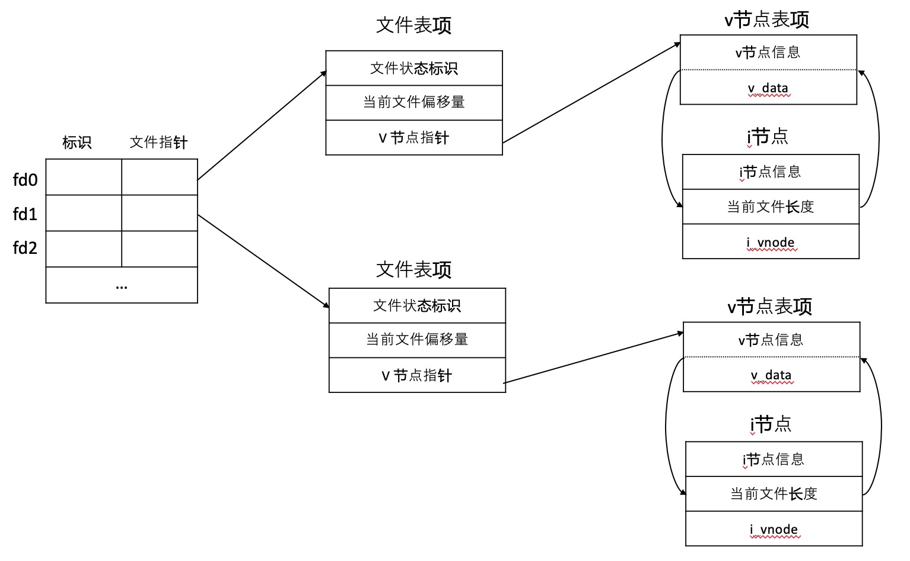
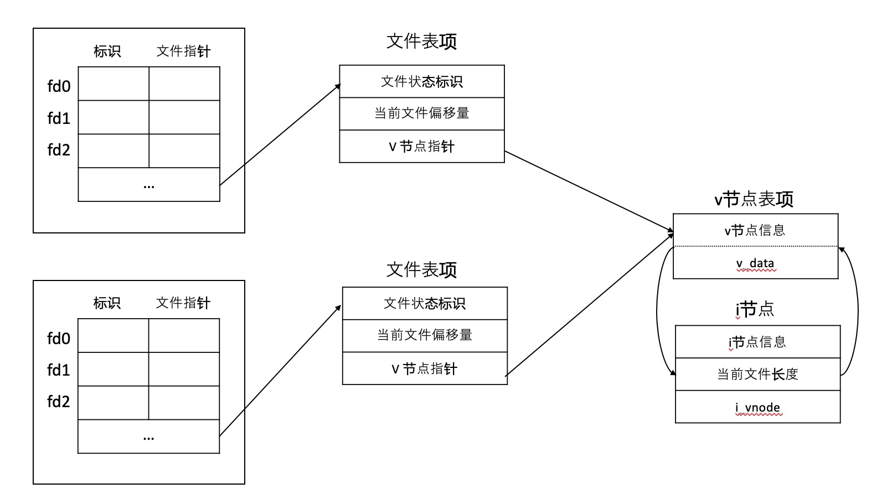
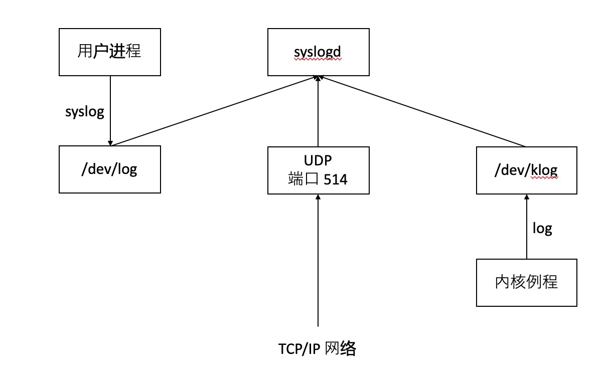

# 1 前言

[UNIX环境高级编程](https://book.douban.com/subject/25900403/)是一本久负盛名的书籍，本博客系列将会重点学习本书并附上学习笔记。为了尝试书中的代码，在 `MacOS` 操作系统如下操作：
- [下载页面](http://www.apuebook.com/code3e.html)
- 解压 `src.3e.tar.gz`
- `cp ./include/apue.h /Library/Developer/CommandLineTools/usr/include`
- `cp ./lib/error.c /Library/Developer/CommandLineTools/usr/include`
- 修改 `apue.h` 文件，在 `#endif` 之前插入 `#include "error.c"`

# 2 基础知识

## 2.1 体系结构


内核处于环境的核心，管理整个计算机的硬件资源；内核的接口称为系统调用，公用函数库构建在系统调用之上，应用程序既可以使用系统调用，也可以使用公用函数库。

## 2.2 登录
`cat /etc/passwd` 中查看用户登录
```
root:*:0:0:System Administrator:/var/root:/bin/sh
```
登录口令由 7 个冒号隔开的字段组成，依次为
- 用户名
- 加密口令
- 用户 ID
- 用户组 ID
- 注释
- 起始目录
- shell 程序

## 2.3 工作目录

每一个进程都有一个工作目录（working directory)，有时称为当前工作目录（ current working directory)。

## 2.4 输入和输出

*文件描述符* 是一个非负整数，内核用以标识一个特定进程正在访问的文件。
每一个 `shell` 都会打开三个文件描述符，即 *标准输入*， *标准输出*和*标准错误*。如果不指定，这三个都指向终端。

## 2.5 进程

- 程序（`program`) 存储在磁盘上可执行的文件，内核使用 `exec` 函数执行；
- 进程（`process`) 程序执行的实体称为进程；
- 进程控制三个主要函数 `fork`，`exec` 和 `waitpid`
    - `fork` 对于父进程返回子进程的 `ID`，对子进程返回 `0`;
    - `waitpid` 父进程等待子进程结束；

## 2.6 出错处理
每个线程都有属于自己的局部 `errno`，以避免一个线程干扰另一个线程，注意两条规则：
- 如果没有出错，其值不会被例程清除，只有在返回值出错才会验证；
- 任何函数都不会将 `errno` 设置为 `0`。

## 2.7 用户标识
- 用户 `ID` 在登录口令中给出，它想系统标识各个不同的用户；其中用户 ID 为 `0` 的用户为根用户(`root`) 或者超级用户 (`superuser`)
- 组 `ID` 也在登录口令中给出。

用户 `ID` 和 组 `ID` 是 `4` 个字节组成，每个使用双字节整型数组保存。

## 2.8 信号
信号用于通知进程发生了某种情况。通常有三种方式处理
1. 忽略信号；
2. 按照系统默认方式处理；
3. 提供了一个函数，信号发生的时候调用该函数。

## 2.9 时间值
*日历时间* 为自协调世界时（`Coordinated Universal Time, UTC`) 1970 年 1 月 1 日 00:00:00 这个时间以来经历的秒数累计值；
*进程时间* 用以度量使用的中央处理器资源，度量进程执行时间包含如下
- 时钟时间：程序运行总时间，与系统中同时运行的进程数有关；
- 用户时间：执行用户指令的时间值；
- 系统 CPU 时间：执行内核程序的时间值。

# 3 文件I/O

## 3.1 前言
 `Unix` 系统中涉及到大多数文件 `I/O` 只需要涉及到 5 个函数：
- open
- read
- write
- lseek
- close

这些函数都是不带缓冲的 `I/O`，每个 `read` 和 `write` 都调用内核中的一个系统调用。

## 3.2 文件描述符
对内核而言，所有打开的文件都通过文件描述符引用。在打开现有文件或者创建新的文件，内核向进程返回一个文件描述符。
文件描述符是一个非负整数，按照惯例 `0` 与进程的标准输入关联，`1` 与标准输出关联，`2` 与标准错误关联，这些在 `<unistd.h>` 定义为 `STDIN_FILENO, STDOUT_FILENO, STDERR_FILENO` 。

## 3.3 `open` 和 `openat` 函数
函数签名
```c
# include <fcntl.h>
int open(const char *path, int oflag, ...);
int openat(int fd, const char *path, int oflag, ... );
```
`path` 为打开或者创建的文件名，`oflag` 设置文件打开或者创建的选项：
- O_RDONLY: 只读打开
- O_WRONLY: 只写打开
- O_RDWR: 读写打开
- O_APPEND: 追加到文件末尾
- ...

这两个函数都返回最小未被使用的文件描述符，`fd` 参数是两个函数的不同，主要区别有三种可能
- `path` 指定参数为绝对路径，`fd` 参数被忽略，`openat` 函数与 `open` 函数相同；
- `path` 为相对路径，`fd` 指出了相对路径在文件系统中的开始位置，`fd` 通过打开相对路径名所在的目录打开；
- `path` 为相对路径名，`fd` 为特殊参数值 `AT_FDCWD`，路径名为当前工作目录。

## 3.4 `creat` 函数
函数签名
```c
#include <fcntl.h>
int creat(const char *path, mode_t mode);
```
如果成功，返回只写打开的文件描述符，等效于
```c
open(path, O_WRONLY | O_CREAT | O_TRUNC, mode)
```
## 3.5 `close` 函数
函数签名
```c
# include <unistd.h>
int close(int fd);
```
关闭一个文件并且释放进程在该文件上所有的记录锁。

## 3.6 `lseek` 函数
每个打开文件都有一个与其关联的*当前文件偏移量*（current file offset），度量从文件开始处计算的字节数，在打开文件的时候，除非指定 `O_APPEND` 选项，否则偏移量都是 `0`。
```c
#include <unistd.h>
off_t lseek(int fd, off_t offset, int whence);
```
-  *whence*  为 `SEEK_SET`： 将文件偏移量移动到 `offset` 位置；
- *whence* 为 `SEEK_CUR`:  将文件偏移量设置当前值加上 `offset`; 
-  *whence* 为 `SEEK_END`: 将文件偏移量设置为文本长度加上 `offset` 

`lseek` 仅仅将当前文件偏移量记录在内核中，不引起任何 `I/O` 操作，仅仅用在下一次读写操作。
## 3.7 `read` 函数
函数签名
```c
# include <unistd.h>
ssize_t read(int fd, void *buf, size_t nbytes);
```
如果 `read` 成功，则返回读到的字节数；如果到达文件的尾端，返回 `0`;
## 3.8 `write` 函数
函数签名
```c
# include <unistd.h>
ssize_t write(int fd, const void *buf, size_t nbytes);
```
返回值与参数 `nbytes` 相同，否则表示出错。

## 3.9 文件共享

内核使用三种数据结构表示打开的文件
-  每个进程表中都有一个记录项，记录项中包含一张打开文件描述表；
    - 文件描述符标志
    -   指向一个文件表项的指针
- 文件表项
    - 文件状态标识（读、写、添写、同步和非阻塞）
    - 当前文件偏移
    - 指向文件 v 节点的指针
- v 节点
    - 文件各种操作函数的指针
    - i 节点
        - 文件所有者
        - 文件长度
        - 磁盘位置指针

如果两个独立进程各自打开了同一文件，进程各自拥有进程表项和文件表项，但是同时指向同一个 `v` 节点表项。

补充说明：
- 每次完成 `write` 操作后，文件表项中当前文件偏移量为增加写入的字节数目；
- 如果使用 `O_APPEND` 标志打开文件，则相应的标志也被设置到文件表项的文件文件状态中，每次写操作，文件偏移量都设置为文件长度；
- 使用 `lseek` 定位到当前文件的尾端，文件偏移量设置为 `i` 节点表项中的文件长度；
- `lseek` 函数值修改文件表项中的当前文件表偏移量，不进行任何 `I/O` 操作。

## 3.10 `dup` 和 `dup2` 函数
函数原型
```c
#include <unistd.h>
int dup(int fd);
int dup2(int fd, int fd2);
```
这个两个函数都是用来复制现有的文件描述符，`dup` 返回新的文件描述符一定当前可用最小的描述符；而 `dup2` 函数可用 `fd2` 参数指定的描述符，如果 `fd2` 已经打开，则将其关闭，如果 `fd` 等于 `fd2`，则返回 `fd2` 而不关闭它，否则 `fd2` 的 `FD_CLOEXEC` 文件描述符就被清除。

## 3.11 `sync`, `fsync` 和 `fdatasync` 函数
在写文件的时候，内核通常将数据复制到缓冲区，然后排入队列，晚些时候再写入磁盘，称为延迟写（`delayed write`)。为了保证缓冲区和磁盘文件一致性，`UNIX` 系统提供 `sync`， `fsync` 和 `fdatasync` 函数
```c
# include <unistd.h>
int fsync(int fd);
int fdatasync(int fd);
void sync(void);
```
- `sync` 将所有修改过的缓冲区排入队列就返回，不等待实际完成；
- `fsync` 将文件描述符 `fd` 指定的一个文件起作用，等待磁盘操作结束后才返回；
- `fdatasync` 类似 `fsync`，但是只影响文件数据部分，而文件属性不同步。

## 3.12 `fcntl` 函数
函数原型
```c
# include <fcntl.h>
int fcntl(int fd, int cmd, ... /* int arg */);
```
`fcntl` 函数可以改变已经打开文件的属性，主要有一下 5 种功能
- 复制一个已有的描述符 （`cmd=F_DUPFD` 或者 `F_DUPFD_CLOEXEC`）
- 获取/设置文件描述符标志（`cmd=F_GETFD` 或者 `F_SETFD`)
- 获取/设置文件状态标志（`cmd=F_GETLFL` 或者 `F_SETFL`)
- 获取/设置异步 `I/O` 所有权 （`cmd=F_GETOWN` 或者 `F_SETOWN`)
- 获取/设置记录锁（`cmd=F_GETLK` 、`F_SETLK` 或者 `F_SETKW`)

## 3.13 /dev/fd
`/dev/fd` 目录下是 `0, 1, 2` 等文件，打开 `/dev/fn/n` 等效于复制描述符 `n`


# 4 文件和目录

## 4.1 `stat、fstat、fstatat` 和 `lstat` 函数
函数原型 
```c
# include <sys/stat.h>
int stat(const char *restrict pathname, sturct stat *restrict buf);
int fstat(int fd, struct stat *buf);
int lstat(const char *restrict pathname, struct stat *restrict buf);
int fstatat(int fd, const char *restrict pathname, struct stat *restrict buf, int flag);
```
- stat 返回此命名文件的信息结构
- fstat 返回文件描述符 `fd` 上打开的文件有关信息
- lstat 返回链接文件的信息，而不是该符号链接的文件的信息
- fstatat 返回当前打开的目录（有 `fd` 指向） 的路径名文件统计信息

文件信息结构 
```c
struct stat{
  mode_t st_mode; /*file type & mode (permission) */  
  ino_t st_ino;  /*i-node number (serial number)*/
  dev_t st_dev; /*device number (file system)*/
  dev_t st_rdev; /*device number for special files*/
  nlink_t st_nlink; /*number of links*/
  uid_t st_uid; /*user ID of the owner*/
  gid_t st_gid; /*group ID of the owner*/
  off_t st_size; /*sieze in bytes,  for regular files */
  struct timespec st_atime; /*time of last access */
  struct timespec st_mtime; /* time of last modification */
  struct timespec st_ctime; /* time of last file status change */
  blksize_t st_blksize; /*best I/O block size */
  blkcnt_t st_blocks; /*number of disk blocks allocated */
};
```

## 4.2 文件类型
1. 普通文件 (`regualr file`)
2. 目录文件（`directory file`)
3. 块特殊文件（`block special file`) 提供对设备带缓冲的访问;
4. 字符特殊文件（`character special file`)提供设备不带缓冲的访问；
5. `FIFO` 用于进程之间之间的通信，又称为命令管道；
6. 套接字（`socket`) 用于进程之间网络通信；
7. 符号链接（`symbolic link`) 文件指向另一个文件；

文件类型信息包含在 `st_mode` 字段中。可以通过相关的宏确定文件类型。

## 4.3 用户 `ID` 和组 `ID`
一个进程关联的 `ID` 如下
- 我们实际上是谁（从登陆口令文件中获取）
    - 实际用户 ID
    - 实际组 ID
- 用于文件访问权限检查（通常与实际用户 ID 和 实际组 ID 相同）
    - 有效用户 ID 
    - 有效组 ID
    - 附属组 ID 
- 由 `exec` 函数保存（执行时候包含有效用户 ID 和有效组 ID 的副本）
    - 保存的设置用户 ID 
    - 保存的设置组 ID 

通常有效用户 ID 等于实际用户 ID， 有效组 ID 等于实际组 ID。在 `st_mode` 中设置一个特殊标志，当执行这个文件时候，进程有效用户 ID 为文件所有者 ID， 有效组等于文件所有组 ID。

## 4.4 文件访问权限
每个文件都有 9 个访问位权限，可以分为3类
- 用户相关
    - `S_IRUSR` 用户读
    - `S_IWUSR` 用户写
    - `S_IXUSR` 用户执行
- 组相关
    - `S_IRGRP` 组读
    - `S_IWGRP` 组写
    - `S_IXGRP` 组执行
- 其他相关
    - `S_IROTH` 其他读
    - `S_IWOTH` 其他写
    - `S_IXOTH` 其他执行

可以使用 `chmod` 可以修改这 9 个权限， `u` 表示用户（所有者），`g` 表示组，`o` 表示其他。补充说明
1. 如果用名字打开任一类型的文件，该名字中包含的每一个目录都是可执行的。读权限只能获得该目录中文件名列表；
2. 对文件的读写权限决定了是否能够打开现有文件读写操作；
3. `open` 函数中指定 `O_TRUNC` 标志，必须要求对文件有写权限；
4. 在目录总创建新文件，必须对目录有写和执行权限；
5. 删除一个文件，必须要改文件的目录写和执行权限，而不管文件本身读写权限；
6. `exec` 函数执行任何一个文件，必须这个文件有执行权限（必须是普通文件）

进程每次打开、创建和删除文件的时候，内核需要进行如下测试
- 若进程有效用户 ID 是 `0` (超级用户)，则允许访问；
- 如果进程用户 ID 等于文件所有者 ID，则按照文件的所有者访问权限设置；
- 如果进程有效组 ID等于文件组 ID， 则按照文件所有组访问权限设置；
- 如果进程是其他用户，按照文件其他用户访问权限设置。
上述步骤只能从上到下，并且只能选择其中的一个。

新建文件的用户 ID 为进程有效用户 ID，组 ID 为下面选项中的一个：
1. 进程有效组 ID 
2. 所在目录的组 ID 

## 4.5 `access` 和 `faccestat` 函数
函数原型 
```c
# include <unistd.h>
int access(const char *pathname, int mode);
int faccessat(int fd, const char *pathname, int mode, int flag);
```
使用 `access` 和 `faccessat` 函数按照实际用户 ID 和实际组 ID 对访问权限进行测试。

mode | 说明
:---: | :---:
`R_OK` | 测试读权限
`W_OK` | 测试写权限
`X_OK` | 测试执行权限

## 4.6 `umask` 函数
函数原型 
```c
# include <sys/stat.h>
mode_t umask(mode_t cmask)
```
创建屏蔽字中 `1` 的位，在文件 `mode` 中相应的位置一定被关闭。

## 4.7 `chmod`, `fchmod` 和 `fchmodat`
函数原型 
```c
# include <sys/stat.h>
int chmod(const char *pathname, mode_t mode);
int fchmod(int fd, mode_t mode);
int fchmodat(int fd, const char *pathname, mode_t mode, int flag);
```
这三个函数可以帮助我们修改现有文件的访问权限。
更改文件的的权限位，进程有效用户 ID 必须等于文件所有者的 ID，或者进程必须具有超级用户的权限。

## 4.8 粘着位
如果对一个目录设置了粘着位，那么对该目录具有写权限的用户并且满足下面条件之一的才能删除或者重命名目录下的文件：
- 拥有此文件
- 拥有此目录
- 是超级用户
使用 `ll` 命令查看目录其它用户权限是 `t` 而不是 `[r|w|x]`。
## 4.9 `chown`, `fchown`, `fchownat` 和 `lchown` 函数
函数原型
```c
#include <unistd.h>
int chown(const char *pathname, uid_t owner, gid_t group);
int fchown(int fd, uid_t owner, gid_t group);
int fchownat(int fd, const char *pathname, uid_t owner, gid_t group, int flag);
int lchown(const char *pathname, uid_t owner, gid_t group);
```
可用于修改文件用户 ID 和组 ID，`owner` 和 `group` 任意参数为 `-1`, 则原先所属不变。基于 `BSD` 的系统一直规定只有超级用户可以更改文件的所有者，而 `System V` 则规定任意用户更改拥有者的文件的所有者。

## 4.10 文件长度
`st_size` 字段支队普通文件、目录文件和符号链接有意义。
- 普通文件为文件大小；
- 目录文件为一个数的整数倍；
- 链接文件是*文件名*的实际字节数；

## 4.11 文件截断
函数原型 
```c
# include <unistd.h>
int truncate(const char *pathname, off_t length);
int ftruncate(int fd, off_t length);
```
将现有文件截断为长度 `length`，如果文件以前大于 `length`, 则 `length` 之外的数据不再被访问；如果之前文件小于 `length`，则文件长度将增加，中间填充 `0` (形成空洞)

## 4.12 文件系统


将一个磁盘分成多个分区，每个分区可以包含一个文件系统，节点的是固定长度的记录项，包含文件的大部分信息。
在下图的实例中


- 有两个目录项指向同一个 i 节点，每个 i 节点中都有一个链接计数，其值为指向 i 节点的目录项数。只有链接计数减少到 0， 才可删除文件（称为硬链接）。
- 符号链接的实际内容包含了该符号链接所指向文件的名字。
- i 节点包含了文件的全部信息：文件类型、文件访问权限、文件长度和指向文件的指针。
- 目录项中的 i 节点编号指向同一文件系统中相应的 i 节点。
- 在同一文件系统中，重命名文件时候，只是重新构建指向 i 节点的目录项，并删除老的目录项。

那么目录的文件系统形式是这样的呢？
```shell
$ mkdir testdir
```


编号 `2549` 的 i 节点，链接数为 2， 来自命名目录 `testdir` 和该目录中的 `.` 项。编号 `1267` 的 i 节点，其类型为一个目录，至少有 3 个链接指向它。在父目录中每一个子目录都会是该父目录的链接计数加一。

## 4.13 `link`, `linkat`, `unlink`,`unlinkat` 和 `remove`
函数原型
```c
# incldue <unistd.h>
int link(const char *exsitingpath, const char *newpath);
int linkat(int efd, const char *existingpath, int nfd, const char *newpath, int flag);
```
创建一个新的目录项 `newpath`，它引用现有文件 `exsitingpath`。
函数原型：
```c
# include <unistd.h>
int unlink(const char *pahtname);
int unlinkat(int fd, const char *pathname, int flag);
```
删除这个目录项，并且将 `pathname` 有引用的链接计数减 1。

## 4.14 `rename` 和 `renameat` 函数
函数原型
```c
# include <stdio.h>
int rename(const char *oldname, const char *newname);
int renameat(int oldfd, const char *oldname , int newfd, const char *newname);
```
1. 如果 `oldname` 为一个文件而不是目录，则为该文件或者符号链接重命名。如果 `newname` 已经存在，那么不能引用一个目录，如果 `newname` 存在且不是一个目录，那么将目录项删去然后将 `oldname` 重命名为 `newname`。
2. 如果 `oldname` 是一个目录，则为目录重命名。如果  `newname` 存在且为空目录，那么删除，然后重命名为 `newname`。注意 `newname` 不能包含 `oldname` 的前缀。
3. 若 `oldname` 或者 `newname` 引用符号链接，则处理符号链接本身。

## 4.15 符号链接
硬链接指向的是文件的 i 节点，而符号链接是对一个文件的间接指针。
函数原型
```c
# include <unistd.h>
int symlink(const char *actualpath, const char *sympath);
int symlinkat(const char *actualpath, int fd, const char *sympath);
```
## 4.16 文件的时间
- st_atim: 文件数据的最后访问时间
- st_mtim: 文件数据的最后修改时间
- st_ctim: i 节点状态最后修改的时间

修改文件访问和修改时间
```c
# include <sys/stat.h>
int futimesns(int fd, const struct timespec times[2]);
int utimensat(int fd, const char *path, const struct timespec times[2], int flag);
```
`times` 数组参数包含第一个元素包含访问时间，第二元素包含修改时间。
1. 如果 `times` 参数为空指针，则访问时间和修改时间设置为当前时间；
2. 如果 `times` 参数指向两个 `timespec` 结构，任一元素的的 `tv_nsec` 字段为 `UTIME_NOW`，相应的时间戳设置为当前时间；`tv_nsec` 字段的值为 `UTIME_OMIT`，则相应的时间保持不变。

## 4.17 `mkdir`，`mkdirat` 和 `rmdir` 函数
函数原型 
```c
# include <sys/stat.h>
int mkdir(const char *pathname, mode_t mode);
int mkdirat(int fd, const char *pathname, mode_t mode);
```
对于普通目录，至少有设置执行的权限位。

```c
# include <unistd.h>
int rmdir(const char *pathname);
```
删除一个空目录，如果目录的链接计数为 `0`, 则释放目录占用的空间。

## 4.18 `chdir`, `fchdir` 和 `getcwd` 函数
每个进程都有当前的工作目录，是搜索所有相对路径的起点。使用 `chdir` 和 `fchdir` 函数可以修改当前的工作目录
```c
# include <unistd.h>
int chdir(const char *pathname);
int fchdir(int fd);
```
调用该函数只影响调用它的进程。


# 5 标准I/O库

## 5.1 流与 `FILE` 对象
当使用标准 `I/O` 库打开或者创建一个文件的时候，使用一个流与文件关联。可以用于单字节或者多字节（"宽")字符集，流的定向决定了所读、写字符是单字节还是多字节。设置流的定向：
```c
#include <stdio.h>
#include <wchar.h>
int fwide(FILE *fp, int mode);
```
- `mode` 参数为负，指定流是字节定向；
- `mode` 参数为正，指定流是宽定向的；
- `mode` 参数为 0，不设置流的定向，返回该流的定向。

## 5.2 标准输入、标准输出和标准错误
在 `<stdio.h>` 中定义好 `stdin, stdout, stderr` 分别指向文件描述符 `STDIN_FILENO, STDOUT_FILENO, STEDERR_FILENO`

## 5.3 缓冲
标准的 `I/O` 提供下面 3 种类型的缓冲
1. 全缓冲，在填满标准 `I/O` 缓冲区后才进行实际 `I/O` 操作，在第一次执行 `I/O` 操作时候，需要调用 `malloc` 函数获取缓冲区。`flush` 将缓冲区中的内容写到磁盘上。
2. 行缓冲，在输入和输出中遇到换行符，标准 `I/O` 执行 `I/O` 操作。
3. 不带缓冲，标准 `I/O` 库不对字符进行行缓存存储。

`ISO C` 要求下列特征
- 当且仅当标准输入和标准输出并不指向交互设备时，它们才是全缓冲；
- 标准错误绝不会是全缓冲。

使用下面函数更改函数缓冲类型
```c
# include <stdio.h>
void setbuf(FILE *restrict fp, char *restrict buf);
int setvbuf(FILE *restrict fp, char *restrict buf, int mode, size_t size);
```
`setbuf` 函数打开或者关闭缓冲机制；使用 `setvbuf` 可以 `mode` 参数实现：
- `_IOFBF` 全缓冲
- `_IOLBF` 行缓冲
- `_IONBF` 不带缓冲

## 5.4 打开流
打开标准 `I/O` 流
```c
# include <stdio.h>
FILE *fopen(const char *restrict pathname, const char *restrict type);
FILE *freopen(const char *restrict pathname, const char *restrict type, FILE* restrict fp);
FILE *fdopen(int fd, const char  *type);
```
`type` 参数指定该 `I/O` 流的读、写方式。
- `r、rb`: 为读而打开 (`O_RDONLY`)
- `w、wb`： 把文件截断为 `0` 长度，或者写而创建 （`O_WRONLY|O_CREAT|O_TRUNC`).
- `a、ab`: 追加 (`O_WRONLY|O_CREAT|O_APPEND`)
- `r+、r+b、rb+` 为读和写打开 （`O_RDWR`)
- `w+、w+b、wb+` 把文件截断为0， 或者为读和写打开（`O_RDWR|O_CREAT|O_TRUNC`)
- `a+, a+b, ab+` 在文件尾读和写打开或者创建（`O_RDWR | O_CREAT|O_APPEND`)

## 5.5 读写流
1. 每次一个字符的 `I/O`;
2. 每次一行的 `I/O`， 分别使用 `fgets` 和 `fputs` 函数;
3. 直接 `I/O`，使用 `fread` 和 `fwrite` 函数支持类型的 `I/O`;

输入函数原型
```c
# include <stdio.h>
int getc(FILE *fp);
int fgetc(FILE *fp);
int getchar(void);
```
`getchar` 等同于 `getc(stdin) `， 如果读错或者已经到达文件末尾，则上述函数返回负数，通过下面函数判断上述情况的哪一种：
```c
# include <stdio.h>
int ferror(FILE *fp);
int feof(FILE *fp);
void clearerr(FILE *fp);
```
从流中读取数据后，可以调用 `ungetc` 将字符压会流中：
```c
# include <stdio.h>
int ungetc(int c, FILE *fp);
```

输出函数原型
```c
# include <stdio.h>
int putc(int c, FILE *fp);
int fputc(int c, FILE *fp);
int putchar(int c);
```

## 5.6 每次一行 `I/O`
函数原型
```c
# include <stdio.h>
char *fgets(char *restrict buf, int n,  FILE *restrict fp);
char *gets(char* buf);
```
使用 `fgets`，必须指定缓冲区的长度 n，此函数一直读到下一个换行符为止，但是不超过 `n` 个字符。

输出一行的功能
```c
# include <stdio.h>
int fputs(const char *restrict str, FILE *restrict fp);
int puts(const char *str);
```
`fputs` 将以 `null` 字节终止的字符串写到指定流，`puts` 将一个以 `null` 字节终止的字符串写出标准输出。

## 5.7 二进制 `I/O`
函数原型
```c
# incldue <stdio.h>
size_t fread(void *restrict ptr, size_t size, size_t nobj, FILE *restrict fp);
size_t fwrite(const void *restrict ptr, size_t size, size_t nobj, FILE *restrict fp);
```
(1) 读写一个二进制数组，浮点数组的 2-5 个元素到文件上
```c
float data[10];
if (fwrite(&data[2], sizeof(float), 4 , fp)  != 4 )
    err_sys("fwrite error");
```

(2) 读写一个结构
```c
struct {
    short count;
    long total;
    char name[NAMESIZE];
} item;
fwrite(&item, sizeof(item), 1, fp);
```

## 5.8 定位流
（1） `ftell` 和 `fseek`
```c
# include <stdio.h>
long ftell(FILE *fp);
int fseek(FILE *fp, long offset, int whence);
int rewind(FILE *fp);
```
`ftell` 返回当前文件位置指示，`fseek` 定位一个二进制文件，指定字节的 `offset`， `whence` 有三种不同的方式。

（2） `ftello` 和 `fseeko`
```c
# include <stdio.h>
off_t ftello(FILE *fp);
int fseeko(FILE *fp, off_t offset, int whence);
```

(3) `fgetpos` 和 `fsetpos` 
由 `ISO C` 定义，注意跨平台使用
```c
# include <stdio.h>
int fgetpos(FILE *restrict fp, fpos_t *restrict pos);
int fsetpos(FILE *fp, const rpos_t *pos);
```

## 5.9 格式化输出
总共有 5 个 `printf` 函数来处理
```c
# include <stdio.h>
int printf(const char *restrict format, ...);
int fprintf(FILE *restrict fp, const char *restrict format, ...);
int dprintf(int fd, const char *restrict format, ...);
int sprintf(char *restrict buf, const char *restrict format, ...);
int snprintf(char *restrict buf, size_t n, const char *restrict format, ...);
```
`format` 格式如下
```
$[flags][fidwidth][precision][lenmodifier]convertypes
```

格式化输入：
```c
# incldue <stdio.h>
int scanf(const char *restrict format, ...);
int fscanf(FILE *restrict fp, const char *restrict format, ...);
int sscanf(const char *restrict buf, const char *restrict format, ...);
```
## 5.10 内存流
```c
# include <stdio.h>
FILE *fmemopen(void *restrict buf, size_t size, const char *restrict type);
```
`buf` 指向缓冲区开始的位置；`size` 参数指定了缓冲区大小的字节数；`type` 控制使用流。


```c
# include <stdio.h>
FILE *open_memstream(char **bufp, size_t *sizep);

# include <wchar.h>
FILE *open_wmemstream(wchar_t **bufp, size_t *sizep);
```
`open_memstream` 函数创建的流面向字节；`open_wmemstream` 函数创建的流面向宽字节。


# 6 系统数据文件和信息

## 6.1 口令文件
`/etc/passwd` 是系统的口令文件，所有字段包含在 `<pwd.h>` 中定义的 `passwd` 文件
- char *pw_name: 用户名
- char *pw_paswd: 加密口令
- uid_t pw_uid: 用户ID
- gid_t pw_gid: 用户组ID
- char *pw_gecos: 注释字段
- char *pw_dir: 初始目录
- char *pw_shell: 初始shell
- char *pw_class: 初始访问类
- time_t pw_change: 下次更改口令
- time_t pw_expire: 账户有效期时间
对于登录项，有一下几点需要注意：
- 用户名为 root 账户，其用户 ID 为 0；
- 加密口令字段为占位符，存放在另一个文件中；
- 如果加密口令字段为空，则该用户没有口令；
- shell 字段为 `/dev/null` 表明不允许该用户登录，除此之外还有 `/bin/false` 和 `/bin/true` 阻止用户登录；
- 用户ID和组ID 为 `65534` 和 `65534` 允许方位人人皆可读、写的文件。

## 6.2 阴影口令
加密口令是经过非对称加密得到的用户口令的副本。某些系统将加密口令存放到阴影口令(shadow passwd) 文件中，通常为 `/etc/shadow` 文件。

## 6.3 组文件
器字段包含在 `<grp.h>` 定义的 `group` 结构中
- char *gr_name: 组名
- char *gr_passwd: 加密口令
- int gr_gid: 数值组 ID
- char **gr_mem: 指向个用户名指针的数组。

## 6.4 其他数据文件
- /etc/passwd: 口令
- /etc/group: 组
- /etc/shadow: 阴影
- /etc/hosts： 主机
- /etc/networks：网络
- /etc/protocols：协议
- /etc/services：服务

## 6.5 登录账户记录
`utmp` 文件记录当前登录到系统的各个用户；`wtmp` 文件跟踪各个登录和注销事件，所有文件包含下面的二进制记录：
```c
struct utmp{
    char ut_line[8]; /*tty line: "ttyh0", "ttyh1", ...*/
    char ut_name[8]; /*login name*/
    long ut_time;  /* seconds since epoch*/
}
```
`login` 程序填写次类型的结构，然后将其写入到 `utmp` 文件中，同时写入 `wtmp` 文件中。注销的时候， `init` 进程将 `utmp` 文件中相应的记录擦除，并将一个新的记录填写到 `wtmp` 文件中。

## 6.6 系统标识
函数原型
```c
# include <sys/utsname.h>
int uname(struct utsname *name);
```
传递一个 `ustname` 结构地址，然后返回。
```c
struct utsname {
    char sysname[]; // name of the operation system
    char nodename[]; // name of this node
    char release[]; // current release of operatiing system
    char version[]; // current version of thie release
    char machine[]; /// name the hardware type
};
```

## 6.7 时间
自协调世界时（`Coordinated Universal Time, UTC`): 公元 1970 年 1 月 1 日 00:00:00 这一特定时间经过的秒数。


# 7 进程环境

## 7.1 进程终止
1. 从 `main` 返回
2. 调用 `exit`
3. 调用 `_exit` 或者 `_Exit`
4. 最后一个线程从启动实例返回
5. 最后一个线程调用 `pthread_exit`
异常终止
1. 调用 `abort`
2. 接到一个信号
3. 最后一个线程对取消请求响应

函数原型
```c
# include <stdlib.h>
void exit(int status);
void _exit(int status);
#include <unistd.h>
void _Exit(int status);
```
`_exit` 和 `_Exit` 立即进入内核，而 `exit` 则先进行清理工作，比如标准 `I/O` 库的清理关闭操作。

一个进程可以登记 32 个函数，这些函数由 `exit` 时候自动调用，称为终止处理程序（exit handler)。
```c
# include <stdlib.h>
int atexit(void (*func)(void));
```
函数执行顺序与登记时候相反。

## 7.2 命令行参数
执行一个程序时候，调用 `exec` 的进程将命令行参数传递给新的应用程序。

## 7.3 环境表
每个程序都能接受到一张环境表，全局变量 `environ` 包含了该指针数组的地址。
```c
extern char **environ;
```


## 7.4 存储空间布局
- 正文段。`CPU` 执行代码部分，通常是只读的；
- 初始化数据段，程序中已经初始化的值；
- 未初始化数据段，称为 `bss` ；
- 栈：自动变量和每次函数调用时候需要保存的信息；
- 堆：动态分配存储分配。


## 7.5 存储空间分配
有三个用于存储空间分配的函数
1. `malloc` 分配指定字节的存储区， 此存储区中的初始值不确定；
2. `calloc` 指定数量长度的对象和分配存储空间，该空间中的每一位bit 初始化为 0；
3. `realloc` 增加和减少之前分配区的长度。

函数原型
```c
# include <stdlib.h>
void *malloc(size_t  size);
void *calloc(size_t nobj, size_t size);
void *realloc(void *ptr, size_t newsize);

void free(void *ptr);
```
这些分配例程都是有系统 `sbrk` 调用完成，虽然 `sbrk` 可以扩大和缩小进程的存储空间，但是 `malloc` 和 `free` 实现都不减少存储空间，而是保持在 `malloc` 池中而不是返回内核。大部分实现锁分配的存储空间比要求的稍大，额外的空间用来记录额外的信息—分配块的长度、指向下一个分配块的指针等。

## 7.6 `setjmp` 和 `longjmp` 函数
在 `C` 中， `goto` 语句不能跨函数调用，而执行这种类型的跳转函数 `setjmp` 和 `longjump`。
函数原型
```c
# include <setjump.h>
int setjmp(jmp_buf env);
void longjmp(jmp_buf env, int val);
```
`setjmp` 在需要返回的位置，参数 `env` 类型是 `jmp_buf`，数据类型是某种形式的数组，用来保存 `longjmp` 时候恢复栈状态的信息。在需要跳转的地方调用 `longjmp`，第一个参数是 `setjmp` 的参数，第二个参数是非 0 的值，该值是 `setjmp` 函数的返回值。

## 7.7 `getrlimit` 和 `setrlimit` 函数
每个进程都有一组资源限制，其中一些可以用 `getrlimit` 和 `setrlimit` 函数查询和更改
```c
# include <sys/resource.h>
int getrlimit(int resource,  struct rlimit *rlptr);
int setlimti(int resource, const struct rlimit *rrlptr);
struct rlimit {
    rlim_t rlim_cur; // soft limit: current limit
    rlim_t rlim_max; // hard limit: maximum value for rlim_cur
}
```
在更改资源限制的时候，须遵循下面 3 个限制
- 任何一个进程都可以将其软限制修改为小于或者等于硬限制
- 任何进程都可以降低其硬限制，但是必须大于或者等于软限制
- 只有超级用户可以提高硬限制；

对于 `resource` 主要有一下
- RLIMIT_AS 进程可用存储空间最大值
- RLIMIT_CORE core 文件的最大字节数
- RLIMIT_CPU CPU时间最大值
- RLIMIT_DATA 数据段的最大字节数
- RLIMIT_FSIZE 创建文件的最大直接输
- RLIMIT_MEMELOCK 进程使用 `mlock` 锁定的最大存储空间字节数
- RLIMIT_MSGQUEUE 消息队列中最大存储字节数
- RLIMIT_NICE 进程调度的优先级
- RLIMIT_NOFILE 进程打开最多的文件数
- RLIMIT_NPROC 用户ID 拥有的最大的子进程数
- RLIMIT_NPTS 用户打开的伪终端的数量
- RLIMIT_RSS  最大贮存内存的字节长度
- RLIMT_SBSIZE 套字节缓冲区最大字节数
- RLIMIT_SIGPENDING 进程排队信号最大值
- RLIMIT_STACK 栈最大字节
- RLIMIT_SWAP 交换空间最大字节数
- RLIMIT_VMEM 同 RLIMIT_AS


# 8 进程控制

## 8.1 进程标识
每个进程都有一个非负整数标识唯一进程 ID，`Unix` 进程的 ID 是复用的，但是是延迟复用算法。
- ID 为 0 的进程是调度进程，是内核的一部分，不执行任何磁盘上的程序。
- ID 为 1 的为 `init` 进程，通常读取与系统有关的初始化文件，该进程不会终止，是普通的用户进程，也是所有孤儿进程的父进程。
- ID 为 2 的是页守护进程，支持虚拟存储器系统分页操作。

## 8.2 `fork` 函数
现有进程调用 `fork` 函数可以创建新的进程
```c
# include <unistd.h>
pid_t fork(void);
```
创建的新的进程称为子进程，`fork` 函数被调用一次， 但是返回两次。子进程返回值为 `0`, 而父进程返回子进程的 ID。父子进程返回的顺序不确定，取决于调度算法。
`fork` 的时候父进程所有打开的文件描述符都复制到子进程中，除此之外还有子进程继承过来的。
- 实际用户ID，实际组ID，有效用户ID，有效组ID
- 附属组ID
- 进程组 ID
- 会话ID
- 控制终端
- 设置用户 ID 标志和设置组 ID 标志
- 当前工作目录
- 根目录
- ...

**区别**
- `fork` 返回值不同
- 进程 ID 不同
- 进程父进程 ID 不同
- 子进程的 `tms_utime`, `tms_stime`, `tms_cutime` 和 `tms_ustime` 设置为 0
- 子进程不继承父进程的文件锁
- ...

`fork` 的用法：
1. 父进程复制自己，分别执行不同的代码段。在网络服务中，父进程等待客户端请求，子进程处理此请求。
2. 一个进程执行不同的程序，`fork` 子进程返回后调用 `exec`。有些操作系统合并这两个步骤为 `spawn`。

## 8.3 `vfork` 函数
`vfork` 创建子进程，不过在父进程的空间中运行，用以提高效率；还有 `vfork` 保证子进程先运行，在调用 `exec` 或者 `exit` 之后父进程才会被调用。

## 8.4 `exit` 函数
**正常终止**

1. `main` 函数执行 `return` 语句
2. 调用 `exit` 函数，调用注册函数，关闭标准 `I/O` 流
3. 调用`_exit` 和 `_Exit` 函数
4. 进程的最后一个线程在其启动的时候执行 `return` 语句
5. 进程的最后一个线程调用 `pthread_exit` 函数

**异常终止**

1. 调用 `abort`
2. 进程接受某些信号
3. 最后一个线程对**取消**请求做出相应

对于父进程已经终止的所有进程，它们的父进程将会变成 `init` 进程。内核为每个终止的子进程保存了一定量的信息，所以父进程调用 `wait` 或者 `waitpid` 获取这些信息。一个已经终止，但是父进程尚未对其善后处理的进程称为僵死进程。

## 8.5 `wait` 和 `waitpid` 函数
当进程正常或者异常终止的时候，内核向其父进程发送 `SIGCHLD` 信号。`wait` 和 `waitpid` 则主动查看子进程状况。
1. 如果其所有的子进程都还在运行，则阻塞
2. 如果一个子进程已经终止，正在等待的父进程获取其终止状态，则取得该子进程的终止状态立即返回。
3. 如果它没有任何子进程，则返回出错。

```c
# include <sys/wait.h>
pid_t wait(int *statloc);
pid_t waitpid(pid_t pid, int *statloc, int options);
```
区别：
- 在子进程终止前，`wait` 使其调用者阻塞；`waitpid` 有一选项，可使调用者不阻塞。
- `waitpid` 并不等待其调用之后的第一个终止的子进程。


如果一个进程有几个子进程，只要有一个进程终止，`wait` 就返回。`waitpid` 指定一个子进程返回。
- $pid==-1$： 等待任一子进程返回；
- $pid>0$: 等待子进程和 `pid` 相同的子进程；
- $pid==0$: 等待组 ID 等于调用进程组 ID 的任一子进程
- $pid<-1$：等待组ID 等于 `pid` 绝对值的任一子进程

## 8.6 `waitid` 函数
```c
# include <sys/wait.h>
int waitid(idtype_t idtype, id_t id, signinfo_t *infop, int option);
```

其中  `idtype` 的类型有：
- `P_PID`: 等待特定的进程
- `P_PGID`: 等待特定进程组中的任一子进程
- `P_ALL`: 任一子进程，忽略 `id`

## 8.7 `wait3` 和 `wait4` 函数
```c
# include <sys/types.h>
# include <sys/wait.h>
# include <sys/time.h>
# incldue <sys/resource.h>
pid_t wait3(int *statloc, int options, struct rusage *rusage);
pid_t wait4(pid_t pid, int *statloc, int options, struct rusage *rusage);
```
增加了参数，用以返回子进程使用的资源情况。

## 8.8 `exec` 函数
进程调用 `exec` 函数时，该进程执行的程序完全替换新的程序，新程序从 `main` 函数开始执行，因为不创建新的进程，所以进程 ID 没有改变， `exec` 只是用磁盘上的程序替换当前程序的正文段、数据段、堆栈和栈。
总共有 7 种 `exec` 函数可以使用 
```c
# include <unistd.h>
int execl(const char *pathname, const char *arg0, ...,  /* (char *)0 */);
int execv(const char *pathname, char const argv[]);
int execle(const char *pathname, const char *args0, ..., /* (char *)0 char *const evp[]  */ );
int execve(const char *pathname, char *const argv[], char *const envp[]);
int execvp(const cahr *pathname, char *const argv[]);
int fexecve(int fd, char *const argv[], char *const *envo[]);
```
这些函数主要有三个区别
1. 是否使用路径名作为参数还是，绝对路径还是相对路径或者是文件描述符；
2. 传递参数形式，依次传递参数还是传递参数数组；
3. 传递环境表


7  个函数㕜，只有个 `execve`  是系统调用，其余的都是库函数。

## 8.9 更改用 ID 和更改组 ID 

```c
# include <unistd.h>
int setuid(uid_t uid);
int setgid(uid_t gid);
```
更改规则
1. 如果进程有超级用户的权限，则 `setuid` 函数将实际用户 ID 、有效用户 ID  以及保存的设置用户 ID 设置为 `uid`;
2. 如果进程没有超级用户特权，但是 `uid` 等于实际用户 ID 或者保存的设置用户 ID， 则 `setuid` 的有效用户 ID 设置为 `uid`，不更改实际用户 ID 和保存用户设置 ID。 
3. 都不满足，否则 `errno` 设置为 `EPERM`，并返回 `-1`。

内核维护的 3 个用户 ID ，需要的注意点：
1. 只有超级用户才能更改实际用户 ID，实际用户 ID 在登录的时候指定，而且绝对不会改变它；
2. 仅当对程序文件设置用户 ID 位的时候， `exec` 函数才设置有效用户 ID，否则 `exec` 函数不会改变有效用户 ID。
3. 保存的设置用户 ID 是由 `exec` 复制有效用户 ID 而得到的。

## 8.10 解释器文件
```shell
#! pathname [optional-argument]
```
`pathname` 通常使用绝对路径名，内核调用执行的进程是 `pathname` 指定的文件。

## 8.11 `system` 函数
```c
# include <stdlib.h>
int system(const char *cmdstring);
```
这个对系统依赖程度较大，在 `system` 实现过程中调用了 `fork`, `exec` 和 `waitpid` ，因此有三种返回值
1. `fork` 失败或者  `waitpid` 失败除了返回 `EINTR` 之外的错误，则返回 `-1`, 并且设置 `errno` 指示错误类型；
2. `exec` 失败，其返回值如同执行 `shell` 执行失败；
3. 上述函数都执行陈宫，则返回 `shell` 的终止状态。

## 8.12 进程会计
典型的会计记录包含总量最小的二进制数据：包含命令名，使用的 `CPU` 时间总量、用户 ID 和组 ID，启动时间等

## 8.13 进程调度
进程可以通过调整 `nice` 值选择更低优先级运行。
```c
# include <unistd.h>
int nice(int incr);
```
也可以使用 `getpriority` 函数获取当前的 `nice` 值
```c
# include <sys/resource.h>
int getpriority(int which, id_t who);
```

## 8.14 进程时间
```c
# include <sys/times.h>
clock_t times(struct tms *buf);
struct tms {
    clock_t tms_utime; // user CPU time
    clock_t tms_stime; // system CPU time
    clock_t tms_cutime; // user CPU time, terminated children
    clock_t tms_cstime; // system CPU time, terminated children
};
```

# 9  进程关系

## 9.1 终端登录
文件 `/etc/ttys` 中每一行代表了终端设备，内核创建的 `init` 进程使系统进入多用户模式，对每一允许登录的终端设备调用 `fork`，生成的子进程值执行 `exec getty` 程序。
`getty` 对终端设备调用 `open` 函数，读写的方式打开，用类似下面的方式输出登录信息
```c
execle("/bin/login", "login", "-p", username, (char *)0, envp);
```
调用形式如下：

上图中所有的进程都是超级用户权限，所有的父进程都是 1。在完成登录后，`login` 将要完成以下事情
- 将当期工作目录调整为用户起始目录；
- 调用 `chown` 更改终端所有权；
- 将对终端设备的访问权限设置为用户读和写
- 调用 `setgid` 和 `initgroups` 设置进程组ID
- 用 `login` 得到的所有信息初始化环境
- `login` 进程更改登录用户 ID 并调用相应的 `shell`

## 9.2 进程组
每个进程除了有一个进程 ID 之外，还属于一个进程组，一个进程组通常包含多个进程，是在同一个作业中结合起来。同一进程组中的集合接受来自同一终端的各种信号。
```c
# include <unistd.h>
pid_t getpgrp(void);
```
每个进程组有一个组长进程，组长进程的进程组 ID 等于其进程 ID。调用 `setpgid` 可以加入一个现有的进程组或者创建一个新的进程组。
```c
# include <unistd.h>
int setpgid(pid_t pid, pid_t pgid);
```

- 如果两个参数相等，则 `pid` 指定的进程变成进程组组长。
- 如果 `pid` 等于 0， 则使用调用者的进程 ID。
- 如果 `pgid` 等于 0， 则是指定的进程 ID 为进程组 ID。

## 9.3 会话
是由一个或者多个进程组的集合。


上面的会话可能是这样形成的
```shell
proc1 | proc2 &
proc3 | proc4 | proc5
```

进程调用 `setsid` 可以创建一个新的会话
```c
# include <unistd.h>
pid_t setsid(void);
```
1. 该进程会变成新会话的首进程，该进程是新会话的唯一进程；
2. 该进程成为新进程组的组长进程；
3. 该进程没有控制终端；

## 9.4 控制终端
会话和进程组有一下特性
1. 一个会话可以有一个控制终端，通常是终端设备；
2. 建立与控制终端连接的会话首进程称为控制进程；
3. 一个会话中的几个进程组可分为一个前台进程组和一个或者多个后台进程组。
4. 如果一个会话只有一个控制终端，则一个前台进程组，其余的进程组都是后台进程组。
5. 如论何时键入终端中断键（`Delete` 或者 `Ctrl+C`)，都会将中断信号发送至前台进程组的所欲进程；
6. 无论何时键入退出键(`Ctrl+\`)，都会将退出信号发送至前台进程组的所有进程
7. 如果终端接口检测到已经断开连接，则将挂断信号发送至会话首进程。


# 10 信号

## 10.1 信号概念
信号提供了处理异步事件的方法，所有信号的名称都是以 `SIG` 开头，产生信号的方法有：
1. 当用户按某些终端键；
2. 硬件异常产生信号：除数为 0， 无效的内存引用；
3. 进程调用 `kill` 函数将任意信号发送给另一个进程或者进程组；
4. 当检测到某种软件条件已经发生；

对于某种信号，可以告诉内核按照下面 3 中方式进行：
1. 忽略此信号，大部分信号可以采用这种方式，处理 `SIGKILL` 和 `SIGSTOP` 两种；
2. 捕捉信号，通知内核在某种信号发生的视乎，调用一个用户函数；
3. 执行系统默认动作；大部分信号系统默认操作是终止该进程，也有些生成 `core` 文件。

## 10.2 `signal` 函数
函数原型 
```c
#include <signal.h>
void (*signal (int signo, void (*func)(int)))(int);
```
`signo` 参数是信号名，`func` 的值是常量 `SIG_IGN`,`SIG_DFL` 或者是此信号调用的函数地址。
`SIG_IGN` 表明是内核忽略此信号；`SIG_DFL` 表明接到此信号后默认动作。

## 10.3 中断的系统调用
将系统调用分为两类：低速系统调用和其他系统调用，低速系统调用是可能会使进程永远阻塞的一类系统调用。在执行信号中断后，可以重新调用。

## 10.4 可重入函数
为了防止在处理信号返回时正确执行正常指令序列不一致问题，`Unix` 中包含了信号处理程序汇总保证调用安全的函数，称为**异步信号安全**，而且在信号处理期间，会阻塞任何引起不一致的信号发送。在信号处理的时候首先保存 `errno` 的值，在处理完毕后恢复 `errno` 值。

## 10.5 可靠信号术语和语义
向进程递送一个信号，在信号产生 (generation) 和递送 (delivery) 之间的时间间隔称为信号未决的`pending`。进程可以选择**阻塞信号递送**，如果为进程产生了阻塞的信号，而且对该信号默认动作或者捕获该信号，则信号为未决状态。每个进程都有一个信号屏蔽字，规定了当前要阻塞递送到该进程的信号集。

## 10.6 `kill` 和 `raise` 函数
函数原型
```c
# include <signal.h>
int kill(pid_t pid, int signo);
int raise(int signo);
```
`kill` 函数将信号发送给进程或者进程组，而 `raise` 函数将信号发送给自身。
`kill` 函数中的 `pid` 参数有一下 4 中不同的情况
- pid > 0: 将信号发送给进程 ID 为 pid 的进程；
- pid == 0: 将信号发送给同属同一进程组的所有进程；
- pid < 0: 将信号发送给进程组 ID 等于 pid 绝对值，并且具有发送信号的权限；
- pid == -1: 将信号发送给所有有权限的进程。

## 10.7 信号集
信号集（`signal set`) 数据类型能够表示多个信号，信号集相关的函数
```c
# include <signal.h>
int sigemptyset(signset_t *set);
int sigfillset(signset_t *set);
int sigaddset(signset_t *set, int signo);
int sigdelset(signset_t *set, int signo);
int sigismemeber(const signset_t *set, int signo);
```
`sigemptyset` 初始化一个 `set` 集合，清楚所有的信号；`sigfillset` 初始化有 `set` 执行的集合；一旦初始化完毕，可以往集合中添加，删除信号，也可以判断某个信号是否在集合中。

## 10.8 `sigprocmask` 函数
函数签名
```c
# include <signal.h>
int sigprocmock(int how, const signset_t *restrict set, sigset_t *restrict oset);
```
- 如果 `oset` 是非空指针，则进程当前信号屏蔽字通过 `oset` 返回；
- 如果 `set` 是非空指针，那么 `how` 参数指示如何修改当前信号屏蔽字；
    - `SIG_BLOCK` 当前信号屏蔽字和 `set` 指向的屏蔽信号的并集；
    - `SIG_UNBLOCK` 当前信号屏蔽字和 `set` 指向的屏蔽信号的交集；
    - `SIG_SETMASK` 新的信号屏蔽字指向 `set`。
- 如果 `set` 是空指针，则无意义。

## 10.9 `system` 函数
`POSIX.1` 要求 `system` 忽略 `SIGINT` 和 `SIGQUIT` 信号， 而阻塞 `SIGCHILD` 信号。

## 10.10 `sleep` 函数
函数原型
```c
# include <unistd.h>
unsigned int sleep(unsigned int seconds);
```
此函数调用进程会挂起直到
- 已经过了 `seconds` 所指向的墙上的时钟时间；
- 调用进程捕获到的一个信号并从信号执行返回。


# 11 线程

## 11.1 线程概念
典型的 `UNIX` 进程只包含一个控制线程，有了多个控制线程后，有一下好处：
- 为每种事件类型单独分配处理线程，简化异步处理事件代码；
- 多个线程可以访问相同的存储地址空间和文件描述符；
- 提高整个程序的吞吐量；
- 交互式应用程序使用多线程改善应用程序相应时间；
每个线程包含所执行环境所必需的信息，包括进程中的线程 ID， 一组寄存器值，栈，调度优先级和策略， 信号屏蔽字，`errno` 变量以及栈私有数据。

## 11.2 线程标识
线程 ID 用 `pthread_t` 数据类型来表示，而且只有在所属的进程上下文才有意义。

## 11.3 创建线程
函数原型
```c
#include<pthread.h>
int pthread_create(pthread *restrict tidp, const pthread_attr_t *restrict attr, void *(*start_rtn)(void *), void *restrict arg);
```
如果 `pthread_create` 成功返回，那么创建的线程 ID 会包含在 `tidp` 所指向的内存单元，`attr` 用来指向不同的线程属性。新创建的线程从 `start_rtn` 函数地址开始执行，该函数只有一个无关类型指针的参数 `arg`, 如果需要的参数不止一个，则将这些参数放入到一个结构中。

## 11.4 线程终止
3 中线程终止的情况：
1. 线程简单的从启动例程中返回；
2. 线程可以被同一进城中的其他线程取消；
3. 线程调用 `pthread_exit` 函数。

```c
# include <pthread.h>
int pthread_join(pthread_t thread, void **rval_ptr);
```
调用线程一直阻塞，直到指定线程终止。如果线程是从启动例程返回，则 `rval_ptr` 则包含返回码，如果线程被取消，则 `rval_ptr` 指定的内存单位为 `PTHREAD_CANCELED`。
线程取消函数 `pthread_cancel` 
```c
# include <pthread.h>
int pthread_cancel(pthread_t tid);
```
线程可以选择忽略这个线程取消的消息，线程也可以注册清理程序。
```c
# include <pthread.h>
void pthread_cleanup_push(void (*rtn)(void *),  void *args);
void pthread_cleanup_pop(int execute);
```
清理函数 `rtn` 在下面情况下执行
- 调用 `pthread_exit` 时候；
- 响应取消请求时；
- 用非零 `execute` 参数调用 `pthreacd_clean_pop` 时。

进程原语 | 线程原语 | 描述
:---|:---|:---
`fork` | `pthread_create` | 创建新的控制流
`exit` | `pthread_exit` | 从现有的控制流退出
`waitpid` | `pthread_join` | 从控制流中得到退出的状态
`atexit` | `pthread_cancel_push` | 注册在退出控制流时调用的函数
`getpid` | `pthread_self` | 获取控制流的 ID 
`abort` | `pthread_cancel` | 请求控制流非正常退出

## 11.5 线程同步
当多个线程对同一个变量进行读写的时候，会产生预期不一致的现象，此时需要对线程进行同步。
### 11.5.1 互斥锁
同一时间内只有一个线程访问数据
```c
# include <pthread.h>
int pthread_mutex_init(pthread_mutex_t *restrict mutex, const pthread_mutextatt_t attr);
int pthread_mutex_destrory(pthread_mutex_t *mutex);
```
使用互斥锁
```c
# include <pthread.h>
int pthread_mutex_lock(pthread_mutex_t *mutex);
int pthread_mutex_trylock(pthread_mutex_t *mutex);
int pthread_mutex_unlokc(pthread_mutex_t *mutex);
```
### 11.5.2 读写锁
读写锁非常适合对数据结构读的次数大于写的情况，在读写锁在写的情况下，能够安全得被修改。
```c
# include <pthread.h>
int pthread_rwlock_rdlock(pthread_rwlock_t *rwlock);
int pthread_rwlock_wrlock(pthread_rwlock_t *rwlock);
int pthread_rwlock_unlock(pthread_rwlock_t *rwlock);
```

### 11.5.3 条件变量
条件变量允许多个线程在同一个时刻汇合，允许线程以无竞争的方式等待特定的条件发生。
等待条件发生:
```c
# include <pthread.h>
int pthread_cond_wait(pthread_cond_t *restrict cond, pthread_mutex_t *restrict mutex);
```
当条件发生的时候：
```c
# include <pthread.h>
int pthread_cond_signal(pthread_cond_t *cond); // awake up at least one thread.
int pthread_cond_broadcast(pthread_cond_t *cond); // awake up all threads
```
### 11.5.4 自旋锁
和互斥锁类似，不过不是通过休眠的形式，而是出于忙等，用于锁被持有时间较短，而且线程不希望在重新调度上花费太多时间。
有些互斥锁在实现的时候先自旋一段时间，只有自选计数达到一定数量，才进入休眠。
```c
# include <pthread.h>
int pthread_spin_lock(pthread_spinlock_t *lock);
int pthread_spin_trylock(pthread_spinlock_t *lock);
int pthread_spint_unlock(pthread_spinlock_t *lock);
```
### 11.5.5 屏障
用户协调多个线程并行工作的同步的机制，允许每个线程等待，知道所有合作线程到达某个临界点。
```c
#include <pthread.h>
int pthread_barrier_init(pthread_barrier_t *restrict barrier, const pthread_barrierattr_t *restrict attr, unsigned int count);
int pthread_barrier_wait(pthread_barrier_t *barrier);
```
初始化的时候 `count` 指定需要等待的线程数量。


# 12 线程控制

## 12.1 线程限制
系统对于线程的限制可以通过 `sysconf` 函数查询
- `PTHREAD_DESCRIPTOR_ITERATEIONS`: 线程退出时系统实现试图销毁线程特定数据的最大次数
- `PTHREAD_KEYS_MAX`：进程可以创建键最大的数目
- `PTHREAD_STACK_MIN`：一个线程栈可用的最小字节
- `PTHREAD_THREADS_MAX`：进程可以创建的最大线程数

## 12.2 线程属性
- 每个对象与它自己类型的属性对象关联，每个属性对象包含多个属性，而且对象对于应用程序是透明的，只提供操作的函数。
- 一个初始化函数，设置为默认值；
- 一个销毁属性对象的函数，销毁分配的资源；
- 每个属性都有从属性对象中获取值的函数；
- 每个属性都有一个设置属性值的函数；

## 12.3 同步属性
### 12.3.1 互斥量属性
属性用 `pthread_mutexattr_t` 结构表示
```c
# include <pthread.h>
int pthread_mutexattr_init(pthread_mutexattr_t *attr);
int pthread_mutexattr_destrory(pthread_mutexattr_t *attr);
```
值的注意的是 3 个属性：
1. 进程共享属性，其值为 `PTHREAD_PROCESS_PRIVATE`, 允许线程库提供更有效的互斥量实现，
2. 健壮性属性，当互斥量进程终止的时候，需要解决互斥量状态恢复的问题。
3. 类型属性，控制互斥量锁定的特性

### 12.3.2 读写锁属性
使用 `pthread_rwlockattr_t` 类型表示，唯一支持的属性是**进程共享**属性。

### 12.3.3 条件变量属性
使用 `pthread_condattr_t` 类型表示，支持**进程共享**属性，控制条件变量可以被单进程多个线程使用，还是可以被多进程的线程使用。
支持**时钟**属性，用来指定超时使用的哪个时钟。

### 12.3.4 屏障属性
使用 `pthread_barrierattr_t` 类型表示，只支持**进程共享**属性。

## 12.4 重入
如果一个函数在同一时间点可以被多个线程安全使用，那么该函数是线程安全的。对于一些非线程安全的函数，会提供可替代的线程安全的版本。如果一个函数对于多个线程是可重入的，就说这个函数是线程安全的，但是这并不能说明对信号处理程序来说该函数是可重入的。

## 12.5 线程特定数据
线程特定数据（`thread-specific data`)，也称为线程私有数据（`thread-private data`)是存储和查询某个特定线程数据的一种机制。在分配线程特定数据之前，需要创建于该数据关联的键。这个键用于获取对该线程特定数据的访问。
```c
#include<pthread.h>
int pthread_key_create(pthread_key_t *keyp, void (*destructor)(void *));
```
创建的键存储在 `keyp`指向的内存单元，这个键可以被进程中所有的线程使用，但是每个线程把这个键与不同的线程特定数据地址进行关联，`destructor` 指定这个键关联的析构函数。

## 12.6 取消选项
可取消状态属性可以是 `PTHREAD_CANCEL_ENABLE` 或者 `PTHREAD_CANCEL_DISABLE`
```c
# include <pthread.h>
int pthread_setcancelstate(int state, int *oldstate);
```
`pthread_cancel` 并不等待线程终止，默认线程在取消请求发出后还是继续运行，知道线程到达某个取消点。通常在调用某些函数的时候会测试该线程是否到达取消点。

## 12.7 线程和信号
每个线程都有自己的信号屏蔽字，但是信号的处理是进程中所有的线程共享的。这意味着单个线程可以阻止某些信号，但是当其他线程修改后，所有的线程必须共享这个处理行为的改变。
进程中的信号是投递到单个线程中，如果一个信号与硬件相关，那么该信号发送至引起该事件的线程中去，其他信号则发送至任意一个线程。可以通过 `pthread_kill` 将信号发送给线程
```c
#include <signal.h>
int pthread_kill(pthread_t thread, int signo);
```

## 12.8 进程和 `fork`
在线程中调用 `fork`，就为子进程创建了整个进程的地址空间的副本，而且从父进程那继承了每个互斥量、读写锁和条件变量。在子进程内部，只有一个线程，就是父进程中调用 `fork` 的线程副本构成。如果父进程中的线程占有锁，子进程也将占有同样的锁，问题是子进程并不包含占有锁的线程副本，所以子进程并不知道它占有了哪些锁，需要释放哪些锁。
为了避免不一致情况，子进程只能调用异步信号安全的函数，要清除锁状态，调用 `pthread_atfork` 函数建立 `fork` 处理程序。
```c
#include <pthread.h>
int pthread_atfork(void (*preapre) (void), void (*parent) (void), void (*child) (void));
```
- `prepare` fork 处理程序有父进程在 `fork` 创建子进程前调用，主要是获取父进程定义的所有锁；
- `parent` fork 创建子进程以后、返回之前在父进程上下文使用，对 `prepare` fork 处理程序获取的所有锁进行解锁。
- `child` fork 处理程序在 `fork` 返回之前在子进程上下文中调用。用来释放 `prepare` 处理程序获取的锁。

## 12.9 线程和 `I/O`
`pread` 和 `pwrite` 是线程安全的 `I/O` 读写。


# 13 守护进程

## 13.1 守护进程特征
使用 `ps -axj` 显示所有进程
```shell
USER               PID  PPID  PGID   SESS JOBC STAT   TT       TIME COMMAND
root                 1     0     1      0    0 Ss     ??   69:07.76 /sbin/launchd
root                46     1    46      0    0 Ss     ??    3:36.34 /usr/sbin/syslogd
root                47     1    47      0    0 Ss     ??    0:46.01 /usr/libexec/UserEventAgent (System)
root                50     1    50      0    0 Ss     ??    0:49.47 /System/Library/PrivateFrameworks/Uninstall.framework/Resources/uninstal
```
父进程为 `0` 的进程都是内核进程， `init` （或者 `launchd`) 除外。内核守护进程出现在方括号中，而且守护进程的终端都是 `?`，表明以无控制终端的方式启动。
- `rpcbind` 守护进程提供远程调用程序号映射为网络端口号。
- `rsyslogd` 守护进程可以有管理员启动将系统的消息记录到日志的任何程序使用
- `inetd` 侦听网络接口
- `nfsd, nfsiod, lockd, rpciod, rpc.idmapd, rpc.statd` 提供网络文件系统。
- `cron` 守护进程在定期安排的日期和时间执行命令

## 13.2 创建守护进程的规则
1. 调用 `umask` 将文件模式创建屏蔽字设置为一个已知值。
2. 调用 `fork` 然后使父进程 `exit`.
3. 调用 `setsid` 创建新的会话。
4. 将当前的工作目录修改为根目录。
5. 关闭不在需要的文件描述符
6. 某些守护进程打开 `/dev/null` 使其文件描述符为 `0, 1, 2`。

## 13.3 出错记录


- 内核例程可以调用 `log` 函数。
- 大多数用户进程（守护进程）调用 `syslog` 函数来产生日志消息，这类消息被发送至 `UNIX` 域数据报套字节 `/dev/log` 中。
- 无论一个用户进程在此主机还是通过 `TCP/IP` 网络连接到此主机的其他主机上，都可以将消息发送个 `UDP` 端口 514。

`syslogd` 守护进程读取 `/etc/syslog.conf` 文件，决定不同种类的消息应要发送到何处，函数接口如下：
```c
# include <syslog.h>
void openlog(const char *ident, int option, int facility);
void syslog(int priority, const char* format...);
void closelog(void);
int setlogmask(int maskpri);
```
直接调用 `syslog` 即可，其中 `priority` 是 `facility` 和 `level` 的组合。

## 13.4 守护进程惯例
- 若守护进程使用锁文件，则该文件通常存储在 `/var/run` 目录中，通常锁文件的名称为 `name.pid`。
- 若守护进程支持配置文件，那么配置文件通常放在 `/etc` 目录中，而且名称 `name.conf`。
- 守护进程可以用命令行启动，通常为初始化脚本为 `/etc/rc*` 或者 `/etc/init.d/*`
- 如果守护进程有一个配置文件，只在启动的时候查看，之后将不会再读取。


# 14 高级I/O


## 14.1 非阻塞 `I/O`
进程可能永远阻塞的**低速**系统调用
- 某些文件类型的数据并不存在，读操作可能导致会使使用者永远阻塞；
- 数据不能被相同类型的文件类型立即接受，写操作可能被调用者永远阻塞；
- 在某种条件发生之前打开某些文件类型发生阻塞；
- 对已经加上强制性锁的文件进行读写；
- 某些 `ioctl` 操作；
- 某些进程间通信函数。

非阻塞的 `i/o` 可以发出非阻塞的 `open`, `read` 和 `write` 这样 `I/O` 操作。
- 使用使用 `open` 获得文件描述符，可以指定 `O_NOBLOCK` 标志；
- 对于已经打开的标识符，使用 `fcntl` 函数打开。

## 14.2 记录锁
记录锁（`record locking`）功能是：当第一个进程正在读或者修改文件的某个部分时，使用记录锁可能阻止其他进程修改同一个文件区。
```c
# include <fcntl.h>
int fcntl(int fd, int cmd, .../* struct flock *flockptf */);
```
`cmd` 可以是 `F_GETLK`, `F_SETLK` 和 `F_SETLKW`, 第三个参数是指向 `flock` 结构的指针
```c
struct flock {
  short l_type;
  short l_whence;
  off_t l_start;
  off_t l_len;
  pid_t l_pid;  
};
```
- `l_type` 所希望的锁类型；
- `l_start` 要加锁的或者解锁的起始字节偏移量；
- `l_len` 区域的字节长度；
- `l_pid` 持有锁能阻塞当前的进程。

上述的锁类型可以分为：共享读锁和独占性写锁。如果进程对一个文件区间已经有一把锁，那么后来进程又企图在同一文件区间再加一把锁，那么新的锁将替换已有的锁。
记录锁自动继承和释放的 3 条规则
1. 锁与进程和文件两者关联，当一个进程终止的时，它所建立的锁全部释放；无论一个描述符何时关闭，该进程通过这一个描述符所引用的文件上的任何一把锁都会释放；
2. 由 `fork` 产生的子进程都不继承父进程所设置的锁；
3. 执行 `exec` 后，新程序可以继承原执行程序的锁，但是注意如果对一个文件描述符执行关闭标志，则释放相应的文件的所有锁。

**建议锁**和**强制性锁**
建议锁并不能阻止对数据库文件有写权限的其他进程写这个数据库文件，强制性锁会让内核检查每个 `open`, `read` 和 `write` ，验证调用进程是否违背正在访问的文件上加一把锁。

## 14.3 `I/O` 多路转接
非阻塞 `I/O` 设计方法
1. 采用轮询方式，依次读取各个文件描述符，判断是否满足读写条件。
2. 异步 `I/O`，进程告知内核当描述符准备好之后可以进行 `I/O`，用一个信号通知。
3. `I/O` 多路转接(`I/O multiplexing`)，构造感兴趣的描述符列表，然后调用一个函数直到一个函数描述符准备好。

### 14.3.1 `select` 和  `pselect` 函数
```c
# include <sys/select.h>
int select(int maxfdp1, fd_set *restrict readfds, fd_set *restrict writefds, fd_set *restrict exceptfds, struct timeval *restrict tvptr);
```
参数
- 我们所关心的描述符；
- 对于每个描述我们所关心的条件；
- 原因等待的时间；
返回
- 已经准备好的描述符总数量
- 对于读、写或者异常这 3 个条件每一个哪一个已经准备好。

最后一个参数表明愿意等待的时间
1. `tvptr == NULL`：永远等待；
2. `tvptr->tv_sec == 0 && tvptr->tv_uses == 0` 立即返回，类似单个轮询；
3. `ptptr->tv_sec != 0 || tvptr->tv_usec != 0` 等待指定的秒数和微纳秒

`select` 可能有 3 个返回值
1. `-1` 表示出错
2. `0` 表示描述符没有准备好；
3. 正返回值说明已经已经准备好描述符，该值是 3 个描述符中准备好的描述符之和。

`pselect` 其中的一个变体。

### 14.3.2 `poll` 函数
```c
# include <poll.h>
int poll(struct pollfd fdarray[], nfds_t nfds, int timeout);
struct pollfd {
  int fd;
  short events;
  short revent;  
};
```
每个数组元素的 `event` 成员告诉这些内核我们关心每个描述符哪些事件，返回时， `revents` 成员由内核设置，用于说明每个描述符发生了那些事情。

## 14.4 异步 `I/O`
使用一个信号通知进程，对某个描述符所关心的某个事件已经发生，使用 `AIO` 控制块描述 `I/O` 操作
```c
struct aiocb {
    int aio_fileds;
    off_t aio_offset;
    volatile void *aio_buf;
    size_t aio_nbytes;
    int aio_reqrio;
    struct sigevent aio_sigevent;
    int aio_lio_opcode;
};
```
- `aio_fileds`: 用来读写的文件描述符；
- `aio_offset`: 指定文件开始偏移量；
- `aio_buf`: 指定的开始位置；
- `aio_nbytes`: 包含了要读和写的字节数；

在 `I/O` 事件完成后，通过 `sigevent` 结构来通知应用程序
```c
struct {
    int sigev_notify;
    int sigev_signo;
    union sigval sigev_value;
    void (*sigev_notify_function)(union_sigval);
    phread_attr_t *sigenv_notify_attributes;
};
```
- `signo_notify` 通知类型
    - `SIGEV_NONE`: 不通知进程
    - `SIGEV_SIGNAL`: 异步 `I/O` 请求完成后，产生指定的信号
    - `SIGEV_THREAD`: 异步 `I/O` 请求完成时，调用 `sigev_notify_function` 字段指定的函数被执行。

```c
# include <aio.h>
int aio_read(struct aiocb *aiocb);
int aio_write(struct aiocb *aiocb);
```
这些函数返回时，异步 `I/O` 请求都被操作系统放入处理等待队列中了。

## 14.5 `readv` 和 `writev` 函数
在一次函数中调用读和写过个非连续缓冲区
```c
#include <sys/uio.h>
ssize_t readv(int fd, const struct iovec *lov, int lovcnt);
ssize_t write(int fd, const struct iovec *lov, int lovcnt);
struct iovec {
    void *iov_base;
    size_t iov_len;
}
```

## 14.6 存储映射 `I/O`
将一个磁盘文件映射到存储空间上的一个缓冲区，不在 `read` 和 `write` 的情况下进行 `I/O`
```c
# include <sys/mman.h>
void *mmap(void *addr, size_t len ,int port, int flag, int fd, off_t off);
```
- `addr` 参数用于指定存储区的起始位置；
- `fd` 用于指定被映射文件的描述符；
- `prot` 指定映射区的保护要求
    - `PROT_READ` 可读
    - `PROT_WRITE`: 可写
    - `PROT_EXEC`可执行
    - `PROT_NONE` 不可访问
- `flag` 指定属性
- `off` 指定磁盘文件的偏移量


# 15 进程间通信

## 15.1 管道
管道具有以下局限性
1. 历史上，管道都是半双工的（数据只能在一个方向上流动）
2. 管道只能在具有公共祖先的的进程之间使用。

创建管道
```c
# include <unistd.h>
int pipe(int fd[2]);
```
`fd[1]` 的输出是 `fd[0]` 的输入。单进程的管道没有意义，通常进程首先调用 `pipe`，接着调用 `fork`，从而创建父进程到子进程的 `IPC` 通道。然后关闭各自相关的描述符构建数据流方向。

当管道一端被关闭
1. 当读一个写端已经被关闭的管道，在所有的数据被读取后，read  返回 0
2. 当写一个读端硬被关闭的通道，则产生信号 `SIGPIPE`

## 15.2 `popen` 和 `pclose` 函数
函数原型
```c
#include <stdio.h>
FILE *popen(const char *cmdstring, const char *type);
int pclose(FILE *fp);
```
函数 `popen` 先执行 `fork`, 然后调用 `exec` 执行 `cmdstring`，并且返回一个标准的 `I/O` 文件指针，如果 `tyep` 是 `r`，则文件指针连接到 `cmdstring` 的标准输出；如果 `type` 是 `w`，则文件指针链接到 `cmdstring` 的标准输入。

## 15.3 协同进程
当一个过滤程序既产生某个过滤程序的输入，又读取过滤程序的输出时，就是协同进程。

## 15.4 FIFO
`FIFO` 又称命名管道，是一种文件类型，不相关的进程也能交换数据。
```c
# include <sys/stat.h>
int mkfifo(const char *path, mode_t mode);
int mkfifoat(int fd, const char *path, mode_t mode);
```

非阻塞标志
- 在一般情况下(没有指定 `O_NONBLOCK`)，只读的 open 要阻塞其他继承为写而打开；
- 如果指定了 `O_NONBLOCK`，只读的 open 立即返回，如果没有进程没有为其打开，则 `open` 返回 -1.

## 15.5 XSI IPC
主要包含消息队列、信号量和共享存储器。

### 15.5.1 标识符和键
内核中的每个 IPC  都使用非负整数加以标识，每个IPC 对象都有一个键（key）关联，这个键作为对象的外部名称。
客户进程和服务端进程在同一个 IPC 结构上汇聚
- 服务进程将返回的标识符存放在某个地方（文件）以便客户进程使用；
- 在共用的头文件定义一个服务进程和客户进程都认可的键
- 客户进程和服务进程认同一个路径名和项目 ID。

### 15.5.2 缺点
- IPC  没有引用计数；
- IPC 结构在文件系统的灭于名字，常见的文件操作并没有作用，需要特别命令处理；
- 不能使用文件描述符，不能使用多路复用的 `I/O` 函数。

## 15.6 消息队列
- msgget 用于创建新的队列或者打开现有的队列；
- msgsnd 用于将消息发送至队列；
- msgrcv 用于从队列中获取消息；

每个消息有三个部分组成：一个正的长整类型的字段、一个非负的长度，以及实际的字节数。

## 15.7 信号量
它是一个计数器，用于多个进程提供共享对象的访问。
需要完成的操作
1. 测试控制该资源你的信号量
2. 若次信号量为正，则可以使用资源，信号量减1
3. 如果此信号量为 0， 则进入休眠状态；直至信号量大于 0， 唤醒该进程；
4. 如果进程不再需要改资源，则信号量加 1 ；

## 15.8 共享存储
多个进程共享给定的存储区，不需要数据复制，因此最快。
```c
# include <sys/shm.h>
int shmget(key_t key, size_t size, int flag);
```
进程可以连接到它的地址空间
```c
# include <sys/shm.h>
void *shmat(int shmid, const void *addr, int flag);
```

# 16 网络IPC：套接字

## 16.1 套接字描述符

套接字是通信端点的抽象，正如使用文件描述符访问对象。
```c
# include <sys/socket.h>

int socket (int domain, int type, int protocol);
```
- `domain` 确定了通信的特征，每个域由 `AF_` 开头
    - `AF_INET`:  ipv4 
    - `AF_INET6`:  ipv6
    - `AF_UNIX`:  `UNIX` 域
    - `AF_UPSPEC`: 未指定

- `type` 指定套接字的类型
    - `SOCK_DGRAM` : 固定长度，无连接，不可靠的报文传递
    - `SOCK_RAW`： IP  协议的数据接口报文
    - `SOCK_SEQPACKET`：固定长度的、有序的、可靠的、面向连接的报文传递
    - `SOCK_STREAM`：有序的、可靠的、双向的、面向连接的字节流

## 16.2 寻址
每个地址标识都会被与特定的域相关，转换为如下结构
```c
struct scoketaddr {
  sa_familly_t sa_family;
  char sa_data[];  
};
```

地址查询一般在 `/etc/hosts` 或者 `/etc/services` 中，也可以通过 `DNS` 系统获得。每个服务都是有一个众所周知的端口号支持，可以从服务到端口号，也可以从端口号到服务名。可以使用 `bind` 函数将一个服务和套接字关联在一起。
```c
# include <sys/socket.h>
int bind(int sockfd, const struct *addr, socklen_t len);
```
- 进程正在运行的计算机上；
- 地址必须和创建套接字的地址族所支持的格式的相匹配；
- 地址中的端口必须不小于 1024；
- 一般只能将一个套接字绑定到一个端口上。

## 16.3 建立连接
如果是面向连接的网络服务，需要在交换数据之前建立连接
```c
# include <sys/socket.h>
int connect(int sockfd, const struct socketaddr *addr, socketlen_t len);
```
一但建立连接，可以调用 `listen` 函数表明愿意接受请求
```c
# include <sys/socket.h>
int listen(int sockfd, int backlog);
```
一旦调用了 `listen`, 所用的的套接字就能接受连接请求：
```c
# include <sys/socket.h>
int accept(int sockfd, struct socketaddr *restrict addr, socklen_t *restrict len);
```
## 16.4 数据
**发送数据**
```c
# include <sys/socket.h>

ssize_t send(int sockfd, const void *buf, size_t nbytes, int flags);
```

`send` 成功返回，表明数据已经无错误的发送到网络驱动程序上。

**接受数据**

```c
# include <sys/socket.h>
ssize_t recv(int sockfd, void *buf, size_t nbytes, int flags);
```

## 16.5 带外数据
带外数据（out-of-band data) 是一种通信协议所支持的可选功能。TCP 只支持一个字节的带外数据，在发送的时候指定 `MSG_OOB` 。


## 16.6 UNIX 域套接字
`Unix` 域套接字用于在同一台计算机上运行的进程之间的通信，因为仅仅是复制数据，因此效率更高。
```c
# incldue <sys/socket.h>

int socketpair(int domain, int type, int protocal, int sockfd[2]);
```


命名 `Unix` 域套接字
```c
struct sockaddr_run{
    sa_family sun_family; /* AF_UNIX */
    char sun_path[108];  /* pathname */
}
```
该成员包含一个路径名，该文件仅仅是像客户程序告示该套接字名字，无法打开也无法有应用程序进行通信。