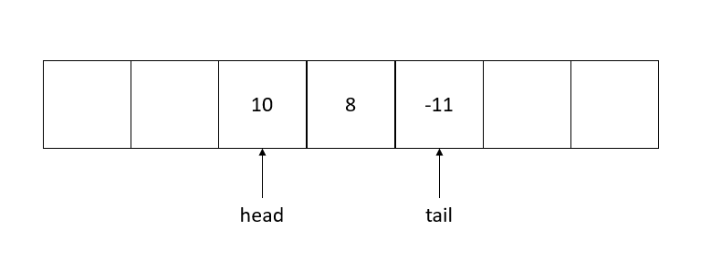
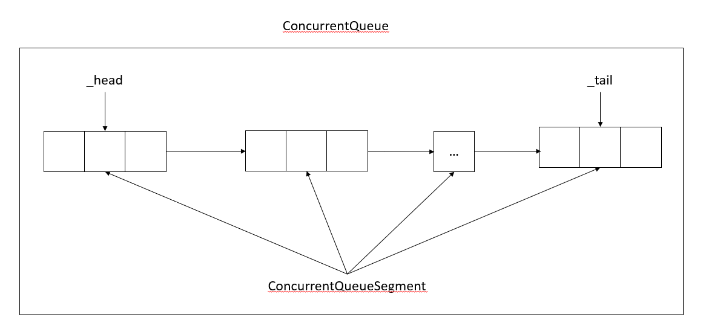

# 1 Collections

## 1.1 List

`List<T>` 是数组的封装，能够自动完成数组大小的扩容，默认大小为 `4`，每次扩容数组大小翻倍。

```C#
public class List<T>
{
    private const int DefaultCapacity = 4;
    private T[] _items;
    private int _size;
    private int _version;
    // elide

    private void EnsureCapacity(int min)
    {
        if(_item.Length < min)
        {
            int newCapacity = _items.Length == 0 ? DefaultCapacity : _item.Length * 2;
            // elide
            Capacity = newCapacity;
        }
    }
}
```

任何堆列表的修改（增加和删除）都会引起 `_version` 字段自增，那么在任何枚举的过程中都会检查 `_version` 是否发生改变，一旦发生改变表明有存在别的线程对队列进行的修改，这个对于非线程安全的列表非常重要。

## 1.2 哈希表

哈希表是一种高效的数据结构，通过空间换取时间上的效率，操作的时间复杂度为 `O(1)` 。一旦发生键冲突，就需要采取相应的措施来解决，所以好的哈希函数能够将键充分散开。但是冲突也无法避免，通常采用的方法有开放定址法和链表发，`.Net core` 中 `Hashtable` 和 `Dictionary` 分别采用着两种方法。

### 1.2.1 Hashtable
何为开放定址法呢？也就是说当某个键在计算得到待插入位置的时候发现已经被占用，再此基础上重新计算待插入的位置，如此循环直到发现有空余的位置。

```C#
public class Hashtable
{
    private struct bucket
    {
        public object? key;
        public object? value;
        public int hash_coll;
    }

    private bucket[] _buckets = null;

    //elide
}
```

`Hashtable` 是非泛型容器，`Key` 和 `Value` 都是 `object` 类型，但是要求 `key` 必须实现 `GetHashCode` 和 `Equals` 方法，而且对于同一个 `key` 对象两个方法返回的值必须一致，某一种意义上将 `key` 是不可变类型，至少计算 `GetHashCode` 和 `Equals` 方法的字段不能修改。`key` 和 `value` 组成一个 `bucket`， 而 `hash_coll` 字段保存该 `key` 计算出来的哈希值，但是如果该值为负值，表明该位置为空，在 `Hashtable` 内部包含一个 `Bucket` 数组。


```C#
private uint InitHash(object key, int hashsize, out uint seed, out uint incr)
{
    unint hashcode = (uint)GetHash(key) & 0x7FFFFFFF;
    seed = (uint)hashcode;
    incr = (uint)(1 + ((seed * HashHelper.HashPrime) % ((uint)hashsize -1)));
    return hashcode;
}
```

首先计算出 `hash` 值并与 `0x7FFFFFFF` 来保证最高位为 0，确保该位置的 `bucket` 被目前已经被占用。然后计算出 `seed` 和 `incr` 来表示开始位置和冲突时候下次计算位置的增量。

```C#
private void Insert(object key, object? nvalue, bool add)
{
    //elide
    uint seed;
    uint incr;
    uint hashcode = InitHash(key, _buckets.Length, out seed, out incr);
    int emptySlotNumber = -1;
    int bucketNumber = (int)(seed % (uint)_bucket.Length);
    do{
        if(emptySlotNumber == -1 && (_bucket[bucketNumber].key == _bucket) && (_bucket[bucketNumber].hash_coll < 0))
        {
            emptySlotNumber = bucketNumber;
        }
        
        if((_bucket[bucketNumber].key==null) || (_bucket[bucketNumber].key==_bucket)
            && ((_buckets[bucketNumber].hash_col & unckecked(0x80000000)) == 0))
            {
                _buckets[bucketNumber].val = nvalue;
                _buckets[bucketNumber].key = key;
                _buckets[bucketNumber].hash_coll |= (int)hashcode;
                return;
            }
        if((_buckets[bucketsnumber].hash_coll & 0x7FFFFFFF) == hashcode) && KeyEquals(_buckets[bucketNumber].Key, key))
        {
            if(add)
            {
                throw new ArugumentException();
            }
            _bucket[bucketNumber].val = nvalue;
            return
        }
        if(emptySlotNumber == -1)
        {
            _bucket[bucketNumber].hash_coll 1= unchecked((int)0x80000000)
            //elide
        }
        bucketNumebr = (int)(((long)bucketNumber + incr) % (uint)_buckets.Length);
    }while(++ntry < _buckets.Length)
    //elide
    if(emptySlotNumber != -1)
    {
        //elide
        _bucket[emptySlotNumber].val = nvalue;
        _bucket[emptySlotNumber].key = key;
        _bucket[emptySlotNumber].hash_coll |= (int)hashcode;
        //elide
    }
}
```

每一个 `bucket` 可能存在如下三种情况：

1. 该位置为空，从未设置过：key 为 null，val 为 null 并且 hash_coll 也为 0;
2. 该位置设置被设置，key 和 value 为相应值，hash_coll 为 key 计算出来的 hash 值，如果发生冲突则将最高位设置为 1， 也就是该值为复数;
3. 该位置为可插入位置，如果之前设置为冲突，则该位置的 key 为全体 `_buckets`，而 `value` 为 `null` 而 hash_coll 仍然保持为负数，如果没有冲突保存原本 hash 值。

在插入过程中，首先计算出 `bucketNumber`， 如果首先发现当前 `bucket` 是第 3 种有冲突情况，则将值保存在 `emptySlotNumber` 中进行下一轮循环，找到所有的可能的冲突。如果发现是第 3 种情况中没有冲突的或者第 1 中情况，直接将 key，value 进行赋值，但是如果发现之前有冲突空位置，则优先选择冲突位置。如果是第 2 种情况，那么将其中的 value 进行更新。剩余的情况则将该位置的 `hash_coll` 标志位设置为冲突。

```C#
public virtual void Remove(object key)
{
    uint seed;
    uint incr;
    uint hashcode = InitHash(key, _bucket.Length, out seed, out incr);
    int ntry = 0;
    bucket b;
    int bn = (int)(seed % (uint)_buckets.Length);
    do
    {
        b = _buckets[bn];
        if((b.hash_coll & 0x7FFFFFFF) == hashcode) && KeyEquals(b.Key, key))
        {
            _buckets[bn].hash_coll &= unchecked((uint)0x8000000);
            if(_bcukets[bn].hash_coll != 0)
            {
                _buckets[bn].Key = _buckets;
            }
            else
            {
                _buckets[bn].key = null;
            }
            _buckets[bn].val = null;
            //elide
        }
        bn = (int)(((long)bn + incr) % (uint)_buckets.Length);
    }while(b.hash_coll <0 && ++ntry < _buckets.Length)
}
```
删除过程就比较简单了，首先找到哈希值和键都相同的 `bucket`, 然后清除 `bucket` 的 `hash_coll`, 如果清除后不等于 0， 则索命该位置之前是冲突的，否则将 key 设置为 null。

### 1.2.2 Dictionary

## 1.4 ConcurrentQueue

`ConcurrentQueue` 是线程安全的队列，用来实现最常见的生产者消费者模式，所以最重要的就是 `Enqueue` 和 `Dequeue` 接口。在 `coreFx` 中具体实现在 [ConcurrentQueueSegment.cs](https://github.com/dotnet/corefx/blob/master/src/Common/src/CoreLib/System/Collections/Concurrent/ConcurrentQueueSegment.cs) 和 [ConcurrentQueue.cs](https://github.com/dotnet/corefx/blob/master/src/Common/src/CoreLib/System/Collections/Concurrent/ConcurrentQueue.cs) 两个文件中。

在深入了解之前，我们先了解一下非线程安全的消息队列，一般使用 [`Circular Buffer`](https://en.wikipedia.org/wiki/Circular_buffer) 数据结构作为底层支持。



如上图所示， `Circular Buffer` 其实就是一维数组和两个指针 `head` 和 `tail`，分别指向两端的操作，在 `Enqueue` 时候在 `tail+1` 位置插入，在 `Dequeue` 时候 `head+1`。同时为了实现循环的功能，每次 `Enqueue` 时候 `tail = (tail + 1) % Length`, 同样在 `Dequeue` 时候需要 `head = (head + 1) % Length`。在判断是否为空和大小的时候，也需要特殊处理。

```C#
int Count()
{
    (tail - head + Length) % Length + 1;
}

bool Empty()
{
    return tail == head;
}
```

虽然可以对 `Circular Buffer` 添加全局锁也可以实现线程安全的队列，但是限制了队列的长度大小，在需要扩容的时候需要申请更大的内存数组，效率上大大折扣。所以 `ConcurrentQueue` 将这些 `Circular Buffer` 链接起来。



**ConcurrentQueueSegment**

```C#
internal sealed class ConcurrentQueueSegment<T>
{
    internal readonly Slot[] _slots;

    internal PaddedHeadAndTail _headAndTail;
    //elide

    internal struct Slot
    {
        public T Item;

        public int SequenceNumber
    }

    //elide
}

internal struct PaddedHeadAndTail
{
    public int Head;

    public int Tail;
}
```

`_headAndTail` 包含 `Head` 和 `Tail` 两个指针，`_slots` 保存队列中的元素，除了 `Item` 保存元素，还包含 `SequenceNumber`，它用来表明当前 `slot` 是否可以 `Enqueue` 或者 `Dequeue`，规则如下：

- 对于往索引 `N` 位置插入一个元素，只有该位置的 `SequenceNumber` 值为 `N` 的时候才可以进行插入队列；
- 对于从索引 `N` 位置取出一个元素，只有该位置的 `SequenceNumber` 值为 `N+1` 的时候才可以进行取出；
- 当插入元素完成后，将该位置的 `SequenceNumber` 值为 `N+1`；
- 当取出元素完成后，将该位置的 `SequenceNumber` 值设置为 `N + _slots.Length`

在 `ConcurrentQueueSegment` 中最重要两个 API 接口分别为 `TryDequeue` 和 `TryEnqueue` ：

```C#
public bool TryDequeu(out T item)
{
    //elide
    var spinner = new SpinWai();
    while(true)
    {
        int current = Volatile.Read(ref _headAndTail.Head);
        int slotIndex = current & _slotMask;

        int sequenceNumber = Volatile.Read(ref slots[slotIndex].SequenceNumber);
        int diff = sequenceNumber - (currentHead + 1);
        if(diff == 0)
        {
            if(Interlock.CompareExchange(ref _headAndTail.Head, currentHead+1, currentHead) == currentHead)
            {
                item = slots[slotsIndex].Item;
                if(!Volatile.Read(ref _preserveForeObserveration))
                {
                    slots[slotsIndex].Item = default;
                    Valatile.Write(ref slots[slotsIndex].SequenceNumber, currentHead + slots.Length);
                }
            }
        }
        else if (diff <0)
        {
            bool frozen = _frozenForEnquences;
            int currentTail = Volatile.Read(ref _headAndTail.Tail)
            if(currentTail - currentHead <= 0 || (forzen && (currentTail - ForeezeOffSet - currentHead <=0)))
            {
                item = default!;
                return false;
            }
        }
        spinner.SpinOnce(-1);
        //elide
    }
}

public bool TryEnqueue(T item)
{
    //elide
    var spinner = new SpinWait();
    while(true)
    {
        int currentTail = Volatile.Read(ref _headAndTail.Tail);
        int slotsIndex = currentTail & _slotsMask;
        int sequenceNumber = Volatile.Read(ref slots[slotIndex].SequenceNumber);
        int diff = sequnenceNumber - currentTail;
        if (diff == 0)
        {
            if(Interlocker.CompareExchange(ref _headAndTail.Tail, currentTail=1, currentTail) == currentTail)
            {
                slots[slotsIndex].Item = item;
                Volatile.Write(ref slots[slotIndex].SequenceNumber, currentTail+1);
                reurn true;
            }
        }
        else if (diff < 0)
        {
            return false;
        }
    }
    spinner.SpinOnce(-1);
    // elide
}
```
为了线程安全，使用了 `SpinWait` 和 `CompareExchange` 控制并发逻辑。在 `TryDequeu` 中，计算待取出 slot 中的 `SequenceNumber` 和 `Head+1` 比较，如果差值等于 0，则取出该值；但是如果该队列被迭代之类，则不将该 slot 的 Item 设置为空。如果差值小于 0， 表明目前没有元素待取出，但是如果此刻有别的线程正在往其中插入数据，则自旋等待片刻，进入 while 下一次循环。`TryEnqueue` 同样如此，只不过当没有 slot 插入的时候，并没有等待取出线程完成，而是直接返回，因为队列插入过程是有序的。

`ConcurrentQueue<T>` 实现就比较简单，具体实现交给 `ConcurrentQueueSegment<T>`。

```C#
public class ConcurrentQueue<T>
{
    // elide
    private readonly object _crossSegmentLock;

    private volatile ConcurrentQueueSegment<T> _tail;

    private volatile ConcurrentQueueSegment<T> _head;

    public ConcurrentQueue()
    {
        _crossSegmentLock = new object();
        _tail = _head = new ConcurrentQueueSegment<T>(InitialSegmentLength);
    }
    // elide
}
```

`_tail` 和 `_head` 分别指向队列的首末的 `ConcurentQueueSegment` 片段，在初始化的时候，两者指向同一个 `Segment`，插入队列实现如下：

```C#
public void Enqueue(T item)
{
    if(!_tail.TryEnqueue(item))
    {
        EnqueueSlow(item);
    }
}
private void EnqueuSlow(T item)
{
    while(true)
    {
        ConcurrentQueueSegment<T> tail = _tail;
        if(tail.TryEnqueue(item))
        {
            return;
        }
        lock(_crossSegmentLock)
        {
            if(tail == _tail)
            {
                //elide
                int nextSize = tail._presevedForObserveraion ? InitialSegmentLength : Math.Min(tail.Capacity * 2, MaxSegmentLength);
                var newTail = new ConcurrentQueueSegment<T>(nextSize);
                tail._nextSegment = newTail;
                _tail = newTail;
            }
        }
    }
}

public bool TryDequeue(out T result) => _head.TryDequeue(out result) || TryDequeueSlow(out result);

private bool TryDequeueSlow(out T item)
{
    while(true)
    {
        ConccurrentQueueSegment<T> head = _head;
        if(head.TryDequeue(out item))
        {
            return true;
        }
        if(head._nexSegment == null)
        {
            item = default!;
            return false;
        }
        if(head.TryDequeue(out item))
        {
            return true;
        }
        lock(_crossSegmentLock)
        {
            if(head == _head)
            {
                _head = head._nextSegment;
            }
        }
    }
}
```

在插入的时候，首先在 `_tail` `segment` 中尝试插入，如果失败，就尝试创建新的 `Segment` 并且将 `_tail` 指针更新；在出队列的时候，同样先尝试从 `_head` 出队列，如果失败，就将 `_head` 指针指向下一个 `segment`，空闲的 `segment` 将会被 GC 处理。
还有一点要注意 `ConcurrentQueue` 的 `Count` 属性和 `IsEmpty` 属性时间效率是不一样的，`Count` 需要遍历全部的 `Segment`，而 `IsEmpty` 则尝试 `Peek` 队列。

(To be continued)
