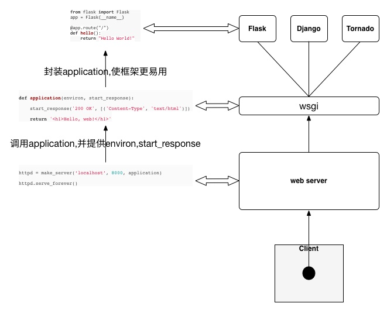

# 1 前言
Python Web开发框架主要有

+ **Django**：一站式开发框架，但是不利于定制化
+ **web.py**: 小巧玲珑， 使用类处理URL
+  **bottle**: 缺少URL模式拦截功能
+  **Flask**: 使用装饰器进行路由转发

本文将基于`Flask`Web开发框架进行相关分析

# 2 WSGI
`WSGI(Python Web Server Gateway Interface)`是Python定义的Web服务器和Web应用程序之间接口的协议，具体文档可以查看[PEP333](https://www.python.org/dev/peps/pep-0333/)。
## 2.1 应用程序部分
WGSI规定了应用程序可以是一下三种形式
### 可调用的函数
```python
def applicaiton(environ, start_response):
    pass
```
### 一个类
```python
class Application(object):
    def __init__(self, environ, start_response):
        pass
```
### 一个可以调用的对象
```python
class Application(object):
    def __call__(self, environ, start_response):
        pass
```
而且WSGI还定义了上述的返回值必须是可迭代的对象。
## 2.2 服务器程序
典型的服务器程序如下所示
```Python
def run(application):
    environ = {}
    def start_response(status, response_header, exc_info=None):
        pass
    result = application(environ, status_response)
    def write(data):
        pass
    for data in result:
        write(data)
```
因此服务器做了以下三个工作

1. 生成应用程序需要的两个参数
2.  调用应用程序
3. 迭代访问返回的数据，并返回给客户端。

## 2.3 总体概览
客户端、Web服务器、WSGI和Web开发框架之间的关系如下图所示。


# 3 Flask Web开发框架
使用Flask开发Web应用程序非常简单
```python
from flask import Flask
app = Flask(__name__)
@app.route('/')
def index():
    return '<h1>Hello World</h1>'
if __name__ == '__main__':
    app.run()
```
使用浏览器输入`http://localhost:5000`，就可以访问该Web应用程序。
# 4 Flask 源码分析
针对上述最小的Flask Web应用程序，对Flask 0.1 进行简单深入探讨。从`Github`上clone下来[Flask源码](https://github.com/pallets/flask), 并Checkout出 `flask 0.1`版本，(git checkout 8605cc3)，整个项目只有个 flask.py一个文件，包含注释也只有600多行， 可以说是相当简洁了。
## 4.1 初始化
Flask类初始化的内容如下
```Python
class Flask(object):
    def __init__(self, package_name):
        #...
        self.view_function={}
        self.error_handlers = {}
        self.before_request_funcs=[]
        self.after_request_funcs=[]
        self.url_map=Map()
```
从中可以看出Flask对象中包含了

+ view_function: 所有注册的视图函数
+ error_handles: 所有注册的错误函数
+ before_request_funcs: 开始处理一个请求所要处理的函数集合
+ after_request_func: 结束处理一个请求索要处理的函数集合
+ url_map保存URI到视图函数的映射

## 4.2 route函数
route函数是装饰器
```python
def route(self, rule, **option):
    def decorator(f):
        self.add_url_rule(rule, f.__name__, **option)
        self.view_functions[f.__name__]=f
    return decorator

def add_url_rule(self, rule, endpoint, **option):
    options['endpoint']=endpont
    options.setdefault('methods', ('GET',))
    self.url_map.add(Rule(rule, **option))
```
Route 装饰器主要做了两件工作，首先添加URL路由规则，使用函数名称`f__name__`作为路由的`endpoint`,作为`url_for`函数查找的内容, 在flask后续版本中，是使用者可以指定endpoint。
```python
def url_for(endpoint, **values):
    return _request_ctx_statck.pop.url_adapter.build(endpoint, values)
```
在`add_url_rule`函数中，设定了options中的methods，默认为GET操作，如果在路由中给定了，就不需要指定。
另一件事函数名和函数作为一个`key-value`键值对存放到`view_function`字典中。
## 4.3 run函数
在flask源码中，`run`函数是这样定义的
```python
def run(self, host='localhost', port=5000, **options):
    from werkzeug import run_simple
    if  'debug' in options:
        self.debug = options.pop('debug')
    options.setdefault('use_reloader', self.debug)
    options.setdefault('use_debugger', self.debug)
    return run_simple(host, port, self, **options)
```
通过调用`werkzeug`模块的`run_simple`函数使web应用程序运行起来。`run_simple`相当于Web服务器，处理客户端发来的请求，将`self`参数传入该函数中，按照WSGI规范，那么Flask对象是一个可调用的对象，包含一个`__call__`函数。
```python
def __call__(self, envrion, start_response):
    return self.wsgi_app(envrion, start_response)

def wsgi_app(self, envrion, start_response):
    with self.request_context(envrion):
        rv = self.request_context(envrion)
        if rv is None:
            rv = self.dispatch_request()
        response = self.make_reponse(rv)
        reponse = self.process_response(response)
        return response(envrion, start_response)
```
`wsgi_app`函数为主要的处理啊过程，其中`request_context`返回一个`_RequestContext`类对象包含了对environ字典对象的一些处理
```python
class _RequestContext(object):
    def __init__(self, app, environ):
        self.app = app
        self.url_apter = app.url_map.bind_to_envrion(envrion)
        self.request = app.request_class(envrion)
        self.session = app.open_session(self.request)
        self.g = _RequestGlobals()
        self.flashes = None
```
`preprocess_reques`函数对`self.before_request_func`列表中的请求预处理进行相关处理，一旦有一个处理，其余的必须停止。
`dispatch_request`是对视图函数进行处理，并进行相关的HTTPException进行处理
```python
def dispatch_request(self):
    #....
```
`make_response`函数将视图函数的返回值返回转换成response对象，而`process_response`则调用`after_request`相关的函数。
通过上述整个过程，可以分析出一个完整的Flask请求的过程。