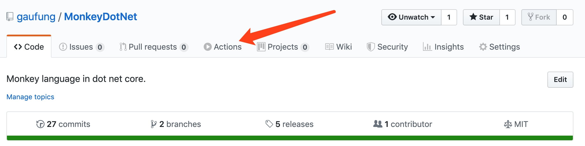
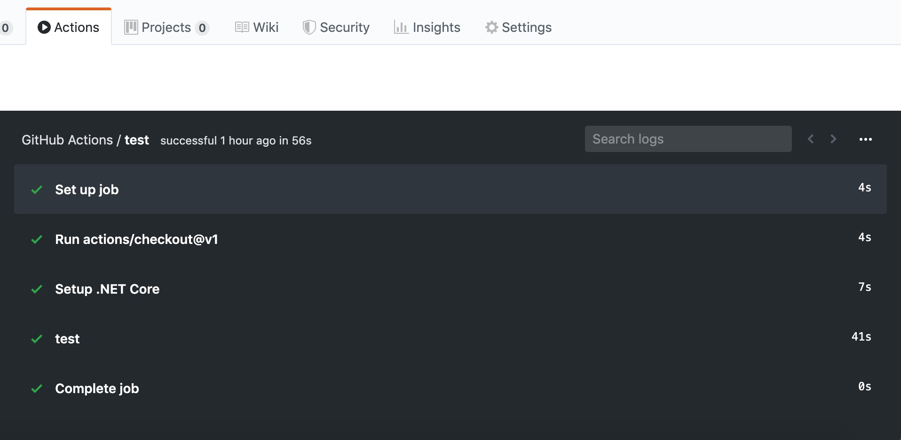
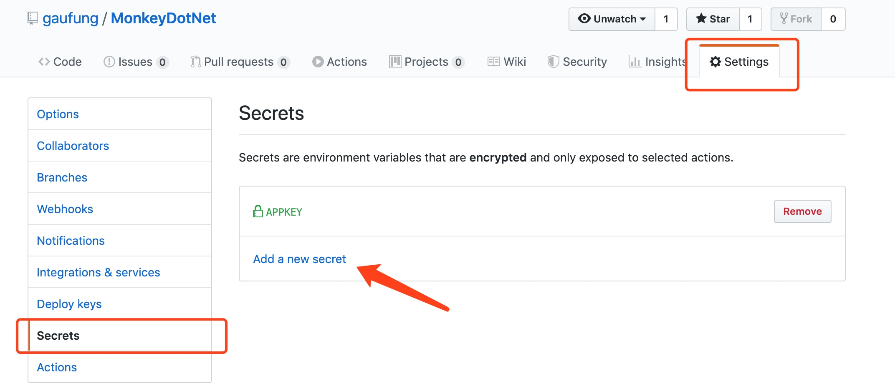
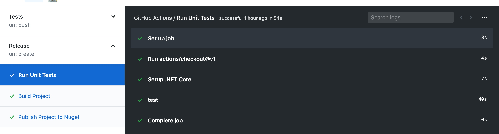
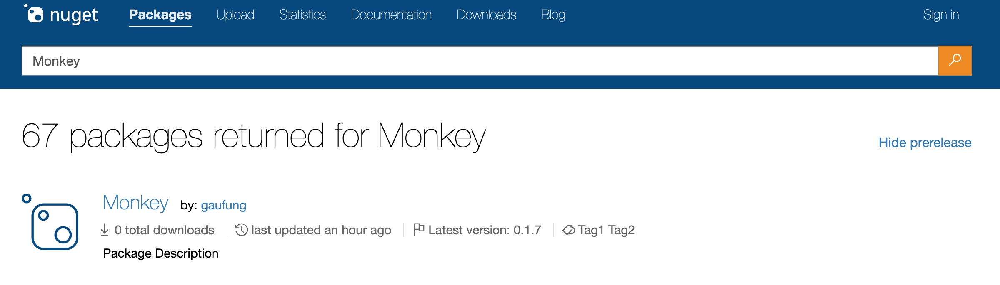

# 1 GitHub Action

`GitHub` 推出 `Action` 服务已有一阵子，主要目的是取代第三方测试、集成和部署等相关服务，除此之外还有更多有趣的功能，而且与 `GitHub` 的相关功能紧密结合。现在在每个 `Repo` 页面中都会看到如下的界面



选择进入可以查看当前 `Repo` 中包含的 `Action` 状况。

## 1.1 GitHub Action 核心概念

- 工作流（`Workflow`）：仓库中包含的配置自动化运行的过程，通常由多个任务（`Job`) 组成。它们通常被定时或者被事件触发。
- 任务（`Job`）：是由一些列步骤（`Step`）组成的任务，每个任务都是运行在不同的虚拟环境中。在一个 `Workflow` 中可以定义不同的任务之间的依赖关系。
- 步骤（`Step`）： 通常有一系列工作的集合，任务中的所有步骤共享同一套虚拟环境。
- 动作（`Action`）：具体的工作，可以自己定义相关操作，也可以使用[他人分享的动作](https://github.com/actions)。

## 1.2 配置 Worfkow

按照约定，在仓库的 `.github/workflows` 目录下 `yml` 或者 `yaml` 文件就是一个 `Workflow`。当 `Workflow` 触发的条件满足的时候，就会执行的相关的操作。`Workflow` 文件配置字段非常多，详细可以查看[文档](https://help.github.com/en/articles/workflow-syntax-for-github-actions)，接下来以具体实例进行讲解：

```yaml
# .github/workflow/test.yml
name: Tests
on: [push]
jobs:
  test:
    runs-on: ubuntu-latest
    steps:
    - uses: actions/checkout@v1
    - name: Setup .NET Core
      uses: actions/setup-dotnet@v1
      with:
        dotnet-version: '2.2.103'
    - name: Test
      run: dotnet test MonkeyDotNet
```

- name: 这个 `Workflow` 的名称是 `Tests`.
- on: 这 `Workflow` 在 `push` 事件发生的时候就会执行。
- jobs: 这个 `Workflow` 中包含的任务，本例中只有 `test` 一个任务。
- runs-on: 这个 `test` 任务执行在 `ubuntu` 虚拟机器上，`GitHub` 支持 `Windows`, `Linux` 和 `MacOS` 三大平台。
- steps: 这个 `test` 包含 `3` 个步骤
    - 第 1 个步骤没有名称，只有个动作，而且使用他人共享的 `checkout` 动作，主要共仓库中获取代码，分享的动作也是有版本管理概念，也就是说使用 `v1` 的版本。
    - 第 2 个步骤叫 `Setup .Net Core`, 同样也是用他人共享的  `setup-dotnet` 动作，这一次该动作包含一个 `dotnet-version` 的参数。
    - 第 3 个步骤是这个 `Workflow` 最终的目的，`run` 中使用 `dotnet test` 来对这个 `Repo` 进行单元测试。
    
## 1.3 触发 Workflow

当使用 `git push` 命令的时候就会触发该 Workflow.



显示该 `Workflow` 中的 `test` 任务中不同步骤的执行情况，点击各个步骤也可以查看执行的日志。在 `REMDME.md` 文件中可以增加 `badge` 用来表明该 `Workflow` 是否成功。

```

```

注意如果 `Workflow` 中包含空格，使用`%20` 代替，效果如下：


# 2 部署 NuGet 包

## 2.1 获取 NuGet Api Key

`NuGet` 是 `.Net` 平台下的包管理平台，开发者可以将自己的包进行分发使全球的开发者进行共享。首先，我们需要到 [nuget.org](https://www.nuget.org/) 注册并 获取 [API key](https://www.nuget.org/users/account/LogOn?ReturnUrl=%2Faccount%2FApiKeys)。但是 `API Key` 是非常私密性的，所以不能在 `Repo` 或者 `Workflow` 文件中包含直接的 `API Key`，需要通过下面方式进行配置：



`dotnet` 命令行工作包含了 `nuget` 包发布和管理的全部功能，详细可以查看[文档](https://docs.microsoft.com/en-us/nuget/nuget-org/publish-a-package)。

## 2.2 部署 workflow

我们需要部署 `Workflow` 有如下要求：

- 在每次 `git push <tag>` 的时候触发部署 `Workflow`。
- 在部署之前需要先进行单元测试和编译过程。
- 部署包含版本信息。

```yaml
name: Release

on: [create]
jobs:
  test:
    name: Run Unit Tests
    runs-on: ubuntu-latest
    steps:
    - uses: actions/checkout@v1
    - name: Setup .NET Core
      uses: actions/setup-dotnet@v1
      with:
        dotnet-version: '2.2.103'
    - name: Test
      run: dotnet test MonkeyDotNet
  
  build:
    needs: test
    name: Build Project
    runs-on: ubuntu-latest
    steps:
    - uses: actions/checkout@v1
    - name: Setup .NET Core
      uses: actions/setup-dotnet@v1
      with:
        dotnet-version: '2.2.103'
    - name: Build
      run: dotnet build MonkeyDotNet/Monkey
  
  publish:
    needs: [test, build]
    name: Publish Project to Nuget
    runs-on: ubuntu-latest
    steps:
    - uses: actions/checkout@v1
    - name: Setup .NET Core
      uses: actions/setup-dotnet@v1
      with:
        dotnet-version: '2.2.103'
    - name: Publish
      run: |
        version=`git describe --tags`
        dotnet pack MonkeyDotNet/Monkey --configuration release -p:PackageVersion=$version
        dotnet nuget push MonkeyDotNet/Monkey/bin/release/Monkey.$version.nupkg -k ${APIKEY} -s https://www.nuget.org/api/v2/package
      env:
        APIKEY: ${{ secrets.APPKEY }}
```

部署 `Workflow` 的触发事件是 `create` 也就是每次提交 `tag` 的时候就会触发版本发布；这次包含 `test`, `build` 和 `publish` 三个任务，而且 `build` 任务中 `needs` 字表指明该任务依赖 `test`, 同理 `publish` 任务则依赖 `test` 和 `publish`。
所以该 `Workflow` 执行的顺序是 `test`, `build` 和 `publish`，因为在 `workflow` 的每个任务都是在独立的虚拟环境中执行，所以默认是并行执行。
在 `publish` 任务中，`run` 动作中包含了三个步骤：获取 `tag` 信息，打包部署包和发布到 `nuget` 上，而且我们的 `APIKEY` 环境变量通过 `secrets.APPKEY` 给定。



左边显示该 `workflow` 包含的全部任务，右边显示各个任务的状态。在每次版本发布之后，就可以在 `nuget` 上找到最新的版本。



# 3 参考

- [About GitHub Actions](https://help.github.com/en/articles/about-github-actions)
- [Events that trigger workflows](https://help.github.com/en/articles/events-that-trigger-workflows)
- [如何在 NuGet 发布自己的类库包](http://nap7.com/how-to-publish-nuget/)
- [GitHub Actions 入门教程](http://www.ruanyifeng.com/blog/2019/09/getting-started-with-github-actions.html)
