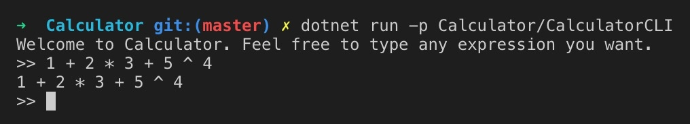
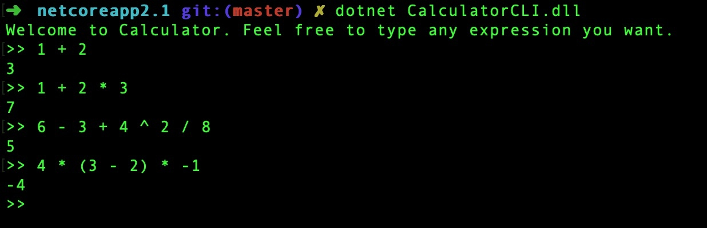

# 1 Overview
**Calculator** is a common tool for us to get the arithmetic expression's result. In *NIX OS, once you type `bc` command, then you get into `bc` environment. Feel free to input any legal arithmetic expressions. 
```
bc 1.06
Copyright 1991-1994, 1997, 1998, 2000 Free Software Foundation, Inc.
This is free software with ABSOLUTELY NO WARRANTY.
For details type `warranty'. 
```
Let's dive into what's going on when you type string(aka arithmetic expression) then it feeds back the result.  If you're familar with `Pyhton`, it provides a interactive console which you can type any Python's statements, including the above arithmetic expression. 
```
Python 2.7.15 (v2.7.15:ca079a3ea3, Apr 29 2018, 20:59:26) 
[GCC 4.2.1 Compatible Apple LLVM 6.0 (clang-600.0.57)] on darwin
Type "help", "copyright", "credits" or "license" for more information.
>>> 1 * 2 + 3 - 4 / 2
3
>>> 
```
Now that it's legal Python code, it must be underwent the full compile phases.  Here are they:
- Tokenize
- Parse
- Evalute

Exactly right, they're all stages for calculate the arithmetic expression. In this article we'll complete above from scratch in `C#` language (also netstandard2.0). And you will learn from this article.
- Abstract syntax tree (aka: AST)
- Pratt parsing method.
- How to evaluate system.

# 2 Environment

- Editor: [Visual Studio Code](https://code.visualstudio.com/)
- Language Runtime: [Dotnet Core](https://dotnet.microsoft.com/download)

After installing `Visual Studio Code`, you could install `C#` plugin to help you write a better code. 
Now you can run command `dotnet new console CalculatorCLI` to create a console application. And open the folder with `visual studio code`. At the begining the project, we just complete the prototype program that we want. 

```csharp:n
// program.cs
static void Main(string[] args)
{
    const string WELCOME = "Welcome to Calculator. Feel free to type any expression you want.";
    const string PROMPT = ">> ";
    Console.Out.Write(WELCOME + Environment.NewLine);
    while(true)
    {
        Console.Out.Write(PROMPT);
        try
        {
            var input = Console.In.ReadLine();
            if(string.Compare(input, "exit", StringComparison.OrdinalIgnoreCase) == 0)
            {
                    break;
            }
            Console.Out.Write(input);
            Console.Out.Write(Environment.NewLine);
        }
       catch(Exception e)
       {
            Console.Out.Write("Oops! Something seems to go wrong." + Environment.NewLine);
            Console.Out.Write(e.Message);
            Console.Out.Write(Environment.NewLine);
        }
      }
  }
```
command: `dotnet run -p Calculator/CalculatorCLI`
There are nothing mysterious in above pieces of code. Read code from input then write back and what's our job? The lines between #16 and #21 will be filled by our calculator. Here we go.

# 3 Calculator Implementation
Take simplicity into consideration, our calculator only supports integer number, excluding float or complex number. And supports add(`+`), minus(`-`), multiply(`*`), divison(`/`) and power (`^`) operators. Parenthesises to group expression is also supported.

## 3.1 Tokenize
`Token` is the basic concept of complie technology. We re-create the source codes into a sequence of tokens. The `Lexer` will take the responsibility for it. First of all, how many kinds of token are in our calculator?
```csharp:n
//Token.cs
public enum TokenType
{
    INT,
    PLUS,
    MINUS,
    MULTIPLY,
    DIVIDE,
    POWER,
    LPAREN,
    RPAREN,
    EOF,
    ILLEGAL,
}
```
Nothing strange, except `EOF` and `ILLEGAL`, they are just talked above section. 
```csharp:n
//Token.cs
public class Token
{
    public TokenType Type { get; set; }
    public string Literal { get; set; }
}
```
`Token` class is quite simple, including two properties. `Literal` including the token literal value in the source code.
The next step is to build our lexer, which just only includes one feature: `NextToken`. Every time we call `NextToken`, it returns a `Token` instance to represent the current source code.  
Before we move forward, we should expect what we'll get. Here are unit tests for the `Lexer` implementation, just like TDD(`Test Drive Development`). Use `dotnet new nunit CalculatorTest` command to create `NUnit` test framwork then `dotnet add CalculatorTest.csproj reference CalculatorCLI.csproj`。
```csharp:n
// LexerTest.cs
[Test]
public void TestLexerNextToken()
{
    string input = @"1 + 2 * (12 - 6) / 3 + 2 ^ 3
+ ((4+3) *   4)
/ 4
";

    var tests = new[]
    {
        new Token {Type = TokenType.INT, Literal="1"},
        new Token {Type = TokenType.PLUS, Literal="+"},
        new Token {Type = TokenType.INT, Literal="2"},
        new Token {Type = TokenType.MULTIPLY, Literal="*"},
        new Token {Type = TokenType.LPAREN, Literal="("},
       //....
    };
    Lexer lexer = new Lexer(input);
    foreach (var tt in tests)
    {
        var actualToken = lexer.NextToken();
        Assert.AreEqual(tt.Type, actualToken.Type, $"expect TokenType {tt.Type}, got {actualToken.Type}");
       Assert.AreEqual(tt.Literal, actualToken.Literal, $"expect Token's Literal {tt.Literal}, got {actualToken.Literal}");
    }
}
```
It chooses `table-driven` unit test pattern. The `Lexer` takes in a string input and invokes `NextToken` once a time to generate a token. Compre this token with expect one. 
```csharp:n
// Lexer.cs
public class Lexer
{
    //...
    public Token NextToken()
    {
        //...
        char character = this.input[this.position];
        switch (character)
        {
                case '+':
                    token = new Token { Type = TokenType.PLUS, Literal = "+" };
                    break;
                case '-':
                    token = new Token { Type = TokenType.MINUS, Literal = "-" };
                    break;
                case '*':
                    token = new Token { Type = TokenType.MULTIPLY, Literal = "*" };
                    break;
               // ...
                default:
                    if(IsDigit(character))
                    {
                        token = new Token { Type = TokenType.INT };
                        token.Literal = this.ReadNumber();
                    }
                    else
                    {
                        token = new Token { Type = TokenType.ILLEGAL, Literal=""};
                    }
                    break;
            }
            this.position++;
            return token;
}
```
The `Lexer` has only two fileds: `input` and `position`. The `position` points to the current character in the `input`. According to the pointing character, it returns the corresponding `Token`. It is pretty straight, isn't it?

## 3.2 AST
AST(Abstract Syntax Tree) is primary concept in the compile, also equivalent  in our calculator.  As we all know, various operators have their precedences respectively.  $1 + 2 \times 3 $  equals $7$, rather than $9$, because of  higher priority of   `multiply` operator. Internally, how will our calculator represents this expression? 


Above illustration tells what the AST looks like. $2 \times 3$  expression seems has lower position. So this expression should be calcluated firstly, which is we expected. Beside the original priorities of operators, the parenthess could *leverage*  their ones. For example, now $(1 + 2) \times 3$'s result is $9$.  Here is the AST. 

Here is the question: 
> How can we build such a AST according to the given expression ?

Firstly, *Expression* is abstract entity in the AST. Every part of the AST, even the whole  is considered as an *Expression*.  Let take above illustration for example. 
- Leaf with $1$: it represents the an integer expresion. Here, we call it *IntegerLiteralExpression*;
- Left subtree, including  leaves $1$ and $2$ with opeator $+$:  It alse can be considered as *Expression* and now it is *InfixExpression*. 
- The whole tree: It is still an *Expression*, even an *InfixExpression*. But this time, its left branch is another *InfixExpression* and the right branch is *IntegerLiteralExpression*. 

Beside above two kinds expression, there is addtional expression callled *PrefixExpression*.  `-1` is an example. We think prefix `-` as a prefix of the *IntegerLiteralExpression*. 
Time to go, let's define AST's components. 
```csharp:n
//Expression.cs
public abstract class Expression
{
    public abstract string TokenLiteral();
}
//IntegerExpression.cs
public class IntegerExpression : Expression
{
    public Token Token { get; set; }
    public long Value { get; set; }
   //...
    public override string ToString()
    {
        return $"{Value}";
    }
}
// PrefixExpression.cs
public class PrefixExpression : Expression
{
    public Token Token { get; set; }
    public Expression Right { get; set; }
    public string Operator { get; set; }
    public override string ToString()
    {
        return $"({Token.Literal} {Right.ToString()})";
    }
}
//InfixExpression.cs
public class InfixExpression : Expression
{
    public Expression Left { get; set; }
    public Expression Right { get; set; }
    public Token Token { get; set; }
    public string Operator { get; set; 
    public override string ToString()
    {
        return $"({Left.ToString()} {Token.Literal} {Right.ToString()})";
    }
}
```

## 3.3 Parser
Everything is ready, we're going to **PARSE** our input expression into AST's *expression*. So many kinds of parser in our toolbox and we choose *Pratt* method, which was first invented by [Vaughan Pratt](https://en.wikipedia.org/wiki/Vaughan_Pratt)'s paper [Top Down Operator Precedence](https://tdop.github.io/).  However, this article doesn't cover the topic about why this method works but just follow how it works. 
As metioned above, every operator has its own precedence. 
```csharp:n
//Pecedence.cs
public enum Precedence
{
    LOWEST = 0,
    SUM = 1,
    PRODUCT = 2,
    PREFIX = 3,
    POWER = 4,
    GROUP = 5,
}
//Parser.cs
public class Parser
{
    //...
    private static IDictionary<TokenType, Precedence> _precedences = new Dictionary<TokenType, Precedence>
    {
        {TokenType.PLUS, Precedence.SUM},
        {TokenType.MINUS, Precedence.SUM},
        {TokenType.MULTIPLY, Precedence.PRODUCT},
        {TokenType.DIVIDE, Precedence.PRODUCT},
        {TokenType.POWER, Precedence.POWER},
        {TokenType.LPAREN, Precedence.GROUP}
    };
    //...
}
```
Almost  every token is related to one or more parse functions, which depends on the position of token.  For example, if `-` exists in the head of expression, it is considered as a `PrefixExpression`. In any other cases, it is `InfixExpression`. 
```csharp:n
// Parser.cs
public  class Parser
{
    //...
    private IDictionary<TokenType, Func<Expression>> PrefixFns;
    private IDictionary<TokenType, Func<Expression, Expression>> InfixFns;
    
    public Parser()
    {
        //...
        PrefixFns = new Dictionary<TokenType, Func<Expression>>();
        InfixFns = new Dictionary<TokenType, Func<Expression, Expression>>();
        RegisterPrefix(TokenType.INT, this.ParseIntegerLiteral);
        RegisterPrefix(TokenType.MINUS, this.ParsePrefixExpression);
        RegisterPrefix(TokenType.LPAREN, this.ParseGroupExpression);
        RegisterInfix(TokenType.PLUS, this.ParseInfixExpression);
        RegisterInfix(TokenType.MINUS, this.ParseInfixExpression);
        RegisterInfix(TokenType.MULTIPLY, this.ParseInfixExpression);
        RegisterInfix(TokenType.DIVIDE, this.ParseInfixExpression);
        RegisterInfix(TokenType.POWER, this.ParseInfixExpression);
    }
}
```
The next is the highlight of *Pratt* method. 
```csharp:n
// Parser.cs
public class Parser
{
    //...
    public Expression Parse()
    {
        return this.ParseExpression(Precedence.LOWEST);
    }
    private Expression ParseExpression(Precedence precedence)
    {
        if(this.PrefixFns.ContainsKey(this._currentToken.Type))
        {
            Func<Expression> prefixFn = this.PrefixFns[this._currentToken.Type];
            Expression leftExp = prefixFn();
            while(!this.PeekTokenIs(TokenType.EOF) && precedence < this.PeekTokenPrecedence())
            {
                if(this.InfixFns.ContainsKey(this._peekToken.Type))
                {
                    Func<Expression, Expression> infixFn = this.InfixFns[this._peekToken.Type];
                    this.ReadNextToken();
                    leftExp = infixFn(leftExp);
                }
                else
                {
                    return leftExp;
                }
            }
            return leftExp;
        }
        else
        {
            throw new Exception($"{this._currentToken.Type} doesn't has corresponding parse function");
        }
    }
    private Expression ParseIntegerLiteral()
    {
        return new IntegerExpression
        {
            Token = this._currentToken,
            Value = long.Parse(this._currentToken.Literal)
        };
    }
    private Expression ParsePrefixExpression()
    {
        PrefixExpression exp = new PrefixExpression();
        exp.Token = this._currentToken;
        exp.Operator = this._currentToken.Literal;
        this.ReadNextToken();
        exp.Right = this.ParseExpression(Precedence.PREFIX);
        return exp;
    }
    private Expression ParseGroupExpression()
    {
        this.ReadNextToken();
        Expression exp = this.ParseExpression(Precedence.LOWEST);
        this.ExpectPeekToken(TokenType.RPAREN);
        return exp;
    }
    private Expression ParseInfixExpression(Expression left)
    {
        InfixExpression exp = new InfixExpression
        {
            Left = left,
            Token = this._currentToken,
            Operator = this._currentToken.Literal,
        };
        Precedence precedence = _precedences[this._currentToken.Type];
        this.ReadNextToken();
        exp.Right = this.ParseExpression(precedence);
        return exp;
    }
    //...
}
```
`ParseExpression` is the key method. It takes `Precedences` parameter.  Firstly, it try to parse out a prefix expression. In most cases, it's `IntegerLiteralExpression` or  a `minus` prefix. Then it compares current precedence with  peek token's precedences. If less than, so it means the right infix operator has lower position in the AST. And the parsed expression should act as like left branch in this infix expression rather than preivous  expression component. 
Thanks to well defined precedences and related parse methods by the token type, the `while` statement can go through until meets the an `EOF`.  
Here is the unit test for parser. 
```csharp:n
// ParserTest.cs
[TestFixture]
public class ParserTest
{
    //...
    [Test]
    public void TestParser()
    {
        var tests = new []
        {
            new ParserTestCase("1+ 2", "(1 + 2)"),
            new ParserTestCase("1 + 2 - 3", "((1 + 2) - 3)"),
            new ParserTestCase("10 - 12 * 12", "(10 - (12 * 12))"),
            new ParserTestCase("16 / 4 ^ 2", "(16 / (4 ^ 2))"),
            new ParserTestCase("(5 - 2) * 3", "((5 - 2) * 3)"),
            new ParserTestCase(" 5 +((12 + 8) / 4))", "(5 + ((12 + 8) / 4))"),
            new ParserTestCase("-4 * 5 + 2", "(((- 4) * 5) + 2)"),
            new ParserTestCase("5 + -3", "(5 + (- 3))"),
        };
        foreach(var tt in tests)
        {
            var parser = new Parser(new Lexer(tt.Input));
            var expression = parser.Parse();
            Assert.AreEqual(tt.Expected, expression.ToString(), $"Expression want = {tt.Expected}, but got {expression.ToString()}");
        }
    }
}
```
## 3.4 Evalution
Now that we use parser to get an expression to represent the AST. It quite nature to get the value of this AST and this is called evalution phrase.  There is only one kind of operand (integer) so we just need just one entity in the object system. 
```csharp:n
// Object.cs
public abstract class Object
{
    public abstract ObjectType Type();
    public abstract string Inspect();
}
// IntegerObject.cs
public class IntegerObject : Object
{
    public long Value { get; set; }
    public override string Inspect()
    {
        return $"{Value}";
    }
    public override ObjectType Type()
    {
        return ObjectType.INTEGER;
    }
}
```
Evalution progress is quite straigthforward. It accepts the expression which is generated by the parser and uses corresponding methods to handle the expression. Because expression may be nested, so we call the eval method recursively. 
```csharp:n
// Evalutor.cs
public class Evaluator
{
    public static Object.Object Eval(Expression expression)
    {
        if(expression is AST.IntegerExpression)
        {
            return new Object.IntegerObject { Value = ((IntegerExpression)expression).Value };
        }
        if(expression is AST.PrefixExpression)
        {
            return EvalPrefixExpression(expression as AST.PrefixExpression);
        }
        if(expression is AST.InfixExpression)
        {
            return EvalInfixExpression(expression as AST.InfixExpression);
        }
        throw new Exception($"Unsupported expression {expression.TokenLiteral()}");
    }
    public static Object.Object EvalPrefixExpression(AST.PrefixExpression expression)
    {
        Object.Object right = Eval(expression.Right);
        Object.IntegerObject rightInteger = right as Object.IntegerObject;
        if(rightInteger == null)
        {
            throw new Exception("Prefix expression right is not Object.IntegerObject");
        }
        return new Object.IntegerObject { Value = -1 * rightInteger.Value };
    }

    public static Object.Object EvalInfixExpression(AST.InfixExpression expression)
    {
        Object.Object left = Eval(expression.Left);
        Object.IntegerObject leftInteger = left as Object.IntegerObject;
        if(leftInteger == null)
        {
            throw new Exception("Infix expression left branch is not Object.IntegerObject");
        }
        Object.Object right = Eval(expression.Right);
        Object.IntegerObject rightInteger = right as Object.IntegerObject;
        if(rightInteger == null)
        {
            throw new Exception("Infix expression right branch is not Object.IntegerObject");
        }
        return InfixExpression(leftInteger, expression.Operator, rightInteger);
    }
    public static Object.Object InfixExpression(Object.IntegerObject left, string op, Object.IntegerObject right)
    {
        if(op == "+")
        {
            return new Object.IntegerObject { Value = left.Value + right.Value };
        }
        if(op == "-")
        {
            return new Object.IntegerObject { Value = left.Value - right.Value };
        }
        if(op == "*")
        {
            return new Object.IntegerObject { Value = left.Value * right.Value };
        }
        if(op == "/")
        {
            return new Object.IntegerObject { Value = left.Value / right.Value };
        }
        if(op == "^")
        {
            return new Object.IntegerObject { Value = (long)Math.Pow((double)left.Value, (double)right.Value) };
        }
        throw new Exception($"Unsupported arithmetic operator {op}");
    }
}
```
Well done, we finally get what we want after a loooong journey. We now hold the `Object.Integer` object to represent the result of input arthmetic expression.  Let's go back to our `Main` method to finish left work. 

# 4 CLI
In the `Main` method, we take in the user input, create a lexer, pass to Parser 's construtor, call parse method to get the AST expression, use Eval static method to get result, and print the result's Inspect ouput. 
```csharp:n
// program.cs
static void Main(string[] args)
{
    var lexer = new Lexer.Lexer(input);
    var parser = new Parser.Parser(lexer);
    var expression = parser.Parse();
    var result = Evaluate.Evaluator.Eval(expression);
    Console.Out.Write(result.Inspect());
}
```



Awesome!  
We create a basic calculator from  nothing but language basic data structure.  Enjoy it.

[Source Code](https://github.com/gaufung/Calculator)

