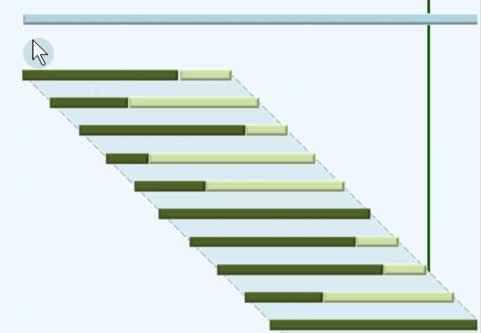
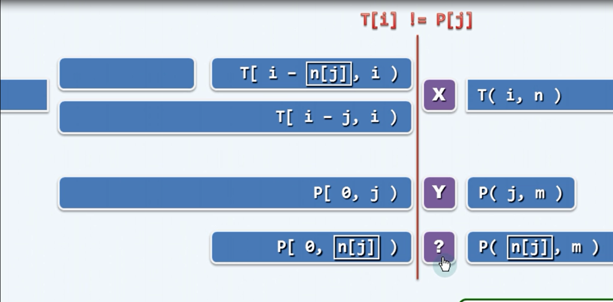

# 串匹配算法描述 
文本串 T 长度为$m$, 模式串 P 长度为$n$。需要做到以下几点 
1. Detection: P **是否**出现
2. Location: 首次出现的位置 
3. Counting: 出现的次数
4. Emumeration: 出现在哪里
其中第二条是最重要的，解决好第二条问题，3、4两问都能顺利解决。

# 蛮力算法 
自左向右，以字符为单位，依次移动模式串，知道某个位置发现匹配。
1. version #1
```C#
public int Match(string t,string p){
    int n=t.Length;
    int m=p.Length;
    int i=0;
    int j=0;
    while(i < n && j < m){
        if(t[i]==p[j]){
            i++;
            j++;
        }else{
            i-=j-1;
            j=0;
        }      
    }
    return i-j;
}
```  
如果返回值(i-j)>(n-m)表示匹配失败，否则(i-j)表示匹配成功的位置。
2. version #2
```C#
public int Match(string t,string p){
    int n=t.Length;
    int m=t.Length;
    int i=0;
    int j;
    for(i=0;i<n-m+1;i++){
        for(j=0;j<m;j++){
            if(t[i+j]!=p[j]){
                break;
            }
        }
        if(m<=j) break;
    }
    return i;
}
```
返回值i=n-m+1,则失配，如果i<n-m+1,则i为匹配的位置。
# 算法分析 
1. 最好情况 
    经过一趟遍历就能够成功匹配,时间复杂度为m
2. 最坏情况
    每次在模式串最后一个字符发生失配，每次匹配需要m次，共有n-m+1次，所以时间复杂度为$m(n-m+1)\approx mn$
    + 当字符集$|\Sigma|$越小,最坏情况出现概率越高
    + 当m越大，最坏情况出现越严重。
    

#问题分析 
一个典型蛮力算法过程如下图所示:


深色部分表示为在模式串中能够进行局部匹配的部分，在文本串T前进而模式串P回退的过程中，存在大量的重复匹配的工作，造成了蛮力算法的低效。解决办法是通过预处理模式串，获取某种预知力。

#KMP主算法
在串匹配算法过程中情况如下


当文本串中j-th的字符X与模式串i-th字符P发生失配，应该大幅度向右滑动模式串,使得子串P[0,n[j])和T[i-n[j],i)相等，直接跳过前面不可能匹配成功的部分，接下来比较字符创T[i]和P[j]两个字符是否相等。
其中数组n(用next数组表示)表示每个模式串字符先前的“预知力”，对于j位置的模式串，其prefix p[0,n[j])和postfix p[j-n[j],j)是相等的。通过预先构建Next数组，使得算法性能大幅度提高。
KMP主算法
```C#
public int Match(string t,string p){
    int n=t.Length;
    int m=p.Lenth;
    int[] next=BuildNext(p);
    int i=0;
    int j=0;
    while(i<n && j<m){
        if( 0>j || t[i]==p[j]){
            j++;
            i++;
        }
        else{
            j=next[j];
        }
    }
    return i-j;
}
```
如果返回值(i-j)>n-m,则表示匹配失败，否则表示匹配成功，(i-j)则文本串匹配的位置。

#Next表构建
重温一下next表的含义，当位置j发生失配，则next[j]表达的为kmp算法进行下一个匹配的位置，P[0,next[j])位置则是相等的。
采用递推的方式求解出next表，即：next[0,j]已知，进而推断出next[j+1]。 
+ 当p[next[j]]==p[j]: next[j+1]=next[j]+1
+ 当p[next[j]]!=p[j]:则next[j+1]的所有候选者为
    + 1+next[j]: p[next[j]]=p[j]
    + 1+next[next[j]]: p[next[next[j]]]=p[j]
    + 1+next[next[next[j]]]: p[next[next[next[j]]]]=p[j]
    + ...
收敛于 1+next[0]
初始化条件：在这里假设next[0]=-1,我们约定在p[-1]有一个通配字符*,这也解释在KMP主算法while算法中if判断语句,小于0的判断语句
```C#
if( 0 > j || t[i]==p[j])
```
Next数组构建算法
```C#
private int[] BuildNext(string p){
    int m=p.Length;
    int[] next=new int[m];
    int t=next[0]=-1;   
    j=1;
    while(j<m){
        if( 0 > t || p[t]==p[j]){
            next[j]= (++t);
            j++;            
        }else{
            t=next[t];
        }
    }
    return next;
}
```
#算法复杂度分析
在kmp主算法while 循环中，构建统计量w=2*i-j
```C#
int w;
while(i<n && j<m){
    w=2*i-j;
    if( 0 >j || t[i]==p[j])
    {
        i++;
        j++
    }else{
        j=next[j];
    }
}
```
在if分支中i++,j++,所以w++; 在else分支中j至少减少1，w增加
所以w<2(n)-(-1)=2n+1 O(n)的算法复杂度。