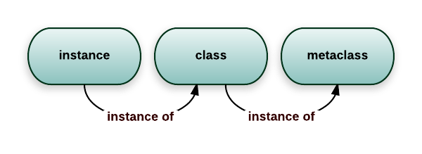

`python`语言中关于元类是高级的topic, 查阅了[廖雪峰Python教程](https://www.liaoxuefeng.com/wiki/0014316089557264a6b348958f449949df42a6d3a2e542c000/0014319106919344c4ef8b1e04c48778bb45796e0335839000#0), [StackOverflow](https://stackoverflow.com/questions/100003/what-is-a-metaclass-in-python)和[PEP3115](https://www.python.org/dev/peps/pep-3115/)相关文档后，一个简单的总结。

# 1 Python类和对象
`metaclass`、`class`和`instance`之间的关系可以用下图来表示

类定义了对象有哪些行为，而元类也定义了类有哪些行为。在`python`中创建一个类的声明 为
```python
class Foo(*bases, **kws):
    pass
class Foo(base1, base1, metaclass=mymeta):
    pass
```
使用了`metaclass`关键字，而`mymeta`控制类创建的过程，每一个可调用的对象都可以成为元类。
# 2 type关键字
在`python`中每一个都是对象，数字为对象，字符串为对象，实例是对象，上述集成体系中可以知道，类也是对象，在`python`中使用`type`可以查阅每个对象所属的类别。
```python
>>> type(1)
>>> 'int'
>>> type('abc')
>>> 'str'
>>> foo = Foo()
>>> type(foo)
>>> '__main__.Foo'
>>> type(Foo)
>>> 'type'
```
同样使用每个对象的`__class__`属性可以查看该对象所属的类别，从上述中可以查看，每个自定类的都是`type`类的实例。因此`python`除了使用`class`关键字定义类之外，还可以使用`type`关键词来创建类
```shell
type(name_of_class, 
     tuple_of_parent_class (for inheritance, can be empty), 
     dictionary_containing_attributes_names_and_values)
```
因此创建`Foo`类可以采取type方式。
```python
>>>def bar():
>>>    print('bar')
>>>Foo = type('Foo', (object,), dict(bar=bar))
>>>Foo.bar()
>>>bar
```
由此可以知道在`python`中当我们使用`class`关键词创建类的时候，最后都会转换为上述中的`type`语句。
# 3 metaclass控制类生成
如果在`class`创建类的过程中指定了`metaclass`关键字参数，那么该值将会拦截该类生成的过程。
## 3.1 函数形式
创建一个metaclass函数，作为将类的所有属性都改写成大写。
```python
def upper_attr(cls_name, cls_parents, cls_attrs):
    atts = ((name, value) for name, value in cls_attrs.items() if not name.startswith('__')))
    uppercase_attrs =  dict((name.upper(), value) for name, value in attrs)
    return type(cls_name, cls_parents, uppercase_attrs)
class Foo(object, metaclass=upper_attr):
    bar='pip'
print(hasattr(Foo, 'bar'))
>>> False
print(hasattr(Foo, 'BAR'))
>>> True
```
## 3.2 使用type子类

```python
class UpperAttrMetaclass(type):
    def __new__(cls, name, bases, dct):
        attrs = ((name, value) for name, value in dct.items() if not name.startswith('__')
        uppercase_attr  = dict((name.upper(), value) for name, value in attrs)
        return type.__new__(cls, name, bases, uppercase_attr)
class Foo(object, metaclass=UpperAttrMetaclass):
    bar='pip'
print(hasattr(Foo, 'bar'))
>>> False
print(hasattr(Foo, 'BAR'))
>>> True
```
# 4 元类使用
## 4.1 单例模式
每个类在创建对象的时候，都使用`(*args, **kw)`,只要在`type`中定义`__call__`方法即可。
```python
class Singleton(type):
    def __init__(self, *args, **kw):
        self.__instance = None
        super().__init__(*args, **kw)
    
    def __call__(self, *args, **kw):
        if self.__instance is None:
            self.__instance = super().__call__(*args, **kw)
            return self.__instance
        else:
            return self.__instance
class Spam(metaclass=Singleton):
    def __init__(self):
        print('Creating Spam')
```

## 4.2 ORM框架
python 中的ORM框架中使用了大量的元类
```python
class Field(object):
    def __init__(self, name, column_type):
        self.name = name
        self.column_type = column_type
    def __str__(self):
        return '<%s:%s>' % (self.__class__.__name__, self.name)

class StringField(Field):

    def __init__(self, name):
        super(StringField, self).__init__(name, 'varchar(100)')

class IntegerField(Field):

    def __init__(self, name):
        super(IntegerField, self).__init__(name, 'bigint')

class ModelMetaclass(type):
    def __new__(cls, name, bases, attrs):
        if name=='Model':
            return type.__new__(cls, name, bases, attrs)
        print('Found model: %s' % name)
        mappings = dict()
        for k, v in attrs.items():
            if isinstance(v, Field):
                print('Found mapping: %s ==> %s' % (k, v))
                mappings[k] = v
        for k in mappings.keys():
            attrs.pop(k)
        attrs['__mappings__'] = mappings # 保存属性和列的映射关系
        attrs['__table__'] = name # 假设表名和类名一致
        return type.__new__(cls, name, bases, attrs)
        
class Model(dict, metaclass=ModelMetaclass):

    def __init__(self, **kw):
        super(Model, self).__init__(**kw)

    def __getattr__(self, key):
        try:
            return self[key]
        except KeyError:
            raise AttributeError(r"'Model' object has no attribute '%s'" % key)

    def __setattr__(self, key, value):
        self[key] = value

    def save(self):
        fields = []
        params = []
        args = []
        for k, v in self.__mappings__.items():
            fields.append(v.name)
            params.append('?')
            args.append(getattr(self, k, None))
        sql = 'insert into %s (%s) values (%s)' % (self.__table__, ','.join(fields), ','.join(params))
        print('SQL: %s' % sql)
        print('ARGS: %s' % str(args)) 
        
class User(Model):
    # 定义类的属性到列的映射：
    id = IntegerField('id')
    name = StringField('username')
    email = StringField('email')
    password = StringField('password')
u = User(id=12345, name='Michael', email='test@orm.org', password='my-pwd')
u.save()
```