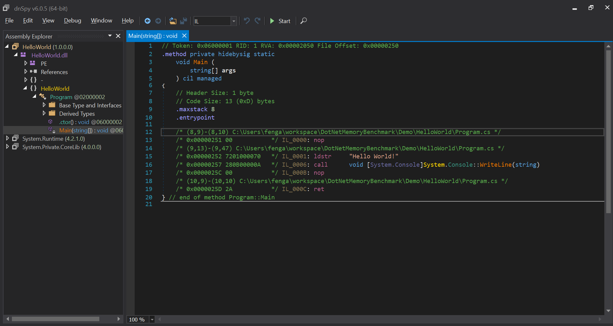

# 1 工具

> 工欲善其事，必先利其器

好的工具才有助于我们写出高性能的 C# 代码，也能证明我们的代码是高效无误。[dnSpy](https://github.com/0xd4d/dnSpy) 和 [BenchmarkDotNet](jttps://github.com/dotnet/BenchmarkDotNet) 就是这样的工具。

## 1.1 dnSpy

众所周知，C# 代码都会被转换成 IL (Intermediate Language) 代码，然后被运行时 (Runtime) 执行，目前使用的运行时主要有 .Net Framework, CoreCLR 和 Mono。通过查看 IL 可以知道我们的 C# 代码在编译器作用下生成怎样的代码，使用 dnSpy 可以将生成的 dll 或者 exe 文件反编译成相应的 IL 代码。

```C#
using System;
namespace HelloWorld
{
    class Program
    {
        static void Main(string[] args)
        {
            Console.WriteLine("Hello World!");
        }
    }
}
```

这是最简单的 Hello World 控制台应用程序，使用 `dotnet build` 命令编译生成 HelloWorld.dll 或者 HelloWorld.exe，这是最小可执行程序。使用 dnSpy 查看编译器究竟为我们生成了怎样的 IL 代码。



文件打开生成的 HelloWorld.dll, 选择 Program 类的 Main 方法，右边就会显示出相应的 IL 代码。IL 是基于栈机器（Stack Machine)，所有的操作基本上可以归结于进栈（Push）和出栈（Push)，比如 Main 函数中执行逻辑可以这样描述：

1. nop 无操作，主要是为了指令对齐
2. ldstr 将字符串 "Hello World" 进行入栈
3. call 调用 WriteLine 方法，所需要的参数从栈中取即可，即出栈。

IL 还有更多技术上的细节，可以查看更多[资料](https://www.amazon.com/Inside-Microsoft-Assembler-Serge-Lidin/dp/0735615470)。

## 1.2 BenchmarkDotNet

BenchmarkDotNet 是开源的 .Net 应用程序 benchmark 工具，用来测试我们的代码运行时空间和时间效率，从而选择正确的实现方式。

### 1.2.1 安装

BenchmarkDotNet 提供一系列相应的 NuGet 包，主要有：
- BenchmarkDotNet: 运行基础框架和逻辑
- BenchmarkDotNet.Diagnostic.Windows: 提供 Windows 相关的诊断服务
- BenchmarkDotNet.Tool: dotnet 相关工具
- BenchmarkDotNet.Templates: Benchmark 模板

通过 `dotnet add package <package name>` 安装上述相关包。

### 1.2.2 示例

使用 `dotnet new Benchmark --console-app -b MyBecnhmark`, 就会在当前目录下创建两个文件 `Program.cs` 和 `MyBenchmark.cs`， 

```c#
// MyBenchmark.cs
public class MyBenchmark
{
    [Benchmark]
    public void Scenario1()
    {
        // Implement your benchmark here
    }

    [Benchmark]
    public void Scenario2()
    {
        // Implement your benchmark here
    }
}

// Program.cs
public class Program
{
    public static void Main(string[] args)
    {
        var summary = BenchmarkRunner.Run<MyBenchmark>();
    }
}
```

带有 `Benchmark` Attribute 的方法就是我们要进行测试的方法，里面就是具体实现方式；而 `BenchmarkRunner` 则是 Benchmark 的入口。使用 `dotnet run` 就可以在控制台得到全部的运行结果。现在我们测试斐波那契数列迭代和递归的两种不同方式性能差异。

```C#
[SimpleJob(launchCount:1, warmupCount:2, targetCount:5)]
public class MyBenchmark
{
    [Params(5, 10)]
    public int N ;

    [Benchmark]
    public void Iteration()
    {
        Fib_Iter(N);
    }

    private int Fib_Iter(int n)
    {
        int f1 = 0;
        int f2 = 1;
        int fi = 0;
        if (n == 0)
            return 0;
        if (n == 1)
            return 1;
        for(int i = 2; i <= n; i++)
        {
            fi = f1 + f2;
            f1 = f2;
            f2 = fi;
        }
        return fi;
    }

    [Benchmark]
    public void Recursive()
    {
        Fib_Rec(N);
    }

    private int Fib_Rec(int n)
    {
        if( n == 0 || n == 1)
            return n;
        return Fib_Rec(n-1) + Fib_Rec(n-2);
    }
}
```
在 Benchark 中，每个都是由 Job 运行，每个 Job 都有相应的执行策略，主要由 `Throughput`, `ColdStart` 和 `Monitoring`，通常 `Thoughput` 基本上满足要求。`launchCount` 指定运行这个 Benchmark 的次数，每个标记 benchmark 方法调用称为一次操作，一连串操作组成在一起就成为一次迭代。`warmupCount` 指定热身的迭代次数，`targetCount` 表明需要进行测量的 benchmark 的测试。示例中得到的结果如下：


|    Method |  N |       Mean |      Error |    StdDev |
|---------- |--- |-----------:|-----------:|----------:|
| Iteration |  5 |   3.605 ns |  0.4940 ns | 0.1283 ns |
| Recursive |  5 |  28.623 ns |  0.6336 ns | 0.1645 ns |
| Iteration | 10 |   5.929 ns |  0.1143 ns | 0.0297 ns |
| Recursive | 10 | 345.854 ns | 36.4126 ns | 9.4562 ns |


### 1.2.3 内存监控

除了时间运行效率，我们还需要关注内存使用情况，这一点 BenchmarkDotNet 也提供了相关的工具，只需要增加 `MemoryDiagnoser` attribute 即可。

```C#
[SimpleJob(launchCount:1, warmupCount:2, targetCount:5)]
[MemoryDiagnoser()]
public class MyBenchmark
{
    // elide
}
```

|    Method |  N |       Mean |     Error |    StdDev | Gen 0 | Gen 1 | Gen 2 | Allocated |
|---------- |--- |-----------:|----------:|----------:|------:|------:|------:|----------:|
| Iteration |  5 |   3.527 ns | 0.0964 ns | 0.0250 ns |     - |     - |     - |         - |
| Recursive |  5 |  28.493 ns | 0.4153 ns | 0.1078 ns |     - |     - |     - |         - |
| Iteration | 10 |   6.035 ns | 0.5147 ns | 0.1337 ns |     - |     - |     - |         - |
| Recursive | 10 | 332.822 ns | 8.2203 ns | 2.1348 ns |     - |     - |     - |         - |


我们斐波那契两种实现方式都是栈空间分配内存，所以并不会存在堆内存分配情况，所以这些列都是为空。

### 1.1.4 其他功能
- 可以指定不同的 runtime，比如 .net framework, coreclr 或者 mono
- 可以从编译好 assembly, exe 等运行 Benchmark.
- 运行的方法必须要由返回值，否则被编译器优化


# 2 避免内存分配

# 3 隐藏内存分配

# 4 隐藏库函数内存分配