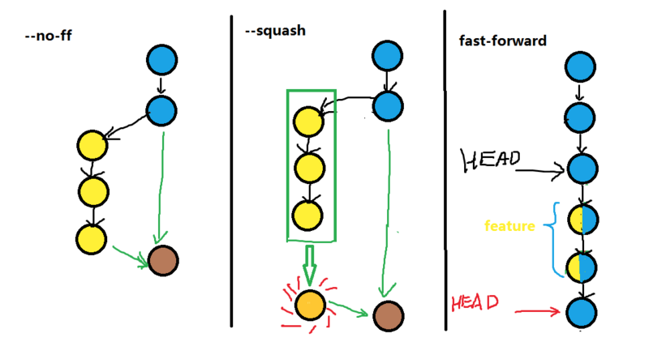
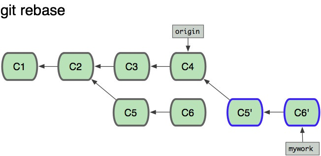
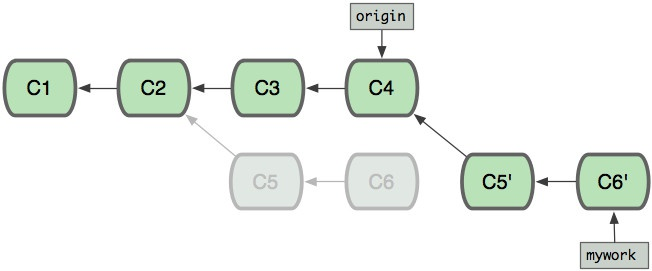
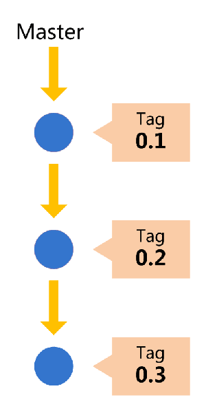
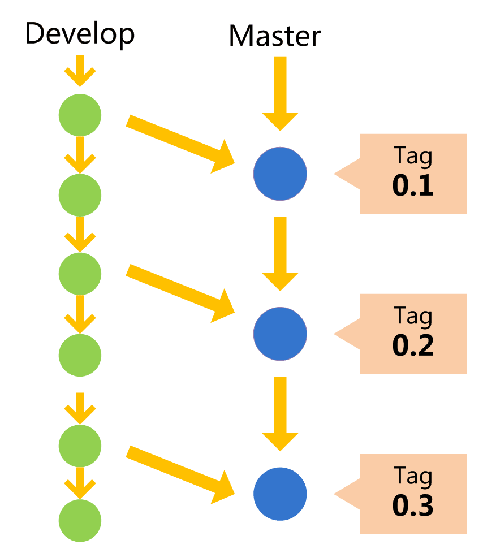
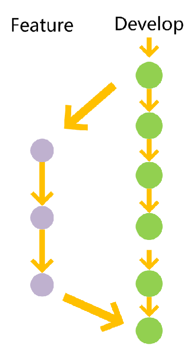

以前写了一份关于 `Git`[基础教程](https://gaufung.me/post/ji-zhu/git_basic). 在生产实际环境中仅仅使用`git status,  git add, git commit,  it push`是远远不够，接下来将更加深入介绍 `Git`相关命令。

# 1 git merge

在涉及到多人开发的过程中，  `git merge branch_name`是经常使用的命令，将别人开发的分支进行合并。
## 1.1 git merge --no-ff
但是默认情况下使用**fast-forward**进行合并，git直接把HEAD指针指向合并分支的头，完成合并，并丢失分支信息。在合并过程中添加`--no-ff`参数能够保留分支，并且能够在合并过程中，强制提交commit

## 1.2 git-merge --squash
在分支上开发功能的时候，有很多的零碎的commit提交，在于主分支合并的过程中，我们想取消零碎的commit的信息，汇总成一个commit信息，使用`--squash`参数能够覆盖掉分支上前面若干的零碎的commit信息。 注意一点，改分支合并只能采用`fast forward`合并方式，并且在操作完成后，必须再进行一次`git commit -m 'commit information'`完成前面琐碎的commit信息合并。



# 2 git rebase
在知乎上有人问`Vue.js`的Maintainer尤雨溪，为什么`Vue.js`的git log非常漂亮，作者回答了使用了大量`git rebase`。

当我们origin 分支的commit C2 中新建分支mywork，在分支B 上进行开发并提交了相应的commit C5和C6， 后来在分支origin的开发者开发了新的功能，并提交了commit C3和C4， 但是分支mywork上是看不到之后的修改，

这是后可以在分支mywork使用rebase操作可以将分支A上的提交的commit进行合并过来，改变分支mywork的base, 所以称为 **rebase**。

# 3 git origin 
在使用git进行与git 服务器上的仓库进行`push`和`pull`的过程中，使用的命令为
```
git add remote origin  git@github.com:gaufung/DS.git
```
这样本地的git仓库将与git服务器上的`DS`仓库进行关联起来，那么为什么使用`origin`是什么意思，其实就这个远程仓库的名称名字叫`origin`。所以在关联的过程中可以自己随便起一个名字，所以可以这样做
```
git add remote whatevername git@github.com:gaufung/DS.git
```

# 4 git 分支管理策略
好的分支管理在大型程序开发过程中非常重要，因此非常有必要对分支进行科学的管理。
## 4.1 master 分支
首先，代码库应该有一个、且仅有一个主分支。所有提供给用户使用的正式版本，都在这个主分支上发布。


## 4.2 dev 分支
平常的开发工作在 *dev* 分支展开，每次发布版本的时候，在master分支上使用 *merge --no-ff* 对dev分支进行合并


## 4.3 feature 分支
为了开发部分功能，需要从dev分支上切出一个单独小分支，进行功能性探索，每完成一个功能，就dev分支将其合并过来，并将feature分支进行删除。

# 5 git 恢复已删除的分支
如果世界上真的有后悔药的话，那么 `git`就是之一。在git的基础教程中，讲述了如何在各个版本之间穿梭，那么如果将一个分支删掉后，该如何恢复呢？
## 5.1 查找commit
使用命令`git reflog`可以查看整个所有操作，包括分支切换，提交等等，选择被删除分支上的最后一次commit的SHA-1值，一般只显示前6位 ，为commit_id。
## 5.2 切换出分支
使用命令`git branch recover_branch_abc commit_id`，那么在分支`recover_branch_abc`上就是刚刚被删除分支最后一次提交的内容。

# 6 git 修改 remote
remote 代表了本地仓库所对应的远程仓库，如果想要改变对应的远程仓库，主要有两种方法，第一种是`删除`+`添加`
```shell
# if remote repository name is origin
git remote remove origin
git remote add origin *****.git
```
第二种方法`更新`远程仓库
```shell
# if remote repository name is origin
git remote set-url origin ****.git
```