本教程的目标是在30分钟内教会使用 git
# 0 基础知识
## 0 什么是 git
git 是 linux 创始人 Linus Torvalds 为了管理 linux 内核而开发的一套开源的分布式版本控制程序。 相对于其他版本控制程序有着相当大的优势。
## 1 安装 git
在 `windows` 平台[下载安装](https://git-for-windows.github.io/)默认安装即可。安装完毕后在任意文件夹下右键出现 git 相关的上下文菜单表明安装正确

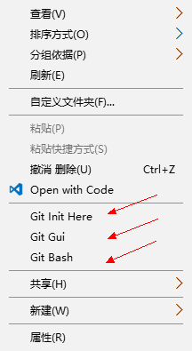

## 2 配置用户姓名和邮箱
在上一步上下文菜单中选择 `Git Bash`，进入命令行状态
```Shell
git config --global user.name "Your name"
git config --global user.email "email@example.com"
```
注意该名称和邮箱只为了用于表明身份，无其他特殊用途。
# 1 git 初体验
新建一个文件夹，该文件夹为我们开发过程中的 `工作区` (Working Directory)。在该文件夹下右键使用上下文菜单进入 *git bash* 命令行模式。
## 0 git init
```Shell
git init
```
输入 git init 新建一个 git 版本控制的文件夹，在资源管理器中可以发现该文件夹下出现了 `.git` 文件夹（若无法看见，请设置 window 隐藏文件夹查看属性）
## 1 建立工程
以 Python 语言开发作为我们开发的实例，创建 Bank.py 文件。完毕后在 *git bash* 命令行中输入
```Shell
 git status
``` 
出现以下信息
> Initial commit
Untracked files:
  (use "git add <file>..." to include in what will be committed)
      Bank.py
....

表明 git 检测到未追踪文件（Untracked files)，接下来我们可以将其添加到 git 版本控制中。 接下来在 *git bash* 中继续输入以下命令
```Shell
git add Bank.py
git commit -m "first init"
```
第1行说明将 `Bank.py` 文件添加到暂存区（Stage）中，第2行说明将暂存区的修改提交到版本库中，并添加了说明 `first init` 。 再一次调用 `git status` 命令，出现如下结果：
> nothing to commit, working directory clean

我们的工作目录干净，尚未提交内容。
## 2 开发进展
使用 Python 的相关 IDE 开发 Bank.py 文件，开始相关开发工作。
```Python
class Bank(object):
    pass
```
再次使用 `git status` 得到如下信息
> Changes not staged for commit:
  (use "git add <file>..." to update what will be committed)
  (use "git checkout -- <file>..." to discard changes in working directory)
        modified:   Bank.py

git 检测到我们修改了 Bank.py 文件，但还是没有添加到暂存区并进行提交。接下来在 *git bash* 中重复提交步骤
```Shell
git add Bank.py
git commit -m "stage"
```
在提交的过程中我们添加所作的工作说明，当然，可以在一天工作完成后，最后再提交任务。
## 3 工作区和暂存区
在上述的过程中，大家可以看出两个非常重要的概念 `工作区` 和 `暂存区`，理解这两个概念对 git 的使用有着重要的作用。
+  **工作区**

就是你在当前里能看到的目录和其相关文件
+ **暂存区**

作区有一个隐藏目录.git，这个不算工作区，而是 Git 的版本库。Git的版本库里存了很多东西，其中最重要的就是称为 stage（或者叫 index ）的暂存区，还有 Git 为我们自动创建的第一个分支 master ，以及指向 master 的一个指针叫 HEAD 。

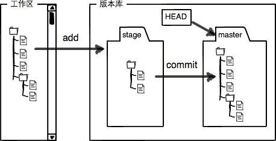

所以，*git add* 命令实际上就是把要提交的所有修改放到暂存区（Stage），然后，执行 *git commit* 就可以一次性把暂存区的所有修改提交到版本控制中。
# 2 git 版本控制
git 一大特点就是强大的版本控制功能，通过版本控制，我们可以开发进度，并且后效的回退和前进程序的版本，避免的代码的重复拷贝。
## 0 版本回退
修改 `Bank.py`，并添加 Bank 类的说明
```Python
class Bank(object):
    '''
    bank model
    '''
    pass
``` 
在 *git bash* 中通过 `git add` 和 `git commit` 相关操作添加到 master 分支中。 比如当我们觉得类的说明写错，不想通过删除内容，直接回退到未添加说明时的状态，通过 git 可以很轻松的回到过去。输入 `git log` 命令查看我们提交的历史记录。
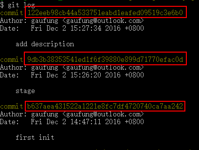

我们总共有三次提交的纪录，红色标记出来的为每次提交的纪录的 SHA1 值,理论上来讲，每次提交的 SHA1 值是不一样的。使用命令 ` git reset --hard 9db3b3 ` 使版本回退到提交 ID 值 为 **9db3b3....**的内容。通过查看 Bank.py 发现的确回到添加注释前的代码版本。也可以不用输入 SHA1 值回退到特定版本，在Git中，用`HEAD`表示当前版本，也就是最新的提交，上一个版本就是`HEAD^`，上上一个版本就是`HEAD^^`，当然往上100个版本写100个^比较容易数不过来，所以写成`HEAD~100`。 
## 1 回到未来
当我们当前处于在上一个版本中，如果想回到后面的状态，如果使用 `git log` 是查看不到后面提交的 SHA1 值。

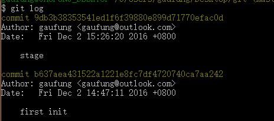

可以选择 `git reflog` 查看所有的提交记录。

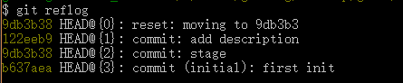

通过` git reset --hard id `命令，这样可以轻松在各个提交之间来回穿梭。
## 2 撤销修改
当我们在工作区修改了代码内容，如添加了构造函数
```Python
class Bank(object):
    '''
    bank model
    '''
    def __init__(self):
        pass
```
通过 `git status` 查看状态

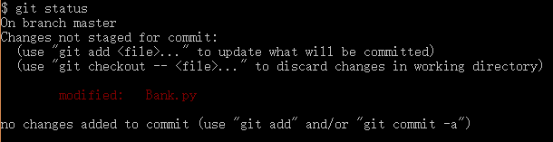

但是又去开发时候考虑不周，想使用带参数的构造函数，所以想要回退到位修改的时候，通过 `git checkout -- Bank.py` 可以使得在工作区的修改回到初始状态。
如果我们在修改后，并通过 `git add Bank.py` 将文件添加到暂存区了，想要撤回修改，可以使用`git reset HEAD file`使得暂存区的修改回到开始状态。
如果我们在提交到版本控制仓库后，想要撤销更改，只好通过版本回退等方式，回到上一次提交。
## 3 删除操作
比如在工作区添加 README.md 文件，并通过 `git add README.md` 和 `git commit -m 'add readme` 两步操作添加到版本库里。把工作区的文件删除，通过`git status`查看当前工作区的状态
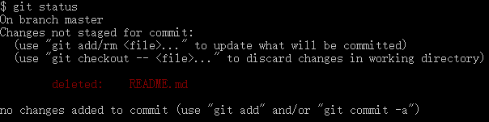

接下来我们可以有**两种**选择：
+ 真正想要该文件

使用`git rm README.md`操作，在版本库中删除文件。
+ 误删除，想要恢复

使用`git checkout -- README.md`操作，将版本库中的 README.md 文件恢复到工作区中。 

# 2 分支管理
分支管理是 git 我最喜欢的功能
## 0 创建分支
当我们想问程序添加新的功能的时候，往往不是直接在 master 分支上继续开发，因为我们无法掌控新功能开发的进度，并且 master 上的代码目前也是在稳定使用的中的，所以如果新功能的中的 bug 不能有效解决将会引起严重的后果。因此我们可以选择在另外一个**平行的宇宙时空**开发新的功能。
使用 `git checkout -b newbranch` 其中 *newbranch* 为新的分支的名字，新的分支是当前分支的完整镜像，在该分支的进行新的功能开发并不会影响其他代码。比如我们想为`Bank`类添加输出余额功能，使用
`git checkout -b balance`后，在工作区修改代码,提交代码。在 balance 分支中查看代码，可以将本地的分支推送到远程仓库中，并创建同样的分支`git push -u origin newbranch`.

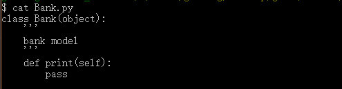

当使用`git checkout master`切换到 master 分支后查看代码

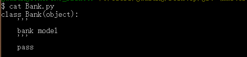

可以发现 master 分支上的代码没有改变。
## 1 合并分支
当我们在 `balance` 分支上的开发，调试工作完毕后，想要在程序下一个版本中推出该功能，所以要在`master` 分支中将 `balance` 分支开发的功能合并过来，先切换到`master`分支中，再调用 `git merge balance` 将 `balance` 修改的功能合并过来，不出意外的情况下，将合并成果。
## 2 解决冲突
当然，意外总会是发生的，比如某个人在 `master`分支上也修改了同样的内容，比如增加的构造函数

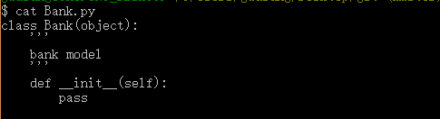

那么 Bank.py 文件在两个分支中都修改了，如果在`master`分支中合并`balance`分支，那么Bank.py文件将不知道以哪一个分支的修改为准，那么将会提示冲突。

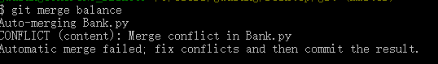

解决方案就是人工手动修改，并提交更新
## 3 分支策略
在实际开发中，我们应该按照几个基本原则进行分支管理：
首先，master分支应该是非常稳定的，也就是仅用来发布新版本，平时不能在上面干活；
那在哪干活呢？干活都在dev分支上，也就是说，dev分支是不稳定的，到某个时候，比如1.0版本发布时，再把dev分支合并到master上，在master分支发布1.0版本；
你和你的小伙伴们每个人都在dev分支上干活，每个人都有自己的分支，时不时地往dev分支上合并就可以了。所以，团队合作的分支看起来就像这样：

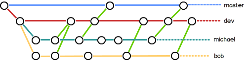

## 4 rebase
当我们在Dev分支上进行开发工作，master分支为发布的分支，但是在Dev上发现了一个`bug`，而master分支的基(base)还是bug之前的bug版本，所以要针对将master分支进行rebase，使用接下来几个步骤`git checkout master`，切回master分支上；`git rebase dev`，将`dev`最新的commit作为master分支的base。
## 5 stash
当我们在某个分支上进行工作的时候，突然被去某个分支上进行bug修复，但手头上的工作还不能作为commit，所以要讲当前的所作的工作进行`stash`起来，接下来切换到别的分支进行bug修复，在bug修复完毕后，切回刚刚工作的分支，将`stash`现场恢复完毕。`git stash`；`git checkout otherbranch`；`git checkout dev`；`git stash pop`恢复现场。
# 3 tag 标
当程序开发到一定程度后，可以通过 **tag** 的方式对代码进行管理，它是对特定`commit`的标签化化管理。
打标签非常简单，在特定的`commit`后使用 `git tag v1.0` 这样 `v1.0` 标签已经管理好，当我们想要在特的时候回到 `v1.0` 版本的时候，只要`git reset --hard tagname` 就可以切回到特定的标签。
# 4 其余主题
## 0 忽略文件
开发过程中，我们最关心的是源代码的内容，至于编译后生成的文件则不是我们关注的内容，而且这些文件是二进制文件，比如 Python 源代码的 `Bank.pyc` 则不是我们关心的内容，又还有的就是整个文件夹内容不是我们想要版本控制的，比如 Visual Studio 开发应用程序文件夹下的 *obj* 和 *bin* 文件夹，因此我们在版本控制中要排除这些内容。那么可以在工作区下新建 `.gitignore`文本文件，文件每一行内容为
```
*.pyc
bin/
```
第一行表明忽略`pyc`的后缀名的文件，第二行说明忽略 `bin` 文件下的内容。
## 1 github 使用
[github](https://github.com) 目前是世界上最大的开源社区，目前几乎所有的著名的开源程序在*github*上都能找得到，在使用之前先注册 github 账号，添加本人机器的 `SSH key` 添加至个人账户的可信任 key 列表中。当然如果你如果不想提交代码至 github 中，可以跳过该步骤，如果感兴趣可以访问我的 github [主页](https://github.com/gaufung)。

+ clone 代码

如果你对某个某个开源代码兴趣，在 web 页面打开该 *Repository* 

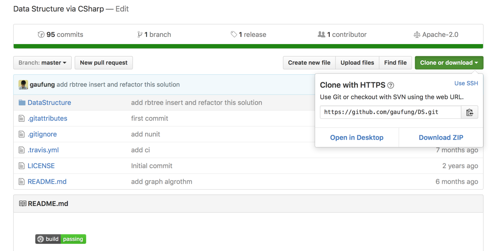

 点击右边的 `clone and download`,会出现一个页面，拷贝改 https 开头的一连串地址，在这里就是 `https://github.com/gaufung/DS.git`。在本地右键进入 *gitbash* 命令行，输入
 `git clone https://github.com/gaufung/DS.git` 这样 github 上的该项目就会被完整的克隆下来，也就是说该项目的历史提交记录也被你克隆下来，那么你可以通过`git log ` 和 `git reset --hard commitid` 查看该作者如何一步步讲整个项目构建起来，对于学习开源项目有很大的作用。
 
 + 提交代码
 
 可以通过 git 将本地的版本库提交至远程 github 账户。首先在 github 上新建一个空的仓库，比如 `Bank`,那么仓库提交的地址就 `github.com/yourname/Bank.git`, 那么在本地的*gitbash* 命令行中输入 `git remote add origin git@github.com/yourname/Bank.git` 那么就可以将本地的版本库与远程的版本库联系在一起，如果在本地有了新的提交，使用命令 `git push -u origin master`,参数 `-u` 是将本地的 `master`分支与远程的`master`分支关联起来，以后再提交的时候不需要再加参数 `-u`。 
 
 + 拉取代码
 
 在涉及到多人协同开发时候，有时服务器上 master 的代码已经更新，所以本地的的代码也要更新 ，使用命令 `git fetch origin master` 将远程 master 分支代码拉取下来，接下里使用 `git diff origin master` 查看本地和远程代码的异同，如果确认没有问题，再接着使用 `git merge orgin/master` 将远程的 master 分支上的内容合并，更新本地的版本库。 
 
# 5 结束 

哈哈，你终于看到这里了，其实我是骗你的，整个过程 30 分钟远远是不够的，git 和 github 还有更多的功能没有讲，但是掌握这些基础知识，再遇到问题 Google 或者 Bing 都能够解决，因为 git 每当错误的操作都会给出相应的提示，在搜索引擎里输入相应的提示即可，一定会有解决方案的。