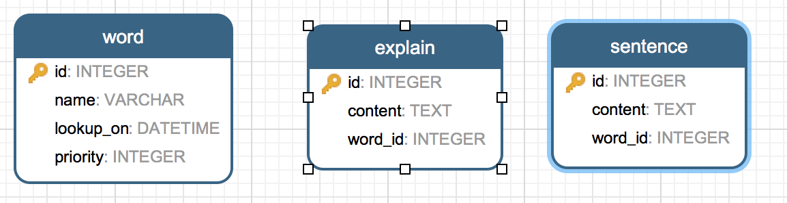

使用`python`开发出单词查询命令行工具，[源代码](https://github.com/gaufung/iDict)。

# 1 简介
可以通过命令行工作查询单词，主要功能有
- 查询
使用`python iDict.py -w <word>`查询`word`单词释义和例句，默认从[bing字典](http://cn.bing.com/dict)在线查询单词，并且将本次查询结果保存至本地数据库中。如果想要给该单词设定相关的级别，在命令行中自行条件`python iDict.py -w <word> -p <priority>`。

- 显示
用户可以按照单词的优先级，将数据库中保存的数据展示出来。使用`python iDict.py -s`

- 删除
删除本地数据库中的单词， 使用命令`python iDict.py --delete <word>`。

# 2 相关第三方库
## 2.1 requests 和 BeautifulSoup
这两个优秀的第三方库主要负责从bing在线字典获取相关单词释义。
### requests
`requests`负责从bing字典中获取相关页面，URL形式为`http://cn.bing.com/dict/search?q=word`，但是如果仅仅`request.get(query_url)`并不能获取完整的页面，应为相关的`javascript`代码会重新想服务器发送请求。为了完整模拟浏览器行为，需要添加`Request`的`header`内容。
```python
my_headers = {
        'Accept': 'text/html, application/xhtml+xml, application/xml;q=0.9, image/webp, */*;q=0.8',
        'Accept-Encoding': 'gzip, deflate, sdch',
        'Accept-Language': 'zh-CN, zh;q=0.8',
        'Upgrade-Insecure-Requests': '1',
        'Host': 'cn.bing.com',
        'User-Agent': 'Mozilla/5.0 (Windows NT 10.0; WOW64) AppleWebKit/537.36 (KHTML, like Gecko) \
                       Chrome/48.0.2564.116 Safari/537.36'
    }
```
### BeautifulSoup
`BeautifulSoup`有效的解决了使用繁琐的正则表达式解析`html`页面。通过查找相关的`dev`和css页面的`class`选项，可以有效的页面内容
```python
definition_tags = soup.find_all(class_='def')
 # ....
sentence_tags = soup.find_all(class_='sen_en')        
            for tag in sentence_tags:
                words = []
                for child in tag.children:
                    words.append(child.string)
```

## 2.2 Sqlalchemy
`Sqlalchemy`是一款优秀的 `Python` ORM框架，`iDict`中包含了是三个主要的类

- `Word`
    - name: 单词名称
    - lookup_on: 查询日期
    - priority: 单词优先级
- `explain`
    - content: 单词释义
    - word_id: 单词id
- `sentence`
    - content: 单词例句
    - word_id: 单词id

## ORM
```python
Base = declarative_base()
class Word(Base):
    __tablename__ = 'word'
    id = Column(Integer, primary_key=True)
    name = Column(String, nullable=False)
    lookup_on = Column(DateTime, default=func.now())
    priority = Column(Integer, default=1)
class Explain(Base):
    __tablename__ = 'explain'
    id = Column(Integer, primary_key=True)
    content = Column(Text)
    word_id = Column(Integer, ForeignKey('word.id'))
    word = relationship(
        Word,
        backref=backref('explains',
                        uselist=True,
                        cascade='delete,all'))
class Sentence(Base):
    __tablename__ = 'sentence'
    id = Column(Integer, primary_key=True)
    content = Column(Text)
    word_id = Column(Integer, ForeignKey('word.id'))
    word = relationship(
        Word,
        backref=backref('sentences',
                        uselist=True,
                        cascade='delete,all'))
```
使用`ForeignKey`创建外键，使用`relationship`穿件反向关联。

## session创建
`session`是`sqlalchemy`操作主要接口，创建过程如下
```python
engine = create_engine(DATABASE_URL)
session = sessionmaker()
session.configure(bind=engine)
session = session()
# Create DataBase
Base.metadata.create_all(engine)
```

## 增删改查
`sqlchemy`相关操作一般
```python
try:
    # CURD methods
except Exception as err:
    logging.error(err)
    session.rollback()
finally:
    session.close()
```

# 3 设计模式
在 `代码大全` 这本书中提出计算代码`dirty`程度，也就是`判断(if else)`、`循环(for, while)`等出现的次数，出现的次数越多，表明代码写得越糟糕。在`iDict`中，在查询一个单词的时候，如果本地数据库中没有，将会从bing在线字典中查找，通常来讲需要进行二到三步判断操作。在`设计模式`中，有`责任链(Chain of Responsibility)`设计模式，当其中的一个对象不能处理该数据，则将处理流程交给后继对象来处理。因此在解析单词的时候使用责任链模式。
```python
# Base class to define the Abstract method
class Parser(object):
    def parse(self, text):
        raise NotImplementedError("Please Implement the method")
# Database parser
class DbParser(Parser):
        def __init__(self, session, **options):
        self.session = session
        self.priority = options.get('priority', 1)
        self.successor = options.get('successor', None) 
    def parse(self, text):
        word = self.session.query(Word).filter(Word.name == text).first()
        try:
            if not word:
                raise ParserError('Cannot look up from database')
            word.priority = self.priority
            self.session.commit()
            return word
        except ParserError as err:
            logging.info(err)
            if self.successor:
                return self.successor.parse(text)
            else:
                raise ParserError('No successor')
# Bing online parser
class BingParser(Parser):
    def __init__(self, session, successor, priority=1):
        self.session = session
        self.priority = priority
        self.successor = successor

    def _parse(self, body, text):
        pass
    def parse(self, text):
        query_url = self.url.format(text)
        response = requests.get(query_url, headers=self.my_headers)
        if response.status_code == 200:
            body = response.text
            self._parse(body, text)
            return self.successor.parse(text)
        else:
            raise ParserError('Can not query word from Internet')
```
在使用的过程中，只需要按照逻辑处理步骤，将这些`parser`的子类构建好即可
```python
parser = DbParser(session, successor=BingParser(session,
                                                            DbParser(session, priority=priority), priority),
                              priority=priority)
            word = parser.parse(word)
```