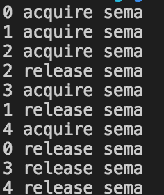
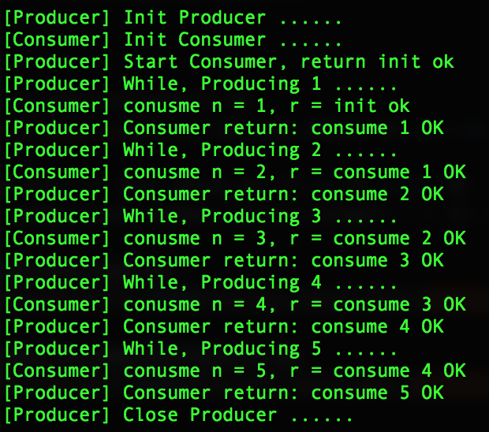
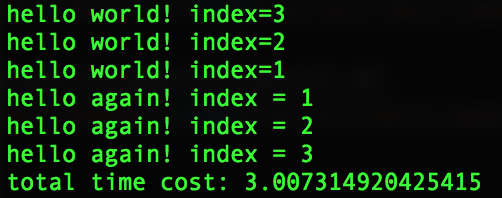

# 1 GIL局限性
`GIL`是Python中最为诟病的一个缺点，但是`GIL`并不是Python语言的特点，而是CPython的特色。
从官方定义来看：
> In CPython, the global interpreter lock, or GIL, is a mutex that prevents multiple native threads from executing Python bytecodes at once. This lock is necessary mainly because CPython’s memory management is not thread-safe. (However, since the GIL exists, other features have grown to depend on the guarantees that it enforces.)

Python的解释器只能同时进行一个线程，获取相关的锁，读写相关的资源。接下来通过代码实例来感受GIL锁带来性能上的问题。
```Python
def profile(func):
    def wrapper(*args, **kw):
        start = time.time()
        func(*args, **kw)
        print('Cost: {}'.format(time.time()-start))
    return wrapper
from threading import Thread
def fib(n):
    if n < 2 :
        return n
    return fib(n-1)+fib(n-2)
@profile
def nothread():
    fib(35)
    fib(35)

@profile
def withthread():
    threads = []
    for i in range(2):
        t = Thread(target=fib, args=(35,))
        t.start()
        threads.append(t)
    for t in threads:
        t.join()
nothread()
withthread()
```


从中可以看出，多线程消耗的时间居然比单线程消耗的还多，因为线程之间的上下文切换也需要需时间。

# 2 Python并发执行
## 2.1 同步异步和阻塞和非阻塞
通过简单的例子来描述这两对概念（来自网络）。
>老张爱喝茶，废话不说，煮开水。
出场人物：老张，水壶两把（普通水壶，简称水壶；会响的水壶，简称响水壶）。
1 老张把水壶放到火上，立等水开。（同步阻塞）
老张觉得自己有点傻
2 老张把水壶放到火上，去客厅看电视，时不时去厨房看看水开没有。（同步非阻塞）
老张还是觉得自己有点傻，于是变高端了，买了把会响笛的那种水壶。水开之后，能大声发出嘀~~~~的噪音。
3 老张把响水壶放到火上，立等水开。（异步阻塞）
老张觉得这样傻等意义不大
4 老张把响水壶放到火上，去客厅看电视，水壶响之前不再去看它了，响了再去拿壶。（异步非阻塞）
老张觉得自己聪明了。
所谓同步异步，只是对于水壶而言。
普通水壶，同步；响水壶，异步。
虽然都能干活，但响水壶可以在自己完工之后，提示老张水开了。这是普通水壶所不能及的。
同步只能让调用者去轮询自己（情况2中），造成老张效率的低下。
所谓阻塞非阻塞，仅仅对于老张而言。
立等的老张，阻塞；看电视的老张，非阻塞。
情况1和情况3中老张就是阻塞的，媳妇喊他都不知道。虽然3中响水壶是异步的，可对于立等的老张没有太大的意义。所以一般异步是配合非阻塞使用的，这样才能发挥异步的效用。

对于同步方法，Python用的最多的线程和进程等方法，通过创建新的线程或者进程，实现同步。但是一个操作系统的线程或者进程是代价极高的。对于服务器之类的系统，每个连接创建一个线程或者进程的代价极高。而且服务器用的最常见的的是IO操作，因此异步的IO操作被提上了日程。

# 3 多线程和多进程
为了减少GIL对多线程的影响，Python提供了`multiprocessing`模块通过提供多个解释器(interpreter)来突破GIL的局限性。
## 3.1 创建进程
将第1小节的的线程修改进程
```python
import time
from multiprocessing import Process
# def profile(func):
#      pass
# def fib(n):
#   pass
# def noProcess():
    # pass
@profile
def withProcess():
    processes=[]
    for i in range(2):
        p = Process(target=fib, args=(35,))
        p.start()
        processes.append(p)
    for p in processes:
        p.join()
noProcess()
witProcess()
```

通过结果可以看出多进程的时间消耗明显小于单进程。
而且`threading`和`multiprocessing`模块的的API基本一样。不同于单线程或者单进程，多线程和多进程就需要考虑到共享和资源锁。
## 3.2 资源锁
### 3.2.1 Lock
Lock保证的同一时间内只有一个线程访问该资源
```python
import time
import threading
value = 0
lock = threading.Lock()
def getlock():
    global value
    with lock:
        new = value + 1
        time.sleep(0.001)
        value = new
    return
threads = []
for i in range(100):
    t = threading.Thread(target=getlock)
    t.start()
    threads.append(t)
for t in threads:
    t.join()
print(value)
```
输出结果为100，通过Lock锁机制避免多线程的脏数据读写。
### 3.2.2 信号量
`Semaphore`规定了同一时间内，最多进入资源的线程的数量。
```python
import time
from random import random
from threading import Thread, Semaphore
sema = Semaphore(3)
def foo(tid):
    with sema:
        print('{} acquire sema'.format(tid))
        wt = random() *2
        time.sleep(wt)
    print('{} release sema'.format(tid))
    return
threads = [ ]
for i in range(5):
    t = Thread(target=foo, args=(i,))
    t.start()
    threads.append(t)
for t in threads:
    t.join()
```

最多只有三个线程能同时进入`foo`函数，也可以看出`Lock`相当于`semapha(1)`。
### 3.2.3 条件
`Condition`规定了当满足条件后，执行相关处理
```python
import time
import threading

def consumer(cond):
    t = threading.current_thread()
    with cond:
        cond.wait()
        print('{}: resource is avaiable to the consumer'.format(t.name))
    return

def producer(cond):
    t = threading.current_thread()
    with cond:
        print('{}: Making resource available'.format(t.name))
        cond.notifyAll()
    return
condition = threading.Condition()
c1 = threading.Thread(target=consumer,args=(condition,))
c2 = threading.Thread(target=consumer, args=(condition,))
p = threading.Thread(target=producer, args=(condition,))
c1.start()
time.sleep(1)
c2.start()
time.sleep(2)
p.start()
```
# 4 异步IO
协程(coroutine)允许一个执行过程A中断，去执行过程B，在适当的时候返回。
协程的好处有

+ 协程的数量理论上可以是无限个，而且没有线程之间的切换动作，执行效率比线程高。
+ 协程不需要“锁”机制，即不需要lock和release过程，因为所有的协程都在一个线程中。
+ 相对于线程，协程更容易调试debug，因为所有的代码是顺序执行的。

## 4.1 Python中协程
使用廖雪峰老师[Python教程](https://www.liaoxuefeng.com/wiki/0014316089557264a6b348958f449949df42a6d3a2e542c000/001432090171191d05dae6e129940518d1d6cf6eeaaa969000)中关于协程的介绍
```python
def consumer():         # 定义消费者，由于有yeild关键词，此消费者为一个生成器
    print("[Consumer] Init Consumer ......")
    r = "init ok"       # 初始化返回结果，并在启动消费者时，返回给生产者
    while True:
        n = yield r     # 消费者通过yield接收生产者的消息，同时返给其结果
        print("[Consumer] conusme n = %s, r = %s" % (n, r))
        r = "consume %s OK" % n     # 消费者消费结果，下个循环返回给生产者

def produce(c):         # 定义生产者，此时的 c 为一个生成器
    print("[Producer] Init Producer ......")
    r = c.send(None)    # 启动消费者生成器，同时第一次接收返回结果
    print("[Producer] Start Consumer, return %s" % r)
    n = 0
    while n < 5:
        n += 1
        print("[Producer] While, Producing %s ......" % n)
        r = c.send(n)   # 向消费者发送消息并准备接收结果。此时会切换到消费者执行
        print("[Producer] Consumer return: %s" % r)
    c.close()           # 关闭消费者生成器
    print("[Producer] Close Producer ......")

produce(consumer())
```


通过`yield`关键字实现了一个协程，消费者和生产者两个过程重复执行。

## 4.2 async 和 await关键字
在Python3.4中引入了`async`和`await`两个关键字，简化了协程。
```python
import asyncio
import time
async def hello(index, time_to_sleep):
    print('hello world! index=%s' % index)
    await asyncio.sleep(time_to_sleep)
    print('hello again! index = %s' % index)
loop = asyncio.get_event_loop()
start = time.time()
tasks = []
for i in range(1,4):
    tasks.append(hello(i,i))
loop.run_until_complete(asyncio.wait(tasks))
loop.close()
print('total time cost: %s' % (time.time()-start))
```


从结果中可以看出，如果顺序执行三个hello程序的话，那么将需要大约`1+2+3=6`秒时间，但是使用协程缺只消耗的3秒，每执行到` await asyncio.sleep(time_to_sleep)`时候（模拟低速的IO操作），该过程将返回，执行其余的过程，而通过`run_until_complete(asyncio.wait(tasks))`不断的询问返回的结果，一旦过程完成，主线程的loop过程将终止。
>async关键字将一个函数声明为协程函数，函数执行时返回一个协程对象。
await关键字将暂停协程函数的执行，等待异步IO返回结果。

# 5 推荐阅读
+ [Python黑魔法](http://python.jobbole.com/87310/)
+ [Python标准库asyncio实例](https://pymotw.com/3/asyncio/index.html)