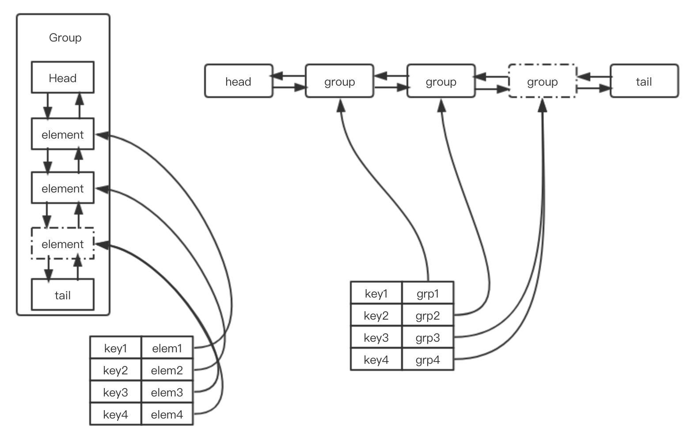

# 1 Algorithm
>实现一个数据结构支持以下操作：
Inc(key) - 插入一个新的值为 1 的 key。或者使一个存在的 key 增加一，保证 key 不为空字符串。
Dec(key) - 如果这个 key 的值是 1，那么把他从数据结构中移除掉。否者使一个存在的 key 值减一。如果这个 key 不存在，这个函数不做任何事情。key 保证不为空字符串。
GetMaxKey() - 返回 key 中值最大的任意一个。如果没有元素存在，返回一个空字符串""。
GetMinKey() - 返回 key 中值最小的任意一个。如果没有元素存在，返回一个空字符串""。
所有操作在 $O(1)$ 时间复杂度内完成。

既然要求在$O(1)$时间完成，所有的查询工作必须要求由`map`完成，还包含了增删的操作，所以必须采用`double link`存储相关数据。


```go
type Element struct {
	key   string
	count int
	prev  *Element
	next  *Element
}

type Group struct {
	head *Element
	tail *Element
	prev *Group
	next *Group
}

func NewGroup() *Group {
	g := &Group{
		head: &Element{},
		tail: &Element{},
	}
	g.head.next = g.tail
	g.tail.prev = g.head
	return g
}

func (g *Group) Front() *Element {
	return g.head.next
}

func (g *Group) Back() *Element {
	return g.tail.prev
}

func (g *Group) Empty() bool {
	return g.head.next == g.tail && g.tail.prev == g.head
}

func (g *Group) Remove(e *Element) {
	prev, next := e.prev, e.next
	prev.next = next
	next.prev = prev
}

func (g *Group) Push(e *Element){
	e.prev = g.tail.prev
	e.prev.next = e
	e.next = g.tail
	g.tail.prev = e
}

func (g *Group) Count() int {
	if g.Empty() {
		return -1
	}
	return g.Front().count
}

func (g *Group) ConnectBack(gg *Group) {
	gg.next = g.next
	gg.next.prev = gg
	gg.prev = g
	g.next = gg
}

func (g *Group) ConnectForward(gg *Group) {
	gg.prev = g.prev
	gg.prev.next = gg
	gg.next = g
	g.prev = gg
}

func (g *Group) Destroy() {
	g.head = nil
	g.tail = nil
	g = nil
}

type List struct {
	head *Group
	tail *Group
}

func NewList() *List {
	l := &List{
		head: NewGroup(),
		tail: NewGroup(),
	}
	l.head.next = l.tail
	l.tail.prev = l.head
	return l
}

func (l *List) Front() *Group {
	return l.head.next
}

func (l *List) Back() *Group {
	return l.tail.prev
}

func (l *List) Remove(g *Group) {
	prev, next := g.prev, g.next
	prev.next = next
	next.prev = prev
}

func (l *List) IsLast(g *Group) bool {
	return g.next == l.tail
}

func (l *List) IsFirst(g *Group) bool {
	return g.prev == l.head
}

func (l *List) Empty() bool {
	return l.head.next == l.tail && l.tail.prev == l.head
}

func (l *List) PushFront(g *Group) {
	l.head.ConnectBack(g)
}

func (l *List) PushBack(g *Group) {
	l.tail.ConnectForward(g)
}


type AllOne struct {
	l            *List
	elementTable map[string]*Element
	groupTable   map[string]*Group
}

/** Initialize your data structure here. */
func Constructor() AllOne {
	return AllOne{
		l:            NewList(),
		elementTable: make(map[string]*Element, 0),
		groupTable:   make(map[string]*Group, 0),
	}
}

func (this *AllOne) Empty() bool {
	return this.l.Empty()
}

func (this *AllOne) Inc(key string) {
	if e, ok := this.elementTable[key]; ok {
		e.count++
		// hit key
		g := this.groupTable[key]
		g.Remove(e)
		nextGroup := g.next
		if nextGroup.Count() != e.count {
			nextGroup = NewGroup()
			g.ConnectBack(nextGroup)
		}
		this.groupTable[key] = nextGroup
		nextGroup.Push(e)
		if g.Empty() {
			this.l.Remove(g)
            g.Destroy()
		}
	} else {
		// not hit key
		e = &Element{
			key:   key,
			count: 1,
		}
		this.elementTable[key] = e
		nextGroup := this.l.Front()
		if nextGroup.Count() != e.count {
			nextGroup = NewGroup()
			this.l.head.ConnectBack(nextGroup)
		}
		this.groupTable[key] = nextGroup
		nextGroup.Push(e)
	}

}

/** Decrements an existing key by 1. If Key's value is 1, remove it from the data structure. */
func (this *AllOne) Dec(key string) {
	e, ok := this.elementTable[key]
	if ok{
		e.count --
		g := this.groupTable[key]
		delete(this.groupTable, key)
		g.Remove(e)
		if e.count == 0 {
			delete(this.elementTable, key)
		}else{
			prevGroup := g.prev
			if prevGroup.Count() != e.count {
				prevGroup = NewGroup()
				g.ConnectForward(prevGroup)
			}
			this.groupTable[key] = prevGroup
			prevGroup.Push(e)
		}
		if g.Empty(){
			this.l.Remove(g)
            g.Destroy()
		}
	}
}

/** Returns one of the keys with maximal value. */
func (this *AllOne) GetMaxKey() string {
	if this.l.Empty() {
		return ""
	}else{
		return this.l.Back().Back().key
	}

}

/** Returns one of the keys with Minimal value. */
func (this *AllOne) GetMinKey() string {
	if this.l.Empty(){
		return ""
	}else{
		return this.l.Front().Front().key
	}
}
```
# 2 Review
[Teach Yourself Programming in Ten Years](http://norvig.com/21-days.html)
**花十年时间自学编程**
## 2.1 为什么每个人都如此匆忙
走进一家书店，你会看到*如何在24小时内自选Java* 这样的书，而且还有无数其他的版本可供选择，比如自学C，SQL，Ruby, 算法等等在几个小时后完成。在Amzon高级搜索中输入*title:teach, yourself, hours, since: 2000*，你会发现大概有512本这样的书。在排行最高的10本书中有9本是编程书（剩下的一本是关于记账），如果将搜索条件*teache yourself*改为*learn*， *hours*改为*days*，结果也是差不多相同的。
让我们分析一下*24小时之自学C++*可能意味着什么：
- 自学：在24小时内你不可能有时间编写有意义的程序，也不能从成功和失败中获取任何教训。你不会有时间从有经验的程序员学到经验，也不能理解如何在C++环境中活下来。简而言之，你不能从中学到任何东西。所以这本书能讨论的仅仅是表面的东西，而不是深层次的理解。正如**Alexander Pope**所说: 学一点点是非常危险的事情。
- C++：在24小时内，如果你有其他语言的基础，你可能学会C++的语法，但是你还是不能学会如何使用这个语言。换句话说，如果你是一个基础的程序员，你可能学会使用C++基础的语法编写程序，但是你不能学会C++到底哪方面是好的。哪有怎样呢？**Alan Perlis**曾经说过：如果一个语言不能影响编程的思维方式，它就是不值得学习的。可能一点就是你必须C++的皮毛（而且跟`Javascript`和`Processing`一样)，因为你需要现有的工具来完成特定的任务。所以你根本不是学习如何编程，而是学会去完成一个任务。
- 24小时：不幸的是，这还不够，在下一小节继续讨论。
## 2.2 10年自学编程
研究表明需要花10年时间在广泛的领域里称为专家，比如下棋，作曲，通讯，绘画，弹钢琴，游泳，网球，在神经心理学或者拓扑学研究。这个其中关键就是**刻意练习**，不是仅仅一遍遍做一件事，而是挑战超出你能力之外任务，尝试做它，并且在做完之后分析你的表现，纠正任何错误，然后继续重复。这个看上去似乎没有任何捷径：甚至Mozart，虽然他在4岁的时候被认为是音乐天才，也花了超过13年的时间创造世界一流音乐。另外一个例证就是Beatles,他们好像一出道就风靡全球在1964年的一场演出中。但是他们从1957年就在Liverpool的小的俱乐部演出。他们取得最大成功的专辑 *Sgt Pepper* 而是在1967年发布的。
**Malcolm Gladwell**将这个观点变得更加流行了，他注重于10000小时，而不是10年。**Henri Cartier-Bresson**提出了另外一个标准：你的前1000照片都是需要浪费的。真正的专家可能花费一生时间：**Samuel Johnson**说过：在任何领域要变得优秀需要一生的努，这个不能用更少的代价获得。**Chaucer**说过：*the lyf so short, the craft so long to lerne*(生命如此短暂，而学习如此漫长)。*Hippocrates* 因这句话被世人所知："ars longa, vita brevis"（译注：拉丁语，意为“艺无尽，生有涯”），更长的版本是 "Ars longa, vita brevis, occasio praeceps, experimentum periculosum, iudicium difficile"，翻译成英文就是 "Life is short, (the) craft long, opportunity fleeting, experiment treacherous, judgment difficult." （生有涯，艺无尽，机遇瞬逝，践行误导，决断不易）。当然没有一个确定的数据成为最终的答案。拥有全部的技能也是不现实的，因为掌握他们所需的时间超过我们的生命的全部时间。*K. Anders Erission*教授指出：在大多数领域，最聪慧的人达到最高层次的能力所需的时间是非常重要的的。10000小时仅仅是告诉你在数年的每周10到20小时练习是那些有天分的人需要达到最高层次的所需的工作。
## 2.3 想成为程序员
想要在程序领域成功，下面是我的清单：
- 对编程感兴趣，是为了兴趣而做。确保它能使你感到快乐，这样才能你愿意在上面花10年或者10000小时；
- 编程：学习最好的方法是在学习中做。专业点来讲就是：对每个个体而言，特定领域的最高的层次的表示不是该层次的经验，而是每个个体通过刻意练习而能够提高。最有效的学习的方式是一个好的任务，而这个任务可以通过适当的难度而完成。有意义的正反馈和有机会不停的反复和错误纠正。
- 和其他程序员交流，阅读它们的代码，这个比任何书籍或者训练课程有效果。
- 如果你愿意，将它放在大学的四年。它能够帮你获取那些需要技能的工作机会，它能帮你更加理解这个领域。如果你不喜欢学校，你可以从你的工作中获取相同的精力。在任何情况下，从书本中学习远远不够的。计算机科学教育不可能让任何人变成出色的程序员，就像只学习画刷和色素不会成为出色的画家。
- 和其他程序员工作一个项目，在一些项目上成为出色的程序员，在其他项目中成为最差的。成为最棒的程序员可以测试你领导一个项目的能力，也可以帮助其他人；如果你是最差的，你可以学到如何去掌握它们，去学习他们不愿意做的。
- 在其他程序员之后的一个项目，理解其他人编写的项目。看看理解它们需要什么并且如果之前程序员没有考虑的内容去修复它们。考虑如何去设计你的程序来变得更加容易维护。
- 学习一系列编程语言。主要有一个语言能够强化面向对象抽象（比如java和C++）；一个能强化函数抽象（比如Lisp,ML或者Haskell）；一个能支持语言抽象（Lisp);一个支持声明规范（比如Prolog 和 C++ 模板）；一个强化并发的（比如Clojure和Go)。
- 记住在计算机科学中有个`计算机`三个字，知道计算机在执行一个指令的消耗的时间；从内存中获取一个字花费的时间（缓存命中和不命中）；从磁盘中获取一系列字节；从磁盘新的位置获取数据。
- 理解一个语言标准；它可以是`ANSI C++`委员会；也可以是你的代码是否用2个或者4个空格缩进；去了解其他门喜欢这门语言的什么，以及为什么喜欢；
- 对偏离语言标准化的代码有很快的直觉感受。
有了这些了解，那么问题就是我们仅仅从书籍中能够获得什么呢。在我第一个孩子出生的时候，我阅读了所有的`How To`的书籍，但是仍然感觉到我自己还是新手。30个月后，我的第二个孩子出生了，我还去书籍中查找吗？不，我将我的个人经验应用其中，而且事实证明这个更加有用而不是有专家写的几千页。
**Fred Brooks** 在他的*No Silver Bullet*书中指出三个计划来找到优秀的软件设计者。
1. 尽早地识别出顶级设计师；
2. 分配一个人作为其职业规划导师；
3. 给与机遇让成长中的设计师互相磨砺；
此处假定有部分人已经有成为伟大设计师的潜质，你所需的就是要诱导他们。艾伦·佩里斯（Alan Perlis）一针见血地指出："假如人人都可以学雕刻，那就得教米开朗基罗如何不去干雕刻。对于伟大程序员，也是如此。”
所以，简单地买一本Java书，你或许能找到些有用的东西，但绝不会让你在24小时内甚至24天抑或24月内，成为行家里手。
# 3 Tips
## 3.1 执行操作所需的时间
操作 | 消耗时间
:---:|:---:
execute typical instruction | 1 nanosec
etch from L1 cache memory | 0.5 nanosec
branch misprediction | 5 nanosec
fetch from L2 cache memory | 7 nanosec
Mutex lock/unlock |	25 nanosec
fetch from main memory | 100 nanosec
send 2K bytes over 1Gbps network | 20,000 nanosec
read 1MB sequentially from memory | 250,000 nanosec
fetch from new disk location (seek) | 8,000,000 nanosec
read 1MB sequentially from disk | 20,000,000 nanosec
send packet US to Europe and back | 150 milliseconds = 150,000,000 nanosec

## 3.2 魔幻数
在程序中，所有的魔幻数必须要用常量代替。 
## 3.3 redis
`redis`是用来保存热数据，也就是说所有的`key`必须带`ttl`，而且`redis`采用`key-value`形式存储数据，所以必须考虑`key`的唯一性。
## 3.4 上线
单元测试必须要保证充分。
## 3.5 python 停止线程
`t._Thread__stop()`
# 4 Share
`2018`年即将过去，对待过去的一年，思考下面七个问题:
1. What's the highlight of this year?
2. What do these highlights have in common?
3. What were the low points of this year?
4. What did these low points have in common?
5. What didi you try this year that you have never done before?
6. What regrets do you have?
7. What the status of your goals?