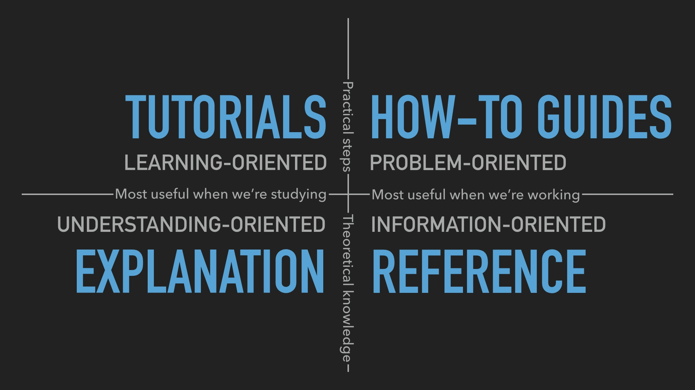

# 1 Algorithm
> 某一个数组中，存在一个众数(majority)的元素，也就是出现的数量大于 $\lfloor num / 2 \rfloor$，其中 $num$ 为数组的总数量。

如果采用排序法或者借助一个字典，完成该任务是绰绰有余的，但是如果要求时间复杂度为 $O(n)$, 空间复杂度为 $O(1)$ 呢？
[Boyer–Moore 众数投票算法](https://en.wikipedia.org/wiki/Boyer%E2%80%93Moore_majority_vote_algorithm) 是解决这个的问题很好的方法。何为众数呢？也就是说该数出现的次数比其他数出现的次数都要多，该算法基于上述的基本事实，采用排除的算法，一旦某个数出现的次数和其他数字一样多，那么它们都不可能都是众数。接下来看看该算法如何工作的：
维持一个候选众数 `m` 和计数器 `counter`，遍历整个数组，如果 `x==m`, 则计数器 `counter` 加 1 ；否则计数器 `counter` 减 1。一旦 `counter` 边为 `0`, 则将下一个数作为众数的候选者。如有必要，按照筛选出来的众数的后选择，再一次遍历数组，确认该数为该数组的众数。
```go
func majority(nums []int) int {
    m, counter := nums[0]; 1
    for i:=1; i < len(nums); i++ {
        if counter == 0 {
            m = nums[i]
        }else{
            if m == counter[i] {
                counter ++
            }else{
                counter --
            }
        }
    }
    return m
}
```
# 2 Review
[What nobody tells you about documentation](https://www.divio.com/blog/documentation/)

**关于文档你所不知道的事情**
为了更好地写出软件的文档，你需要了解下面的事实：
> 没有只有一种文档的总称，而是有四种

它们是基础教程（`tutorial`），指南（ `how-to guides`)，解释 (`explanation`)和技术参考（`technical reference`)。它们有四个不同的功能，也需要不同的方式来完成它们。理解它们才会让你的软件文档质量大大提高。

## 2.1 简介
你的软件好不好是不重要的，重要的是你的文档是否足够好，否则别人都不会使用你的软件。
尽管有可能他人别无选择只能使用你的没有好的文档的软件，但是它们肯定无法高效地使用它们。
几乎所有人都知道这些，也几乎所有人都知道需要好的文档，同时大部分人都在尝试创建好的文档，但是大部分人都失败了。
并非他们不努力，而是他们并不知道正确的方式。在本篇文章中，我将解释如何让你的文档变得更好，是通过正确地方式，而不是努力的方式。正确地方式是更简单的方式去撰写，更简单的去维护。
在编写文档中有一些简单的原则很少被人提及，好像是个秘密一样，但是他们不应该是秘密。
这些原则是可行的，它能够让你的文档，项目，产品或者团队变得越来越好。

## 2.2 秘密
文档应该被组织成下面四种形式：教程，指南，解释和技术参考。每一种方式都需要不同写作模式，使用软件的人在不同阶段需要使用不同种类的文档，所以软件需要它们。
文档需要被明确的结构化并且需要让他们之间区分开来。

**教程**
- 学习为导向
- 让新手开始行动起来
- 跟课程一下

类比：教一个小朋友如何烹饪

**指南**
- 目标为导向
- 展示如何解决特定的问题
- 一些列步骤

类比：烹饪书中的菜谱

**解释**
- 理解为导向
- 解释
- 提供背景和上下文语境

类比：一篇烹饪社交历史的文章

**参考**
- 信息为导向
- 描述机制
- 准确而又全面

类比：一个百科全书文档的参考

这个划分让作者和读者都知道需要什么信息。它告诉作者如何去写，去写什么和在哪里开始写。它将作者从花费大量时间在重复着那些信息中解救出来，因为每一种文档都有他们自己的唯一的工作。
事实上，如果一个文档不是这四种中的一个，那么它将会是非常难以维护的。所以这个需要每一个和其他的文档都要不同，任何维护那些混杂的文档都非常难以维护，就好像同事往不同的方向拉，肯定没有效果。
一旦你理解了这个结构，它是帮助你分析一篇文档的有力的工具，并且理解如何提高它们。

**项目文档**
你可能会问：那些修改日志、共享策略和其他关于项目的信息属于哪个种类呢？答案是它们都不属于上述的四种，严格来讲是属于项目文档而不是软件的文档。
它们可以很简单的被保存下来和其他材料区分开来，只要你不混淆它们。
接下来，让我们解释下它们各自的关键功能。

## 2.3 教程
教程就是一堂课，它让读者通过一系列步骤手动完成一种项目。这个是你项目中需要的，用来想初学者展示它们可以完成一些东西。
它们完全是教学导向的，确切的说是它们是朝向学习如何做而不是学习什么具体的东西。
你现在就是一个老师，你对学生所做的全部都负责。在你的指导下，学生将会执行一些列操作来取得正确的结果。
结果和中间的操作都取决于你，但是决定要做什么是一项艰难的工作。结果应当是有意义的，但是对于一个完全的新手的是可行的。
想象一下教小孩子做饭的类比。
教小孩子做饭做什么不重要，重要的是让孩子发现乐趣，获得信心并且希望再一次尝试。
通过孩子做的事情，它让孩子学习到做饭、厨房是什么样子的，如何使用厨具以及出入何处食物。
因为使用软件就跟烹饪一下，这是个知识。但是这一个实用技能，而不是理论技能。当我们学习一个新的技艺或者技能的时候，我们都是通过做来学习。
通过完成教程，学习者就会里了解剩下的文档的信息，包括文档。
大部分软件都有非常差甚至是没有教程，教程就是让你的软件的学习者变成使用者。一个差的或者缺失的教程将会阻碍的你的项目获取更多的新的使用者。
好的教程非常难写，它们需要对初学者友好、更简单的学习、结果有意义并且非常健壮性。

**如何写好的教程**
- 让你的使用者在做中学

在最开始我们只能在做中学，跟我们学习说话和走路一样。
在软件的教程中，你的学习者需要做一些事情。他们需要做的事情需要包含大部分工具和操作，从简单的部分构建复杂的。

- 让用户行动开始起来

让你的初学者就跟小孩子走路第一步一样；也不要让他成为一个有经验的人一样，或者甚至这不是正确的方式。对于初学者的教程不是最佳实践的操作手册。
教程的意义在于让你的学习者开始旅程，而不是让他们到达目的地。

- 确保你的教程起作用

你所做的辅导工作就是激起你的初学者自信：在软件中，在教程中，在辅导中当然在他们的能力中都能达到被要求的目标。
有很多方法可以达到这个要求：友好的帮助，通过材料完成有逻辑的进度。但是最重要的是那些要求初学者必须要求做的工作。学习者需要看到那些你命令要求完成的内容。
如果初学者的行为导致了错误或者非预期的结果，那么你的教程就是失败的，尽管不是的错误。如果你他们在你身边，你能够拯救他们；但是如果他们只是在阅读你的文档却不能阻止发生，所以你必须要求提前阻止这些事情的发生。

- 确保用户能够立刻看到结果

每个初学者所做的应该取得一些理解，哪怕是很小的。如果你的学生需要做奇怪的并且难以理解的事情长达两页，并且也没有取得结果。那么这个教程是太长了。每一个动作的效果应该可视化并且尽可能的验证，和操作的联系应该更加清晰。
结论就是你的教程的每一小节，或者教程的整体都应该是有意义的结果。

- 确保你的教程可重复性

你的教程一定要可依赖的重复性，这是个不容易达到的要求，人们可能使用不同的操作系统，不同级别的经验和工作。还有任何软件和资源都会在他们使用的时候发生改变。
教程应该对上述所有情况都符合，并且要求每一次。
因此教程不幸地是需要常规的和细节性的检查来确保仍然可行。

- 专注于具体的步骤，而不是抽象的概念

教程应该是具体的，构建在具体的、特定的操作和结果输出上。
介绍抽象的概念是非常具有诱惑性的，但是所有的学习流程都是从特定而具体想通用和抽象转换。在学生们没有机会掌握任何具体的内容之前要求掌握一定层次的抽象是一种错误的教学手段。

- 提供最少必要的解释
不要解释那些除了完成教程内容之外的全部东西。延伸讨论是重要的，但是不是教程。在教程中，这就是添堵和导致分心。只有最小的解释是可行的，将额外的解释的连接到文档的其他地方。

- 专注于那些用户需要掌握的步骤

你的教程应该专注于任务。尽管你介绍的命令还有其他选项，或者还有不同方式来访问特定的API，这些都不重要，至少现在你的学习者不需要知道这些。

## 2.4 指南
指南用来知道读者一步步来解决现实问题，它们是特定的步骤、指引来完成特定的结局。比如如何创建一个 web 表单；如何去绘制一个三维数据集；如何完成 LDAP 授权。
他们就是目标导向的。如果你喜欢类比，想想菜谱，它是为了准备特定能吃的食物。
菜谱是非常清晰的，定义也非常清楚。它表达了一个特定的问题，它假设了其他人已经掌握了基本的知识，只不过想要取得一些事情。
指南和教程非常不同，它解答了一些教程的学习者不会想到的问题。在写指南中，你可以假设读者已经知道基础知识和基础的工具。软件的指南也需要认真地完成，他们通常也非常容易去写。

**如何写指南**

- 提供一系列步骤

指南必须包含一系列步骤，而且按照特定的步骤。你不需要从零开始，仅仅是从一个可行的开始点即可。指南必须是可信赖的，但是不需要重复教程中的内容。

- 专注于结果

指南必须专注于特定的结果，其他的任何东西都是分心。而且在教程中，拓展的内容可以放在这里。

- 解决问题

指南必须以这样的形式开始
> 如何做....?

这是指南区别于教程的主要点：当涉及到指南的时候，读者应该被假设他们应该知道要取得什么，只不过不知道如何去做。在教程中，要取得什么结果都是由你来决定的。

- 别解释概念

指南不需要解释任何事情，这边需要讨论这些东西。他们会通过某种方式得到，如果解释非常重要，采用链接的方式。

- 允许一些灵活性

在做同一件事情上，指南可以有一些不同，它需要一些灵活性在不同的例子上的应用。

- 保留一些事情

操作可用性比完整性更加重要，教程必须是完整的，从端到端的完整性；但是指南不是，开始和结束的地方都是由你来决定的，也不需要提起在其他地方提到的相关的所有的事情。一个膨胀的指南并不能帮助使用者快速地得到解决方案。

- 规范命名
指南的的命名应当告诉用户它确切的所做的工作。比如 *如何创建类基础界面* 比 *创建类基础界面*要好。

## 2.5 参考
参考是机制的技术上的描述并且如何操作它。
参考只有一个工作目的：**描述**。他们是代码决定的，因为他们描述的对象：关键类，函数，API等等。同样他们也需要列出字段，属性，方法并且如何设置和使用它们。
参考应当是信息为导向。技术参考也可以通过例子来表示他们的使用。但是不要尝试去去解释基础的概念，或者是完成一些普通的任务。
参考材料应该是简单粗暴也很只戳痛点。
如果用烹饪来类比的话，就是原材料的百科全书的文章，描述它的来源、它的行为、它的化学组成和它应该如何被烹饪。
注意到描述包含了基础的描述：如何实例化一个特定的对象，调用特定的方法。比如在调用某个方法之前必须要注意那点。这些都是参考的内容，请注意这些不要和指南混淆起来，描述正确的使用软件（技术参考）和如何取得特定的结果（指南文档）是不同的。
对于一些开发者而言，参考文档是他们唯一能想到的文档。他们已经理解了软件，他们也知道如何使用它。他们能想象到的也是别人想象到的，这些必须要求在文档中。
参考文档应当好好写，当然他们也可以自动化生成。

**如何写出好的参考文档**
- 在代码周围编写文档
把参考文档也当做代码库的一部分，这样使用者在代码导航中也能查看文档。这可以帮助维护者查看是否存在部分代码缺少文档。
- 一致性
在参考文档中，结构、语调和格式都应当保持一致，就更百科全书字典一样完成。
- 仅仅是描述
参考文档仅仅是要描述即可，尽可能的完整和清晰。其他的任何东西（解释，讨论、说明、猜测和观点）都是分散注意的东西，而且增加维护的难度。如有可能使用例子来表达表述。
避免在参考文档中添加上如何取得一些东西，这个超出了软件的使用范围，将这些东西链接到指南和解释中。
- 准确
参考文档的描述必须准确而且实时更新。任何软件和你的描述之间的差异都是不可逆转的，导致的结果也是不可估量的。

## 2.6 解释
解释或者讨论都是用来澄清和描述特定的主题，它扩宽了文档所能覆盖的主题。
解释应当是理解为导向。解释等同于讨论，它为跳出软件，共更宽的角度来思考提供了机会。从更高的层次甚至不同的角度来思考问题。你可以想想这是在空闲期间阅读的问题文章，而不代码。
这一节的文档很少是显示地去创建，而且散落在其他的小节中。有时候这些小节是存在的，但是以这样的名字命令的：`背景` 或者 `其他` 标识出来。
解释并没有它看上去那样容易创建，从某一个问题开始讨论一个特定问题比从空白页开始讨论苦难多了。
讨论的主题也不是根据任务或者目标而确定的，这个取决于你想要讨论的内容来覆盖主题。

**如何写好代码解释**
- 提供上下文
解释在背景和上下文中，举例来说，对于一个 web 表单，在 `Django`, `Search` 和 `Djange CMS` 中都是如何处理的。他们也可以解释为什么这么设计，设计选择，历史原因，技术限制。
- 讨论选择和其他选项
解释可以包含其他选项，对于同样的问题，有不同种的方式来解决。比如在一篇`Django` 部署的文章中，这个可以比较不同的 web 服务器的选项
讨论甚至可以考虑和权衡相反的选项，比如测试模块是否放在同一个包目录下。
- 不要提供技术倾向性
解释应该做哪些其他文档不做的事情，在技术解释中，不要解释如何去做一件事。也或者提供技术描述

## 2.7 总结



# 3 Tip
- kibana 正则 `message:/.*_278570760/ AND "hot word train request id:"`, 使用 `/ /` 表示正则。
# 4 Share

