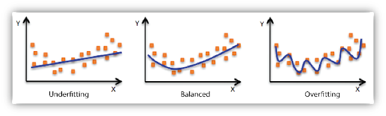
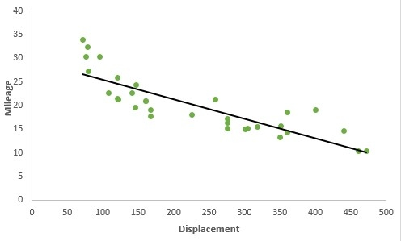
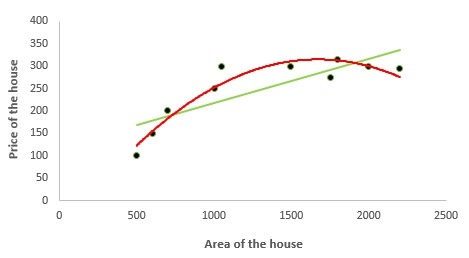
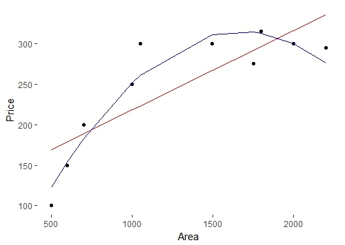
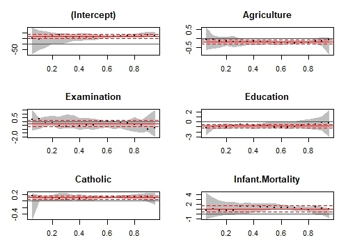
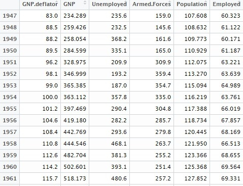
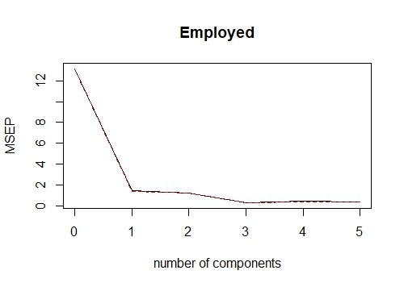
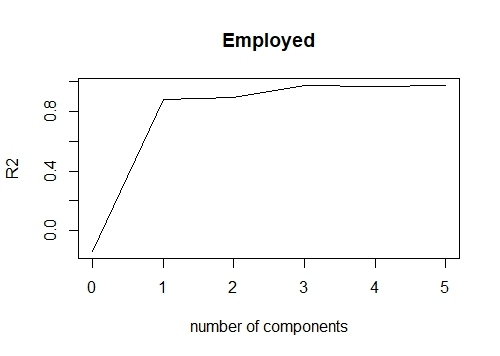

# 1 Algorithm
**递增三元组**
> 对于一个数组，如果索引 $i, j, k$ 满足 $i < j < k$ 和 $num[i] < num[j] < num[k]$, 那么表示该数组包含了一个递增三元组

## 1.1 大小划分
创建两个数组 `forward` 和 `backward`,  `forward[i]` 表示 `[0, i]` 区间最小值；`backward[i]` 表示区间 `[i, len-1]` 区间最大值。对于任意 `i`，如果满足 `forward[i] < nums[i] < backward[i]`  表示存在递增三元组。
```go
func increasingTriplet(nums []int) bool {
	if len(nums) < 3 {
		return false
	}
	forward, backward := make([]int, len(nums)), make([]int, len(nums))
	forward[0] = nums[0]
	for i:=1; i < len(nums); i++{
		if nums[i] < forward[i-1] {
			forward[i] = nums[i]
		}else{
			forward[i] = forward[i-1]
		}
	}
	backward[len(nums)-1] = nums[len(nums) - 1]
	for i := len(nums) - 2; i>=0; i-- {
		if nums[i] > backward[i+1] {
			backward[i] = nums[i]
		}else{
			backward[i] = backward[i+1]
		}
	}
	for i:=0; i < len(nums); i++{
		if forward[i] < nums[i] && nums[i] < backward[i] {
			return true
		}
	}
	return false
}
```

## 1.2  动态规划
使用 `dp[i]` 表示索引 `i` 位置最大递增数量，初始状态 `dp[i] = 1`， 递推公式:
`dp[i] = max(dp[j] + 1)`, 其中 `j<i` 而且 `nums[j] < num[i]`
```go
func increasingTriplet(nums []int) bool {
    if len(nums) < 3 {
        return false
    }
    dp := make([]int, len(nums))
    for i := 0; i < len(nums) ; i++ {
        dp[i] = 1
    }
    for i := 1; i < len(nums) ; i ++ {
        for j := i-1; j >=0; j-- {
            if nums[i] > nums[j] {
                if dp[j] + 1 > dp[i] {
                    dp[i] = dp[j] + 1
                }
            }
        }
    }
    for i := 0; i < len(dp); i ++ {
        if dp[i] >= 3 {
            return true
        }
    } 
    return false
}
```
# 2 Review
[15 TYPES OF REGRESSION YOU SHOULD KNOW](https://www.listendata.com/2018/03/regression-analysis.html)
**15 种你应该知道的回归方法**
回归分析是最流行的统计手段之一，一般用在模型预测和数据挖掘任务中。一般分析师知道 2-3 种在实际工作使用到的回归方法：线性回归和 `logistic` 回归。实际上针对不同的分析类型，有超出十几种回归算法，每一个都有自己的侧重点，所以每一个分析师应该知道根据不同的数据类型和分布选择不同的回归模型。
## 2.1 什么是回归分析
让我们举一个简单的例子：假设你的经理让你预测年度的销售额，几乎有上百个因素影响销售额。在这种情况下，销售额就是因变量 (`dependent variable`)，影响销售额的因素就是自变量(`independent variable`)，回归分析就能帮你解决这个问题。
> 简单来讲，回归分析用来为一个因变量和一个或者多个自变量之间的关系建模。

它可以帮助我们回答下面的问题：
- 哪些因素对销售额有显著的影响？
- 哪一个因素的影响最重要？
- 因素之间是如何相互影响的？
- 那么明年的销售额是多少？

## 2.2 回归的相关术语
### 2.2.1 离群值(`Outlier`)
假设数据集中的有些观测值和其他观测值相比非常大或者非常小，它们不属于整体的数据，这些观测值就是离群值，简单来讲就是异常值。异常值是大问题，它往往阻碍我们得到正确的结果。
### 2.2.2 多相关性(`Multicollinearity`)
当这些应变量互相之间是高度相关的，就可以说这些变量是多相关性的。许多类型的回归技术都假设多相关性不应该出现在数据集中，因为这样会在变量重要性排名上导致问题，那么选择最重要的自变量的问题变得困难。
### 2.2.3 异方差(`Heteroscedasticity`)
当因变量的变化性和自变量的变化性范围不相等，那么就会导致异方差，举个例子：
> 当一个的收入增加，食物消费的变化性将会增加。一个穷人在食物上消费是个稳定的数，因为他只会购买便宜的事务；但是一个更加富裕的人可以偶尔买一些便宜的食物也会购买昂贵的事务。所以更高的收入带来了更高的食物消费的变化。

### 2.2.4 欠拟合和过拟合(`Underfitting` & `Overfitting`)
当我们使用没必要的的解释变量，可能会导致过拟合。过拟合也就意味着我们的算法在训练集上表现得很好，但是在测试集上表现很差。这也就是所说的高方差。
当我们的算法表现地非常糟糕，甚至在训练数据集合上也不能工作，我们说这个数据是欠拟合的。这也是所说的高偏差。
在下面的示意图，我们可以看到用线性回归匹配（在图1的直线）对数据集是欠拟合的，它会导致在训练集上更大的误差；使用多项式回归匹配（如图2）对训练集和测试集都表现的很好；但是在图3中，我们模拟的回归在训练集上更小的误差但是在测试集上并不完美。

## 2.3 回归的类型
每一个回归方法在我们分析之前都需要附属上一些假设，区别在于自变量和因变量的分布方式。
### 2.3.1 线性回归
这是最简单的回归形式，它的自变量和因变量都是连续的。这种回归假设因变量和自变量的关系是线性的。我们可以看到下面的绘图展示了汽车发动机的消耗和里程之间的关系是线性的，绿色的点是真实观测值而黑色的线是就是线性回归值。

> 当你有 1 个自变量和 1 个因变量，那么就叫做简单线性回归；
> 当你有超过 1 个自变量和 1 个因变量，那么久叫做多元线性回归。

多元线性回归等式如下所示：
$$y =  \beta_1 + \beta_2X_2 + \beta_3X_3 + \ldots + \beta_kX_k + \epsilon$$
在这里 $y$ 就是要估计的因变量值，$X$ 是自变量, $\epsilon$ 是误差项。$\beta_i$就是回归的系数。
**线性回归包含如下假设**
1. 自变量和因变量必须是线性相关的；
2. 不能有离群值；
3. 不能有异方差；
4. 观测样本必须相互独立；
5. 误差项必须正态分布而且平均值为 0 方差为常数；
6. 不能有多相关性和自关联；

**参数估计**
为了得到预估参数也就是回归参数，我们使用最小二乘法则来达到误差项的平方和最小。
$$Min \sum \epsilon^2 = Min \sum(y - (\beta_1 + \beta_2X_2 + \ldots + \beta_kX_k))^2$$
为了得到上述方程的解，我们可以通过下述等式得到系数：
$$\hat{\beta} = (X^{'}X)^{-1}X^{'}y$$

**回归系数解释**
我们以下面例子来讲，因变量是学生的成绩，自变量是学生学习的时间（小时）和参加课程的数量。假设我们得到的线性回归如下：
> 成绩 =  5 + 2 （学习的时间） +  0.5 （课程的数量）

在这里我们得到的回归系数是 2 和 0.5， 它们可以这样解释
1. 如果学生的学习时间和学习课程数量都是 0， 那么他将得到 5 分；
2. 保持在课程数量不变，如果学生每在学习时间上增加一个小时，他将会多得到 2 分；
3. 同样的如果保持学习时间不变，如果学生没增加一个学习课程，他将会多得到 0.5 分；

**使用 R 完成线性回归**
我们用 R语言使用 `swiss` 数据集来展示线性回归。使用基础库中的 `lm()` 函数，我们尝试估计影响繁殖能力的因素
```r
library(datasets)
model = lm(Fertility ~ .,data = swiss)
lm_coeff = model$coefficients
lm_coeff
summary(model)
```
我们将得到结果
```
     (Intercept)      Agriculture      Examination        Education         Catholic 
      66.9151817       -0.1721140       -0.2580082       -0.8709401        0.1041153 
Infant.Mortality 
       1.0770481 
> summary(model)

Call:
lm(formula = Fertility ~ ., data = swiss)

Residuals:
     Min       1Q   Median       3Q      Max 
-15.2743  -5.2617   0.5032   4.1198  15.3213 

Coefficients:
                 Estimate Std. Error t value Pr(>|t|)    
(Intercept)      66.91518   10.70604   6.250 1.91e-07 ***
Agriculture      -0.17211    0.07030  -2.448  0.01873 *  
Examination      -0.25801    0.25388  -1.016  0.31546    
Education        -0.87094    0.18303  -4.758 2.43e-05 ***
Catholic          0.10412    0.03526   2.953  0.00519 ** 
Infant.Mortality  1.07705    0.38172   2.822  0.00734 ** 
---
Signif. codes:  0 ‘***’ 0.001 ‘**’ 0.01 ‘*’ 0.05 ‘.’ 0.1 ‘ ’ 1

Residual standard error: 7.165 on 41 degrees of freedom
Multiple R-squared:  0.7067, Adjusted R-squared:  0.671 
F-statistic: 19.76 on 5 and 41 DF,  p-value: 5.594e-10
```
因此我们得到大约 `70%` 的繁殖能力可以用线性回归解释。

### 2.3.2多项式回归
这是通过采用因变量的多项式函数来适应非线性方程。在下面的图中，我们可以看到红色的曲线比绿色的曲线更加适应数据。因此在这种情况下，自变量和因变量的关系似乎是非线性关系，非线性回归模型更加适应这种数据集。


因此为 `k` 的多项式回归可以写成下面的样子
$$y  = \beta_0+\beta_1X+\beta_2X^2 +\ldots+\beta_kX^k +\epsilon$$
在这里我们也可以创建新的变量
$$X_1=x, X_2=x^2, \ldots, X_k=x^k$$
这样我们就可以变得和线性回归方程一样。
同样我们也可以将 `X1` 和 `X2` 变量相乘得到新的第三个变量 `X3`
$$X_3 = X_1 \times X_2$$
**注意**：要注意创建无所谓的额外变量或者使用更高多项式度会导致过拟合。

**R中的多项式回归**
使用这个[数据](https://sites.google.com/site/breathe42/poly.csv?attredirects=0)来模拟多项式回归，在这里我们预估一下房屋的面积和价格之间的关系。
首先通过 `read.csv()` 读取数据，将它们划分为因变量和自变量
```r
data = read.csv("poly.csv")
x = data$Area 
y = data$Price
```
为了比较线性回归和多项式的结果，我们首先来适配线性回归
```r
model1 = lm(y ~x) 
model1$fit
model1$coeff
```
系数和预测值如下：
```
> model1$fit
       1        2        3        4        5        6        7        8        9       10 
169.0995 178.9081 188.7167 218.1424 223.0467 266.6949 291.7068 296.6111 316.2282 335.8454 
> model1$coeff
 (Intercept)            x 
120.05663769   0.09808581
```
现在我们闯将新的数据集，这里的新的变量是 `x` 和 `x` 的平方
```r
new_x = cbind(x,x^2)
model2 = lm(y~new_x) 
model2$fit
model2$coeff
```
适配后的值和多项式回归系数如下：
```
> model2$fit
       1        2        3        4        5        6        7        8        9       10 
122.5388 153.9997 182.6550 251.7872 260.8543 310.6514 314.1467 312.6928 299.8631 275.8110 
> model2$coeff
  (Intercept)        new_xx         new_x 
-7.684980e+01  4.689175e-01 -1.402805e-04 
```
使用 `ggplot2` ，我们尝试绘制出线性和多项式回归的比较曲线
```r
library(ggplot2) 
ggplot(data = data) + geom_point(aes(x = Area,y = Price)) +
geom_line(aes(x = Area,y = model1$fit),color = "red") +
geom_line(aes(x = Area,y = model2$fit),color = "blue") +
theme(panel.background = element_blank())
```


### 2.3.3 `logistic` 回归
在 `logistic` 回归中，因变量是二元变量（有两个类别）。自变量可以是连续的，也可以是二元的。在多项 `logistic` 回归中，因变量可以包含多个类别。
下面是模型
$$p=\frac{1}{1+e^{-(b_0+b_1X_1+b_2X_2+\ldots+b_kX_k)}}$$
**为什么不使用线性回归？**
- 违反了均齐变异性假设；
- 误差项不是正态分布；
- `y` 是二项分布因此是非常规形式；

**例子**
- HR分析：IT 公司会招募很多人，但是他们遇到的问题是接受 `offer` 的候选人不一定会加入。所以这个增加了运营成本，因为必须要重复整个流程。现在你有了这应用程序，你就可以预测这个候选人是否能够加入公司（二元输出：加入和不加入）
- 选举：假设你对政治候选人是否当选的影响因素感兴趣。输出结果变量是二元的，当选或者不当选。感兴趣的预测变量是竞选过程中花费的费用和时间。

通过 `logistic` 回归我们可以得到
$$P(Y=1) = \frac{exp(a+BX)}{1+exp(a+BX)}$$
因此截断概率 $p$ 可以这样说，如果 $P(Y_i=1) > p$我们可以说 $Y_i$ 属于类型 `1`否则属于类型 `0`。
**`logistic` 回归系数解释**
如果我们拿出指数的系数，我们可以得到解释变量的几率。假设几率等于 2，那么意思就是说时间发生的概率是不发生概率的 2 倍。假设自变量是客户的流失（客户是否结束和公司的关系）因变量是客户的国籍情况（国内/国外）。那么国外客户的流失概率是国内客户流失概率的三倍。
**使用R完成 `logitic` 回归**
在这两个例子中，我们尝试预估用户是否得癌症取决于他是否吸烟。首先我们使用 `glm()` 函数来进行 `logistic` 回归，然后设置 `family` 为二元变量。
```r
model <- glm(Lung.Cancer..Y.~Smoking..X.,data = data, family = "binomial")
```
通过 `model$fitted.values` 得到预测值
```
1         2         3         4         5         6         7         8         9 
0.4545455 0.4545455 0.6428571 0.6428571 0.4545455 0.4545455 0.4545455 0.4545455 0.6428571 
       10        11        12        13        14        15        16        17        18 
0.6428571 0.4545455 0.4545455 0.6428571 0.6428571 0.6428571 0.4545455 0.6428571 0.6428571 
       19        20        21        22        23        24        25 
0.6428571 0.4545455 0.6428571 0.6428571 0.4545455 0.6428571 0.6428571 
```
为了预测是否患有癌症，我们选择截断概率为 0.5
```r
data$prediction <- model$fitted.values>0.5
> data$prediction
 [1] FALSE FALSE  TRUE  TRUE FALSE FALSE FALSE FALSE  TRUE  TRUE FALSE FALSE  TRUE  TRUE  TRUE
[16] FALSE  TRUE  TRUE  TRUE FALSE  TRUE  TRUE FALSE  TRUE  TRUE
```
### 2.3.4 分位数回归
分位数回归是线性回归的扩展，当数据集中有异常值，偏态和异方差性的时候，我们通常会使用它。
在线性回归中，我们通过给定的自变量来预测因变量的平均值。但是平均值并不能描述整个分布，所以平均值的模型不能描述自变量和因变量之间的关系。所以我们可以通过分位数回归来预测给定的自变量的分位值。
**分位数回归的基础概念**
在分位数回归中，我们尝试通过给定的 `X` 的值来预估因变量的分位值，注意因变量必须是连续的。
**分位数回归模型**
对于第 `q` 个分位值，我们有如下的回归模型：
$$Y_i = X_i^{'}\beta + \epsilon$$
这个看上去和线性回归模型类似，下面是目标函数，我们希望得到最小值：
$$q\sum|\epsilon_i| + (1-q)\sum|\epsilon_i|$$
在这里 $q$ 就是第 $q$ 个分位。
如果 $q==0.5$，那么我们就是对中位值感兴趣，它就变成中位数回归（或者最小绝对值导数回归）。这时候我们的目标函数就会变成如下：
$$\sum|\epsilon_i|$$

**分位数回归系数解释**
假设对于 $25%$ 分位数回归公式如下
$$y = 5.2333 + 700.823x$$
它意味着对于 $x$ 每增加一个单位，增加 $25%$ 分位值的 700.823 个单位。
**分位数回归比线性回归的优势**
- 当数据集中包含异方差性时比较好，而且对异常值有鲁棒性；
- 自变量的的分布可以按照分位值；
- 当数据有倾向性的时候，比线性回归有用。

**在使用分位数回归注意点**
要注意我们在分位数回归中获得的系数应当和线性回归中的系数不一样，通常分位数回归的是在线性回归中是不适用的，但是这个可以通过观察回归系数的置信区间。

**R中实现分位数回归**
首先我们需要安装 `quantreg` 包来完成任务
```r
install.packages("quantreg") 
library(quantreg)
```
使用 `rq` 函数我们来预测 $25%$ 回归 `Swiss` 数据集中的生育率。首先我们设置 `tau=0.25`
```r
model1 = rq(Fertility~.,data = swiss,tau = 0.25) 
summary(model1)
tau: [1] 0.25
Coefficients:
                 coefficients lower bd upper bd
(Intercept)      76.63132      2.12518 93.99111
Agriculture      -0.18242     -0.44407  0.10603
Examination      -0.53411     -0.91580  0.63449
Education        -0.82689     -1.25865 -0.50734
Catholic          0.06116      0.00420  0.22848
```
然后我们设置 `tau=0.5`, 我们得到了中位数回归
```r
model2 = rq(Fertility~.,data = swiss,tau = 0.5)
summary(model2)
tau: [1] 0.5

Coefficients:
                 coefficients lower bd upper bd
(Intercept)      63.49087     38.04597 87.66320
Agriculture      -0.20222     -0.32091 -0.05780
Examination      -0.45678     -1.04305  0.34613
Education        -0.79138     -1.25182 -0.06436
Catholic          0.10385      0.01947  0.15534
Infant.Mortality  1.45550      0.87146  2.21101
```
我们也可以运行多个分位值回归在同一个绘图中
```r
model3 = rq(Fertility~.,data = swiss, tau = seq(0.05,0.95,by = 0.05)) 
quantplot = summary(model3)
quantplot
```
我们可检查一下我们的分位数回归结果是否和 `OLS` 不同
```r
plot(quantplot)
```
我们得到了下面的绘图


`X` 轴表示不同分位值，中间红色的实线表示 `OLS` 估计的系数值， 上下红色的虚线表示系数的置信区间。黑色的虚线表示分位数回归预计的系数，而灰色的区间的表示在不同的分位数的置信区间。我们可以看到在大部分分位值处，所有的变量在两个回归中都是重叠的。换句话说，我们希望重叠的部分越少越好，这样才能使用分位数回归。
### 2.3.5 岭回归
在跳转到岭回归之前，需要重点了解正则项的概念。
#### 2.3.5.1 正则项
正则项用来帮助我们解决过拟合的问题，它在训练集上表现很好，但是在验证集上表现很糟糕。正则项通过为目标函数增加一个惩罚项来控制模型的复杂度。
正则项在下面的情形非常有用
1. 变量多；
2. 观测项和变量值数据量比较低；
3. 高自相关性；

#### 2.3.5.2 L1 损失函数和 L1 正则化
在 `L1` 正则化中，我们尝试为最小化的目标函数增加所有系数的绝对值之和，这也是所说的最小绝对值导数方法。岭回归使用 `L1` 正则化。
#### 2.3.5.2 L2 损失函数和 L2 正则化
在 `L2` 正则化中，我们尝试为最小化目标函数增加所有系数的平方和。`Ridge` 回归和 `shrinkage` 回归使用 `L2` 正则项目。

> 通常情况下，`L2` 正则化 表现比 `L1` 正则化好，`L2` 正则化计算更有效率。在有一种情况下 `L1` 是更优的选择，`L1` 包含了从稀疏矩阵中进行特征选取的功能。 假设你将从超过 20000 个基因标注中来预测个人是否有脑肿瘤，总所周知，大部分基因对于疾病是由很少或者没有任何影响。

在线性回归中，目标函数是最小化误差平方和，在 岭回归中我们为平方和增加限制项。因此岭回归的目标函数是
$$
Min(\sum\epsilon^2 + \lambda\sum\beta^2) = Min\sum(y-(\beta_1+\beta_2X_2+\beta_3X_3+\ldots+\beta_kX_k))^2 + \lambda\sum\beta^2
$$
在这里 $\lambda$ 是正则项参数，这是一个非负值，同时我们也没有假设误差项的分布。
**重要点**
> 我们对于截断项没有进行正则化，限制项仅仅是回归系数的平方和

我们可以知道岭回归采用的是 `L2` 正则项。
解上述目标函数，我们得到了参数  $\beta$ 的估计值
$$\hat{\beta} = (X^{'}X+\lambda I)^{-1}X^{'}y$$
在这里 $I$ 是单位矩阵，用来进行矩阵计算。

**我们该如何选择正则项参数 $\lambda$ ?**
如果我们选择 $\lambda=0$，那我们回到了最小二乘回归。如果我们 $\lambda$ 选择非常大，这就会导致欠拟合。所以选择合适的 $\lambda$ 非常重要。为了解决这个问题，我们可以绘制不同的正则参数下的效果，当参数稳定的时候，选择最小的。

**R实现岭回归**
考虑 `swiss` 数据集，我们创建不同的数据集，其中一个包含自变量，另一个包含因变量。
```r
X = swiss[,-1]
y = swiss[, 1]
```
我们需要加载 `glmnet` 库来执行岭回归
```r
library(glmnet)
```
使用 `cv.glmnet` 函数我们可以做交叉验证。默认情况下 `alpha=0` 表示我们正在使用岭回归。$\lambda$ 是一系列数值，用来进行交叉验证。
```r
set.seed(123) #Setting the seed to get similar results.
model = cv.glmnet(as.matrix(X),y,alpha = 0,lambda = 10^seq(4,-1,-0.1))
```
通过 `lambda.min` 获得最小的 $\lambda$，因此使用 `predict` 函数得到回归系数
```r
best_lambda = model$lambda.min
ridge_coeff = predict(model,s = best_lambda,type = "coefficients")
```
`ridge_coeff` 就是使用岭回归得到的参数
```
6 x 1 sparse Matrix of class "dgCMatrix"
                           1
(Intercept)      64.92994664
Agriculture      -0.13619967
Examination      -0.31024840
Education        -0.75679979
Catholic          0.08978917
Infant.Mortality  1.09527837
```
### 2.3.6 `Lasso` 回归
`Lasso` 是 ` Least Absolute Shrinkage and Selection Operator` 的缩写，它在目标函数中使用 `L1` 正则项。因此目标函数为：
$$Min(\sum\epsilon^2 + \lambda\sum|\beta|) = Min\sum(y-(\beta_1+\beta_2X_2+\beta_3X_3+\ldots+\beta_kX_k))^2 + \lambda|\beta|$$
$\lambda$ 是正则项参数，截断项目没有被正则化，我们不假设误差项是正则分布的。我们这没有具体的数学公式，但是我们可以通过统计软件计算出来。
注意 `Lasson` 回归需要标准化。

**Lasso 回归比岭回归的优势**
`Lason` 回归可以在内置变量选择上有比较好的表现，但是使用岭回归可以得到全部变量，但是基本上都缩小参数。
**R代码实现Lasso 回归**
还是使用`swiss` 数据集，我们得到
```r
#Creating dependent and independent variables. 
X = swiss[,-1]
y = swiss[,1]
```

继续使用`cv.glmnet`函数来交叉验证，对于 `lasso` 回归，我们将$\alpha=1$，默认情况下 `standarize=TRUE`，因此我们不需要对变量进行标准化
```r
#Setting the seed for reproducibility 
set.seed(123)
model = cv.glmnet(as.matrix(X),y,alpha = 1,lambda = 10^seq(4,-1,-0.1))
#By default standardize = TRUE
```
我们通过 `lambda.min` 从模型中获取 `lambda`值的最小值，使用`predict`函数得到变量的系数。
```r
#Taking the best lambda 
best_lambda = model$lambda.min
lasso_coeff = predict(model,s = best_lambda,type = "coefficients")
lasso_coeff The lasso coefficients we got are:
6 x 1 sparse Matrix of class "dgCMatrix"
                           1
(Intercept)      65.46374579
Agriculture      -0.14994107
Examination      -0.24310141
Education        -0.83632674
Catholic          0.09913931
Infant.Mortality  1.07238898
```
**哪一个更好呢？**
岭回归和 `lasso` 回归都是处理多相关性的问题。岭回归对 `lasso` 回归计算更加有效率，任何一个都能表现很好，最佳方法是选择在测试集上表现更好的回归方法。
### 2.3.7 弹性网络回归
在处理高度相关的自变量的时候，弹性网络回归比岭回归和`lasso` 回归表现更好。因为它结合 `L1` 和 `L2` 正则。
它的目标函数是:
$$Min(\sum\epsilon^2 + \lambda_1\sum\beta^2+\lambda_2\sum|\beta|) = Min\sum(y-(\beta_+\beta_2X_2+\beta_3X_3+\ldots+\beta_kX_k))^2 +\lambda_1\sum\beta^2+\lambda_2\sum|\beta|$$
和岭回归和 `lasso` 回归一样，它不假设分布
**R 语言实现弹性网络回归**
从 `0` 到 `1` 设置不同的值，我们执行弹性网络回归
```r
set.seed(123) 
model = cv.glmnet(as.matrix(X),y,alpha = 0.5,lambda = 10^seq(4,-1,-0.1))
#Taking the best lambda
best_lambda = model$lambda.min
en_coeff = predict(model,s = best_lambda,type = "coefficients")
en_coeff
```
我们得到的系数如下：
```r
6 x 1 sparse Matrix of class "dgCMatrix"
                          1
(Intercept)      65.9826227
Agriculture      -0.1570948
Examination      -0.2581747
Education        -0.8400929
Catholic          0.0998702
Infant.Mortality  1.0775714
```
### 2.3.8 主成分回归
主成分技术被广泛使用在当你有很多有自变量或者数据集中包含了自相关性，它可以分为两步：
1. 获取主成分；
2. 对主成分运行回归分析；
主成分回归分析的主要特色有：
1. 数据降维；
2. 移除自相关性；

**获取主成分**
主成分分析是一个统计方法，用来从原先高度相关的变量中提取新的变量，我们提取的新的变量是不自相关的。
让我们开始考虑第一主成分：
$$U_1 = \beta_1X_1 + \beta_2X_2 + \ldots + \beta_pX_p \text{such that } \sum\beta2 = 1$$
第一主成分包含最大的方差。
相似的我们可以找到第二主成分，它和第一主成分是不相关的，它拥有第二大的方差。同样的方法对于 `p` 特征，我们有第 `p` 大的主成分，在这里所有的主成分都是不相关的。

**缺陷**
需要提出的是主成分回归不是特征选择方法而是特征提取方法，每一个主成分都是都是其余特征的组合函数。因此使用主成分无法解释哪一个因素影响因变量。

**R实现主成分回归**
我们使用R中的 `longley` 数据集，它是高度自相关的，我们使用年展开获取数据集
```r
data1 = longley[,colnames(longley) != "Year"]
```
我们的数据集中的观测值如下：

我们使用 `pls` 包来运行主成分回归
```r
install.packages("pls") 
library(pls)
```
在主成分回归中，我们尝试估计雇佣的人数， `scale=T` 表明我们标注化整个数据集；`validation=CV` 表明惊醒交叉验证。
```r
pcr_model <- pcr(Employed~., data = data1, scale = TRUE, validation = "CV") 
summary(pcr_model)
```
我们得到的结果如下：
```
Data:  X dimension: 16 5 
 Y dimension: 16 1
Fit method: svdpc
Number of components considered: 5

VALIDATION: RMSEP
Cross-validated using 10 random segments.
       (Intercept)  1 comps  2 comps  3 comps  4 comps  5 comps
CV           3.627    1.194    1.118   0.5555   0.6514   0.5954
adjCV        3.627    1.186    1.111   0.5489   0.6381   0.5819

TRAINING: % variance explained
          1 comps  2 comps  3 comps  4 comps  5 comps
X           72.19    95.70    99.68    99.98   100.00
Employed    90.42    91.89    98.32    98.33    98.74
```
这里 `RMSEP `表明是误差平方和根；而 `Training: %variance explained` 表明是多少方差已经被主成分解析。我们可以看到 $99%$ 的方差被 3 个主成分共享的。
使用不同的主成分，我们绘制出不同的误差平方平均值。
```r
validationplot(pcr_model,val.type = "MSEP")
```

通过设置 `val.type="R2"`，我们可以绘制不同的主成分时候的 R 平方值。
```r
validationplot(pcr_model,val.type = "R2")
```

如果我们向需要使用 3 个主成分来完成主成分回归，我们使用`predict`函数得到预测函数。
```r
pred = predict(pcr_model,data1,ncomp = 3)
```
### 2.3.9 偏最小二乘回归
当你的自变量高度自相关，可以选择偏最小二乘回归来代替主成分回归。当自变量的数量特别多，也可以考虑偏最小二乘。
**偏最小二乘和主成分分析区别**
两种技术都是创建叫做成分新的自变量，它们是原先预测变量的组合，但是主成分回归的是预测变量的主成分，没有考虑的相应变量；而偏最小二乘应变量考虑进去。因此它的模型对于包含更少的成分自变量更加有效。
**R中偏最小二乘回归**
```r
library(plsdepot)
data(vehicles)
pls.model = plsreg1(vehicles[, c(1:12,14:16)], vehicles[, 13], comps = 3)
# R-Square
pls.model$R2
```
### 2.3.10 支持向量回归
支持向量回归能解决线性和非线性回归模型，`SVM` 使用非线性核函数对非线性模型找到最优的解决方案。
支持向量回归的主要思想是最小化误差，在每个超平面上最大化间隔。
```r
library(e1071)
svr.model <- svm(Y ~ X , data)
pred <- predict(svr.model, data)
points(data$X, pred, col = "red", pch=4)
```
### 2.3.11 有序回归
有序回归用来预测排名值，简单的来说，这类回归模型对于因边量是有序的比较适应。比如对于调查的结果（1 到 6 级别），病人对于药剂量的反应（无，中度和激烈）
**在处理有序目标变脸的时候，为什么不能使用线性回归**
在线性回归中，假设因变量变化的范围和自变量的范围是等同的。举例来说，100 kg 的人的体重和 120 kg 的人的差距和 150 kg 的人和 170 kg 之间的差距是相同的。但是在有序变量中，这中关系是不存在的。
```r
library(ordinal)
o.model <- clm(rating ~ ., data = wine)
summary(o.model)
```
### 2.3.12 泊松回归
泊松回归用在当因变量是可数值的时候。
泊松分布主要用在下面场景：
1. 客服针对某种产品的反馈电话数量；
2. 某个活动期间预测紧急电话拨打数量；

自变量必须要满足如下条件：
1. 自变量必须满足泊松分布；
2. 数量不能是负数；
3. 这个方法不适合全部自然数集合；

下面的代码，我们使用`wrapbreak`数据集合，它表示了在织布期间，布断开的次数。在这种情况下，这个模型包含了丝绸的类型，丝绸的韧性和两者的相互叠加效果。
```r
pos.model<-glm(breaks~wool*tension, data = warpbreaks, family=poisson)
summary(pos.model)
```
### 2.3.13 负二项式回归
和泊松回归一样，用来处理可数数据。那么问题来了，它和泊松分布有什么区别。答案是负二项式分布不假设数据的分布中平均值和方差相等， 因为泊松回归假设数据的方差和平均值相等。
> 当数据的方差大于数据平均值，这种情况叫做 `过分散`；相反的是的情况叫做 `欠分散`；

```r
library(MASS)
nb.model <- glm.nb(Days ~ Sex/(Age + Eth*Lrn), data = quine)
summary(nb.model)
```
### 2.3.14 Quasi 泊松回归
它是负二项式分布的另外的一种选择，它同样也可以用在过分散的可数数据中。两个算法给出的结果是相同的，不懂点在于估计协变量的影响。`quassi` 泊松模型方差的模型是平均值的线性函数而负二项式回归方差的模式是平均值的二次函数。
```r
qs.pos.model <- glm(Days ~ Sex/(Age + Eth*Lrn), data = quine,  family = "quasipoisson")
```
`Quassi` 泊松回归可以解决过分散和欠分散的情况。
### 2.3.15 比例风险回归
比例风险回顾适用于时间-事件的数据，比如下面的例子：
1. 客户开户到销户的时间；
2. 癌症治疗到死亡；
3. 第一次心脏病发作到第二次时间；

> `logistic` 回归使用二元因变量但是忽略了事件的时间。

和预测到特定的时间的预估，幸存分析可以用来比较不同的组之间的事件的时间。
在生存模型中有两个目标：
1. 连续变量代表了事件发生的时间；
2. 二元变量代表状态表示事件是否发生
```r
ibrary(survival)
# Lung Cancer Data
# status: 2=death
lung$SurvObj <- with(lung, Surv(time, status == 2))
cox.reg <- coxph(SurvObj ~ age + sex + ph.karno + wt.loss, data =  lung)
cox.reg
```
## 2.4 如何正确地选择模型
1. 如果因变量是连续的而且模型有自相关的问题或者许多自变量，那么你可以尝试 `主成分回归`， `偏最小二乘`, `岭回归`, `lasso` 和 `弹性网络回归`。你可以基于模型最后的`适应性 R-square` , `RSME`， `AIC` 和 `BIC` 确定最好的模型；
2. 如果你是在离散型数据上，你可以尝试 `泊松`， `quasi 泊松`和 `负二项式回归`；
3. 为了避免过拟合，你可以使用交叉验证方法来评估使用的模型。你也可以使用 `岭回归`，`lasso` 回归和 `弹性网络回归`来纠正过拟合问题；
4. 当你需要非线性模型，尝试使用 `支持向量回归` 。

## 2.5 参考
**译者注**
1. [Liner Regression](https://en.wikipedia.org/wiki/Linear_regression)
2. [Polynomial Regression](https://en.wikipedia.org/wiki/Polynomial_regression)
3. [Logistic Regression](https://en.wikipedia.org/wiki/Logistic_regression)
4. [Quantile Regression](https://en.wikipedia.org/wiki/Quantile_regression)
5. [Ridge Regression](https://en.wikipedia.org/wiki/Tikhonov_regularization)
6. [Lasso Regression](https://en.wikipedia.org/wiki/Lasso_(statistics))
7. [Elastic Net Regression](https://en.wikipedia.org/wiki/Elastic_net_regularization)
8. [Principal Component Regression](https://en.wikipedia.org/wiki/Principal_component_regression)
9. [Partial Least Square Regression](https://en.wikipedia.org/wiki/Partial_least_squares_regression)
10. [Suport Vector Regression](https://www.saedsayad.com/support_vector_machine_reg.htm)
11. [Ordianl Regression](https://en.wikipedia.org/wiki/Ordinal_regression)
12. [Poisson Regression](https://en.wikipedia.org/wiki/Poisson_regression)
13. [Negative Binomial Regression](https://ncss-wpengine.netdna-ssl.com/wp-content/themes/ncss/pdf/Procedures/NCSS/Negative_Binomial_Regression.pdf)
14. [Quasi-Poisson Regression](https://www.hindawi.com/journals/ddns/2014/489052/)
15. [Cox Regression](https://en.wikipedia.org/wiki/Proportional_hazards_model)

# 3 Tips
## 3.1 Linux下创建新任务
- fork: 复制当前进程
- exec: 使用新的可执行映像覆盖当前可执行映像
- clone: 创建子进程并且制定位置 （通过 `flag` 可以指定是否共享内存、信号量、文件系统，类似线程）

## 3.2 信号量和锁
- 互斥量（mutex）和 二元信号量（binary  Semaphore) 类似，但是信号量可以被任意线程获取和释放，互斥量只能由获取的线程释放；
- 条件变量（condition variable）可以被多个线程唤醒，也可以唤醒多个线程；

## 3.3 Golang 反汇编
`go tool objdump -s "search_pattern" <binary_file>"`

## 3.4 git pull
如果想要远端的分支覆盖本地的分支
```shell
git fetch --all
git reset --hard origin/<branch-name>
```

# 4 Share
对于媒体型的应用，尽量避免浏览那些推荐的内容，因为后面的机器学习算法对你的兴趣爱好建模，推送给符合你观点的内容。你将会得不到其他不同的观点，长此以往，那么你的世界观会变得狭隘。
和人相处也是同样的情况，你的长期好朋友也是和你观点相同的人，他们会强化你的观点。尝试去不同的相处，留心生活中违背你看法的事情，或许这能帮你打开另外一扇门。