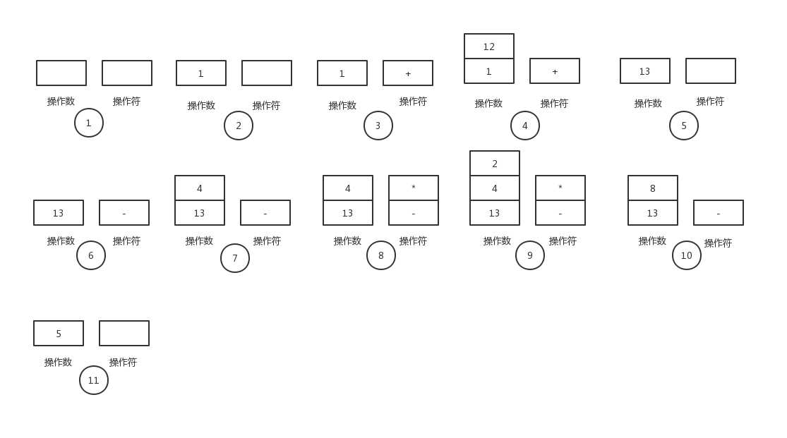
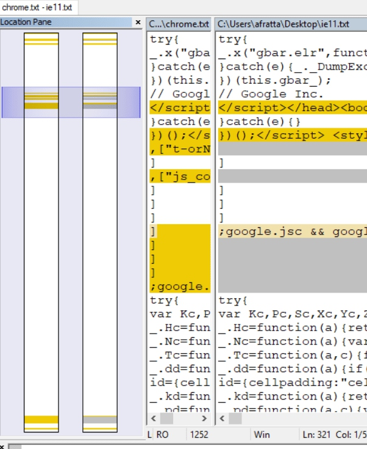

# 1 Algorithm 
> 输入一个字符串，包含了 `+`, `-`, `*`, `/` 和非负整数，请输出该计算表达式的值。
> 例如： `1 + 12 - 4 * 2`，输出的结果就是 `5`。

算法要求我们编写一个类似计算器的函数，输入为表达式计算，输出为表达式的值。如果写过编译器，这个问题不难，只要构建出一个抽象语法树（`AST, Abstract Syntax Tree`) 即可。

写个编译器有点小题大做，可以借助栈结构完成同样的目的。创建两个栈，分别存放操作数(` operand `)和操作符(` operator `)，当待入栈的操作符优先级比栈顶操作符优先级小，则将栈顶操作符出栈，并且从操作数栈出栈相应的操作数并进行计算，将计算结果重新入栈，如此迭代直到操作符为空，操作符栈顶元素就是表达式最终结果。

```go
func calculator(s string) int {
	operandStack := NewStack()
	operatorStack := NewStack()
	lexer := NewLexer(s)
	operations := map[string]func(int, int) int{
		"+": func(a, b int) int { return a + b },
		"-": func(a, b int) int { return a - b },
		"*": func(a, b int) int { return a * b },
		"/": func(a, b int) int { return a / b },
	}
	precedences := map[string]map[string]bool{
		"+": {"+": false, "-": false, "*": false, "/": false},
		"-": {"+": false, "-": false, "*": false, "/": false},
		"*": {"+": true, "-": true, "*": false, "/": false},
		"/": {"+": true, "-": true, "*": false, "/": false},
	}
	for {
		token, literal := lexer.Next()
		if token == EOF {
			break
		}
		if token == NUMBER {
			number, _ := strconv.Atoi(literal)
			operandStack.Push(number)
		} else {
			for {
				if operatorStack.Empty() {
					operatorStack.Push(literal)
					break
				} else {
					top := operatorStack.Top().(string)
					if precedences[literal][top] == false {
						operand2 := operandStack.Pop().(int)
						operand1 := operandStack.Pop().(int)
						result := operations[top](operand1, operand2)
						operatorStack.Pop()
						operandStack.Push(result)
					} else {
						operatorStack.Push(literal)
						break
					}
				}
			}

		}
	}
	for !operatorStack.Empty() {
		operator := operatorStack.Pop().(string)
		operand2 := operandStack.Pop().(int)
		operand1 := operandStack.Pop().(int)
		result := operations[operator](operand1, operand2)
		operandStack.Push(result)
	}
	return operandStack.Top().(int)
}

type Token int

const (
	NUMBER Token = iota
	OPERATOR
	EOF
)

type Lexer struct {
	input   []byte
	pos     int
	readPos int
}

func NewLexer(expression string) *Lexer {
	return &Lexer{
		input:   []byte(expression),
		pos:     0,
		readPos: 0,
	}
}

func (l *Lexer) Next() (Token, string) {
	l.skipWhiteSpace()
	if l.pos == len(l.input) {
		return EOF, ""
	}
	if l.input[l.pos] == '+' || l.input[l.pos] == '-' || l.input[l.pos] == '*' || l.input[l.pos] == '/' {
		literal := string(l.input[l.pos : l.pos+1])
		l.pos++
		return OPERATOR, literal
	} else {
		return NUMBER, l.readNumber()
	}
}

func (l *Lexer) skipWhiteSpace() {
	for l.pos < len(l.input) && l.input[l.pos] == ' ' {
		l.pos++
	}
}

func (l *Lexer) readNumber() string {
	l.readPos = l.pos + 1
	for l.readPos < len(l.input) && isDigits(l.input[l.readPos]) {
		l.readPos++
	}
	literal := string(l.input[l.pos:l.readPos])
	l.pos = l.readPos
	return literal
}

func isDigits(ch byte) bool {
	return ch >= '0' && ch <= '9'
}

type Stack struct {
	elements []interface{}
	size     int
}

func NewStack() *Stack {
	return &Stack{
		elements: make([]interface{}, 0),
		size:     0,
	}
}

func (s *Stack) Push(v interface{}) {
	s.elements = append(s.elements, v)
	s.size++
}

func (s *Stack) Pop() interface{} {
	s.size--
	val := s.elements[s.size]
	s.elements = s.elements[:s.size]
	return val
}
func (s *Stack) Top() interface{} {
	return s.elements[s.size-1]
}

func (s *Stack) Empty() bool {
	return s.size == 0
}
```
辅助类 `Lexer` 用来解析输入字符串的 `Token`，对输入的字符串解析出操作符( `Operator` ) 和操作数( `Operand` )，分别放入相应的栈中。而 `precedences` 查询表判断当前待入栈的操作符与栈顶操作符的比较，如果为 `true`，则入栈，否则将栈顶操作符出栈并计算。在解析后全部的 `Token` 后，如果操作符栈不为空，仍然要依次退栈，计算出全部的结果，直到为空。
# 2 Review
[What happens when you type 'google.com' into a browser and press Enter?](https://dev.to/antonfrattaroli/what-happens-when-you-type-googlecom-into-a-browser-and-press-enter-39g8?utm_source=wanqu.co&utm_campaign=Wanqu+Daily&utm_medium=website)

**在浏览器中输入`google.com` 之后按下回车键，接下来会发生什么？**

至今我遇到的最喜欢的面试题目是：
> 当你在浏览器中输入 `google.com` 地址后，然后按下 `<Enter>` 键，接下来会发生什么？

有些人为了整个完整性，可以在这个问题上回答一整天。那么他们究竟讨论得有多深？在这篇文章中，我将会讨论这些，当我在现实面试中遇到这个提问，在面试官打断我之前，我足足讲了十几分钟。在面试结束后，我将在面试中没有包含的内容重新整理了一下。

*究竟发生了什么？*
浏览器首先分析输入，通常如果输入内容包含 `.com`，那么它不会认为这是搜索的内容。一旦它认为这是 `URL`，它就会检查它的 `scheme`，如果没有就在开头添加 `http://` 协议，由于你没有指定特定的 `HTTP` 协议就假定默认值，比如端口号选定 `80`, `GET` 方法和无验证授权等。
然后它就创建一个 `HTTP` 请求发送出去，对底层的网络知识还不是很自信但是如果要将的话就包含 `MAC` 地址，`TCP` 包传递，丢包处理等等。无论如何，都会进行 `google.com` DNS 查询操作。如果 `DNS` 服务并没有缓存这个域名，它将返回一系列 `IP` 地址，因为 `google.com` 并不是只有一个 `IP` 地址。我想浏览器会默认选择第一个地址，但是不是很清楚 `IP` 地址地域分布或者 `IP` 地址列表是如何收集的。
接下来 `HTTP` 请求从不同节点之间跳转直到 `google.com` IP 地址的负载均衡器。但是这个不会持续很长时间，`Google` 服务器会给出响应要求浏览器使用 `HTTPS` 协议，这个通过 `301` 响应码跳转。沿着原路返回到浏览器，浏览器改用 `HTTPS` 协议和默认 `443` 端口重新发送请求。这时候在浏览器和负载均衡器之间进行 `TLS` 握手。请求会告诉 `Google` 服务器它可以支持哪些 `TLS` 协议（`TLS 1.0 1.1 1.2`)，`Google` 服务器会响应具体的协议版本，之后请求就会使用 `TLS` 进行加密。
接下来是 `Google` 服务器将请求通过负载均衡器上的防火墙来判断这个是否为恶意请求，一旦通过防火墙验证，安全连接就会被中断（因为 `PCI-DSS`规定内部流量不需要进行加密），请求会被分配到它们 `CDS` 池中，`Google` 服务器端缓存的主页面会通过 `HTTP` 响应返回过去，响应可能会压缩处理。
浏览器会读取 `Google` 响应头，缓存响应头中缓存的策略制定的文件，然后响应体可能会被解压，这些都是由于 `Google` 极致的优化处理，比如最小化，预先渲染内容，内联 `CSS`，`Javascript` 和图片，这些都是用来减少请求网络带宽。但是一次请求可能引发一系列其他请求，在 `HTTP/2` 上都是并发执行的。在这些请求执行过程中，`Javascript` 代码将会被解析，这些操作是非阻塞的因为它们在标签上使用了延迟属性。
浏览器可能已经渲染好搜索框并且正在处理上面的工具栏，它将会花费一些额外的网络请求。我可能已经有一些 `cookie` 或者包含 `OAuth token` 的本地存储亦或者我正在使用 `Chrome` 浏览器它已经知道我是谁了。包含我授权的请求发送至它们的 `Google+ API`，以便告诉 `Google` 搜索页面应用程序我的信息。
还有一个请求会被发送，用来得到我的头像图片。此刻它们已经探测我是否在使用 `Chrome` 浏览器，如果不是它们会弹出一个提示框告诉我 `Chrome` 是如此地棒我应该使用它而不是其他的。
**还有什么显而易见的不同？**
- 查询 `DNS`


我们已经知道`google.com` 来自不同的 `IP` 地址，但是不知道是如何给出结果，不过看上去使用[轮询的方式](https://stackoverflow.com/questions/10257969/is-it-possible-that-one-domain-name-has-multiple-corresponding-ip-addresses)。

- 网络层次
在正式完整的答案中，你可能参考 `OSI` 模型，这个我了解这一块内容，但是跳过这一块，下面是网络层次图。
1. 应用层 -- 最初的逻辑请求
2. 表示层 - HTTP
3. 会话层 - TLS
4. 传输层 - TCP 
5. 网络层 - 包路由（IP）
6. 数据链接层 - 框 （可以看成包容器）
7. 物理 - 比特流

- 我漏了在 `TLS` 层在达成协议后交换证书；
- 网络不是擅长的领域。

**不带缓存用浏览器打开 `google.com` 地址**

- 我忘了主域名权威，它是状态码 `301`。
- 从 `HTTP` 到 `HTTPS` 转换是 `307` 内部跳转。
- 然后下载字体、`logo` 图片和我的头像，而不是调用 API。这也就意味着它将我的个人信息去全部加载到一个页面中然后返回，所以在输入 `google.com` 的时候直接获取数据而不是从缓存中提取。

**响应**

上面的文件对比是在登出情况下 `IE11` 和 `Chrome` 浏览器的响应对比。
- 两者没有显著的区别，也就意味着 `user-agent` 探测在服务端而不客户端。这个我应该在回答中提一下。
- 出人意料的是 `Chrome` 响应体比 `IE11` 响应体大 `22kB`。我想是不是语音搜索功能导致的，因为这个显然在 `IE11` 上没有这个功能。`IE11` 可能需要填充物但是 `google` 广告是加密的。在这个问题上，我不想折磨太多。
- 尽管我在 `Chrome` 中已经清理了 `cookie`, 它仍然在首次请求发送汇总包含了`cookie`，这个在 `IE11` 中并没有这样做。

**渲染**


上图是 `Chrome` 浏览器第一次加载的截图。
- 在 `Javascript` 代码标签中并没有什么异步和延迟的属性，仅仅只有 `nonce` 属性。我研究了一下 `nonce` 好像和安全相关。我猜它们是阻塞的代码，我确信它们在某一点的时候包含异步或者延迟执行。
- 还有一点整个相应是 `Javascript`, `CSS` 和 `HTML` 的混合，它们并没有遵循任何规则或者分开加载。

**关于这个问题本身**
或许这个对于一个开发者而言，这个问题并不是最好的问题，因为包含了太多的网络知识。但是问题的形式比较喜欢，因为这是个开放式的，包含了很多的猜测。它给面试者比如这样的问题
> 你认为 `TLS` 是如何建立的？

这个问题可以观察面试者如何思考问题、是否有创造力还有他们限制。

那么你最喜欢的面试题目是什么？

# 3 Tips

**Linux 性能优化**

## 3.1 top 

top 命令可以查看当前系统状态。

```shell
$top
    top - 09:14:56 up 264 days, 20:56,  1 user,  load average: 0.02, 0.04, 0.00
    Tasks:  87 total,   1 running,  86 sleeping,   0 stopped,   0 zombie
    Cpu(s):  0.0%us,  0.2%sy,  0.0%ni, 99.7%id,  0.0%wa,  0.0%hi,  0.0%si,  0.2%st
    Mem:    377672k total,   322332k used,    55340k free,    32592k buffers
    Swap:   397308k total,    67192k used,   330116k free,    71900k cached
    PID USER      PR  NI  VIRT  RES  SHR S %CPU %MEM    TIME+  COMMAND
    1 root      20   0  2856  656  388 S  0.0  0.2   0:49.40 init
    2 root      20   0     0    0    0 S  0.0  0.0   0:00.00 kthreadd
    3 root      20   0     0    0    0 S  0.0  0.0   7:15.20 ksoftirqd/0
    4 root      RT   0     0    0    0 S  0.0  0.0   0:00.00 migration/
```

- 输入 `M`，进程列表按照内存使用大小排序
- 输入 `P`, 进程列表按照 `CPU` 使用大小排序

第三行显示系统的状态

- %id: 空闲 `CPU` 时间的百分比，如果这个值过低，系统瓶颈在 CPU；
- %wa: 等待 `I/O` 的 `CPU` 时间百分比，如果这个值过高，表示 `IO` 存在瓶颈。

## 3.2 free 

```shell
$free
             total       used       free     shared    buffers     cached
Mem:        501820     452028      49792      37064       5056     136732
-/+ buffers/cache:     310240     191580
Swap:            0          0          0
```

系统可用内存：`free` + `buffer` + `cached`

## 3.3 iostat

```shell
$ iostat -d -x -k 1 1
Device:         rrqm/s   wrqm/s     r/s     w/s    rkB/s    wkB/s avgrq-sz avgqu-sz   await  svctm  %util
sda               0.02     7.25    0.04    1.90     0.74    35.47    37.15     0.04   19.13   5.58   1.09
dm-0              0.00     0.00    0.04    3.05     0.28    12.18     8.07     0.65  209.01   1.11   0.34
dm-1              0.00     0.00    0.02    5.82     0.46    23.26     8.13     0.43   74.33   1.30   0.76
dm-2              0.00     0.00    0.00    0.01     0.00     0.02     8.00     0.00    5.41   3.28   0.00
```

- 如果%iowait的值过高，表示硬盘存在I/O瓶颈。
- 如果 %util 接近 100%，说明产生的I/O请求太多，I/O系统已经满负荷，该磁盘可能存在瓶颈。
- 如果 svctm 比较接近 await，说明 I/O 几乎没有等待时间；
- 如果 await 远大于 svctm，说明I/O 队列太长，io响应太慢，则需要进行必要优化。
- 如果avgqu-sz比较大，也表示有大量io在等待。

## 3.4 pstack

`pstack` 用来跟踪进程栈，输出当前执行的位置。

```shell
$pstack <pid>
#0  0x00000039958c5620 in __read_nocancel () from /lib64/libc.so.6
#1  0x000000000047dafe in rl_getc ()
#2  0x000000000047def6 in rl_read_key ()
#3  0x000000000046d0f5 in readline_internal_char ()
#4  0x000000000046d4e5 in readline ()
#5  0x00000000004213cf in ?? ()
#6  0x000000000041d685 in ?? ()
#7  0x000000000041e89e in ?? ()
#8  0x00000000004218dc in yyparse ()
#9  0x000000000041b507 in parse_command ()
#10 0x000000000041b5c6 in read_command ()
#11 0x000000000041b74e in reader_loop ()
#12 0x000000000041b2aa in main ()
```

# 4 Share