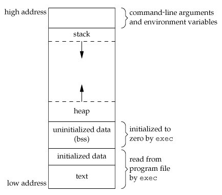

# 1 Algorithm
> 
> 一个数独的解法需遵循如下规则:
> 1:数字 1-9 在每一行只能出现一次。
2:数字 1-9 在每一列只能出现一次。
3:数字 1-9 在每一个以粗实线分隔的 3x3 宫内只能出现一次。

对于一个数独表格，总共有 $81(9 \times 9)$ 个表格，索引为 `0-80`，所以对于每一个索引位置对应的行、列和块索引分别为:
- `row = i / 9`
- `col = i % 9`
- `block = row / 3 * 3 + col / 3`

采用 `DFS` 方式没分别尝试各个空白位置，然后分别检查该位置是否满足数独的要求，如果无法满足，则进行回溯。
```go
func solveSudoku(board [][]byte) {
	rowUsed := make([][]bool, 9)
	for i := 0; i < 9; i++ {
		rowUsed[i] = make([]bool, 9)
	}
	colUsed := make([][]bool, 9)
	for i := 0; i < 9; i++ {
		colUsed[i] = make([]bool, 9)
	}
	blockUsed := make([][]bool, 9)
	for i := 0; i < 9; i++ {
		blockUsed[i] = make([]bool, 9)
	}
	for i := 0; i < 9; i++ {
		for j := 0; j < 9; j++ {
			if board[i][j] != '.' {
				val := int(board[i][j] - '1')
				rowUsed[i][val] = true
				colUsed[j][val] = true
				blockUsed[i/3*3+j/3][val] = true
			}
		}
	}
	dfs(board, 0, rowUsed, colUsed, blockUsed)
}

func dfs(board [][]byte, pos int, rowUsed, colUsed, blockUsed [][]bool) bool {
	if pos >= 81 {
		return true
	}
	row := pos / 9
	col := pos % 9
	block := row/3*3 + col/3
	if board[row][col] != '.' {
		return dfs(board, pos+1, rowUsed, colUsed, blockUsed)
	}
	for i := 1; i < 10; i++ {
		if rowUsed[row][i-1] || colUsed[col][i-1] || blockUsed[block][i-1] {
			continue
		}
		board[row][col] = byte(i + '0')
		rowUsed[row][i-1] = true
		colUsed[col][i-1] = true
		blockUsed[block][i-1] = true
		if dfs(board, pos+1, rowUsed, colUsed, blockUsed) {
			return true
		} else {
			rowUsed[row][i-1] = false
			colUsed[col][i-1] = false
			blockUsed[block][i-1] = false
			board[row][col] = '.'
		}
	}
	return false
}
```

# 2 Review 

[Hack The Virtual Memory: C strings & /proc](https://blog.holbertonschool.com/hack-the-virtual-memory-c-strings-proc/)

**虚拟内存初探：C string 和 /proc**

这是关于虚拟内存教程的系列文章的第一篇，主要目的是以一种不同的方式学习计算机科学的基础知识，并且更具有可操作性。
首先我们将会使用 `/proc` 来查找并修改运行的进程使用的虚拟内存包含的变量，然后通过这种方法学一些很酷的事情。

## 2.1 环境
所有的脚本和程序都在下面的系统中测试通过。
- Ubuntu 14.04 LTS
  - Linux ubuntu 4.4.0-31-generic #50~14.04.1-Ubuntu SMP Wed Jul 13 01:07:32 UTC 2016 x86_64 x86_64 x86_64 GNU/Linux
- gcc
  - gcc (Ubuntu 4.8.4-2ubuntu1~14.04.3) 4.8.4
- Python 3:
  - Python 3.4.3 (default, Nov 17 2016, 01:08:31)
  - [GCC 4.8.4] on linux
## 2.2 背景
为了充分理解本文，你需要知道如下：

- C 语言基础知识
- Python 基础知识
- Linux 文件系统和 Shell 命令基础知识

## 2.3 虚拟内存
在计算机中， 虚拟内存是一种由硬件和软件共同完成的内存管理技术。它将程序使用的内存，也就是内存虚拟地址，映射到计算机内存的物理地址。主存（被程序或者任务所使用）是作为一个连续的地址空间，或者连续 `segment` 的集合。操作系统会管理这些虚拟内存地址，并且将真实的内存分配个虚拟内存。CPU 中地址翻译的硬件经常被叫做内存管理单元（MMU，Memory Management Unit)，它能够自动将虚拟地址翻译成物理地址，所以现代计算机软件能够使用超出真实内存所提供的实际内存的能力。
借助分页的技术，完成虚拟内存的好处可以让应用程序从管理共享内存中解脱出来，通过内存隔离增加了安全性，并且增加的概念的理解简单性。
管理虚拟内存更多的内容，可以查看 [wikipedia](https://en.wikipedia.org/wiki/Virtual_memory)。在下一章中，我们将会查看虚拟内存背后更多的信息，现在你需要知道如下关键信息：
- 每一个进程都有自己的虚拟内存
- 虚拟内存你的大小取决于你的系统架构
- 每一个操作系统处理虚拟内存是不同的，不过目前大部分现代操作系统的虚拟内存看上去是这样的


在内存的高地址主要有：
- 命令行参数和环境变量
- 栈向下生长，这看上去反直觉，但是这就是栈在虚拟内存中的实现

在内存低地址主要有：
- 可执行文件（这个有点复杂，但是理解这边文章剩下的内容足够了）
- 堆，向上增长

堆是栈的一部分并且是动态分配的（比如使用 `malloc` 获取分配内存）。所以要记住虚拟内存和 `RAM` 是不同的。

## 2.4 C 程序

让我们开始简单的 C 程序

```c
#include <stdlib.h>
#include <stdio.h>
#include <string.h>

/**
 * main - uses strdup to create a new string, and prints the
 * address of the new duplcated string
 *
 * Return: EXIT_FAILURE if malloc failed. Otherwise EXIT_SUCCESS
 */
int main(void)
{
    char *s;

    s = strdup("Holberton");
    if (s == NULL)
    {
        fprintf(stderr, "Can't allocate mem with malloc\n");
        return (EXIT_FAILURE);
    }
    printf("%p\n", (void *)s);
    return (EXIT_SUCCESS);
}
```

*strdup*
仔细想一想，你是怎么认为 `strdup` 创建了 `Holberton` 字符串的拷贝？如何去确认这一点？
`strdup` 需要创建新的字符串，首先它需要为它分配足够的空间，所以函数 `strdup` 可能使用 `malloc` 函数。快速通 `man` 手册查看这个函数。

```shell
DESCRIPTION
       The  strdup()  function returns a pointer to a new string which is a duplicate of the string s.
       Memory for the new string is obtained with malloc(3), and can be freed with free(3).
```
在仔细想一下，根据我们之前关于虚拟内存的讨论，你认为重复的字符串分配在哪呢？高地址还是低地址？
可能是低地址（分配在堆中），让我们编译一下程序并且运行我们的程序来测试我们的假设。

```shell
julien@holberton:~/holberton/w/hackthevm0$ gcc -Wall -Wextra -pedantic -Werror main.c -o holberton
julien@holberton:~/holberton/w/hackthevm0$ ./holberton 
0x1822010
julien@holberton:~/holberton/w/hackthevm0$ 
```
我们的重复的字符串分配的地址是 `0x18222010`，那么这个是内存中高地址还是低地址？


## 2.5 虚拟内存地址有多大
虚拟内存的大小取决你系统的架构，在这个例子中，我使用 64 位操作系统，所以理论上讲，每个程序的虚拟内存都是 $2^{64}$ 字节，也就是说内存的最高地址为 `0xffffffffffffffff`，低地址为 `0x00`。`0x18222010` 地址和 `0xffffffffffffffff` 比起来小，所以重复的字符串被分配在低的内存地址，这个我们在查看 `/proc` 的时候确认这个结论。

## 2.6 `proc` 文件系统
在 `man` 手册上，`proc` 是这样的
```shell
The proc filesystem is a pseudo-filesystem which provides an interface to kernel data structures.  It is commonly mounted at `/proc`.  Most of it is read-only, but some files allow kernel variables to be changed.
```
如果你列出 `/proc` 目录下的内容，你将会看到很多文件，我们将会专注于其中的两个。

- `/proc/[pid]/mem`
- `proc/[pid]/maps`
  
### 2.6.1 `mem`
从 `man` 手册从中得知
```shell
      /proc/[pid]/mem
              This file can be used to access the pages of a process's memory
          through open(2), read(2), and lseek(2).
```
所以我们能够访问和修改任何进程的全部虚拟内存？ 

### 2.6.2 `maps`
`man` 手册中是这样说的
```shell
 /proc/[pid]/maps
              A  file containing the currently mapped memory regions and their access permissions.
          See mmap(2) for some further information about memory mappings.

              The format of the file is:

       address           perms offset  dev   inode       pathname
       00400000-00452000 r-xp 00000000 08:02 173521      /usr/bin/dbus-daemon
       00651000-00652000 r--p 00051000 08:02 173521      /usr/bin/dbus-daemon
       00652000-00655000 rw-p 00052000 08:02 173521      /usr/bin/dbus-daemon
       00e03000-00e24000 rw-p 00000000 00:00 0           [heap]
       00e24000-011f7000 rw-p 00000000 00:00 0           [heap]
       ...
       35b1800000-35b1820000 r-xp 00000000 08:02 135522  /usr/lib64/ld-2.15.so
       35b1a1f000-35b1a20000 r--p 0001f000 08:02 135522  /usr/lib64/ld-2.15.so
       35b1a20000-35b1a21000 rw-p 00020000 08:02 135522  /usr/lib64/ld-2.15.so
       35b1a21000-35b1a22000 rw-p 00000000 00:00 0
       35b1c00000-35b1dac000 r-xp 00000000 08:02 135870  /usr/lib64/libc-2.15.so
       35b1dac000-35b1fac000 ---p 001ac000 08:02 135870  /usr/lib64/libc-2.15.so
       35b1fac000-35b1fb0000 r--p 001ac000 08:02 135870  /usr/lib64/libc-2.15.so
       35b1fb0000-35b1fb2000 rw-p 001b0000 08:02 135870  /usr/lib64/libc-2.15.so
       ...
       f2c6ff8c000-7f2c7078c000 rw-p 00000000 00:00 0    [stack:986]
       ...
       7fffb2c0d000-7fffb2c2e000 rw-p 00000000 00:00 0   [stack]
       7fffb2d48000-7fffb2d49000 r-xp 00000000 00:00 0   [vdso]

              The address field is the address space in the process that the mapping occupies.
          The perms field is a set of permissions:

                   r = read
                   w = write
                   x = execute
                   s = shared
                   p = private (copy on write)

              The offset field is the offset into the file/whatever;
          dev is the device (major:minor); inode is the inode on that device.   0  indicates
              that no inode is associated with the memory region,
          as would be the case with BSS (uninitialized data).

              The  pathname field will usually be the file that is backing the mapping.
          For ELF files, you can easily coordinate with the offset field
              by looking at the Offset field in the ELF program headers (readelf -l).

              There are additional helpful pseudo-paths:

                   [stack]
                          The initial process's (also known as the main thread's) stack.

                   [stack:<tid>] (since Linux 3.4)
                          A thread's stack (where the <tid> is a thread ID).
              It corresponds to the /proc/[pid]/task/[tid]/ path.

                   [vdso] The virtual dynamically linked shared object.

                   [heap] The process's heap.

              If the pathname field is blank, this is an anonymous mapping as obtained via the mmap(2) function.
          There is no easy  way  to  coordinate
              this back to a process's source, short of running it through gdb(1), strace(1), or similar.

              Under Linux 2.0 there is no field giving pathname.
```
这也就意味着我们查看 `/proc/[pid]/mem` 文件看定位运行进程的堆位置，如果我们可以从堆中读，我们可以定位我们想要修改的字符串；如果我们可以写堆，那么我们想要任何东西来替换这个字符串。

### 2.6.3 pid
进程是程序的实例，包含一个独一无二的进程 ID, 很多函数和系统调用使用这个进程 ID 来操作进程，我们可以使用 `ps` 命令来获取运行进程的 `PID`。

## 2.7 C 程序

现在我们需要编写一个脚本或者程序来找到运行进程堆中找到那个要替换的字符串，现在需要对刚刚的简单程序做一点修改让它无限循环打印重复的字符串。

```C
#include <stdlib.h>
#include <stdio.h>
#include <string.h>
#include <unistd.h>

/**              
 * main - uses strdup to create a new string, loops forever-ever
 *                
 * Return: EXIT_FAILURE if malloc failed. Other never returns
 */
int main(void)
{
     char *s;
     unsigned long int i;

     s = strdup("Holberton");
     if (s == NULL)
     {
          fprintf(stderr, "Can't allocate mem with malloc\n");
          return (EXIT_FAILURE);
     }
     i = 0;
     while (s)
     {
          printf("[%lu] %s (%p)\n", i, s, (void *)s);
          sleep(1);
          i++;
     }
     return (EXIT_SUCCESS);
}
```
编译和运行上述源代码应该输出无限循环的字符串，直到你杀掉这个进程

```shell
julien@holberton:~/holberton/w/hackthevm0$ gcc -Wall -Wextra -pedantic -Werror loop.c -o loop
julien@holberton:~/holberton/w/hackthevm0$ ./loop
[0] Holberton (0xfbd010)
[1] Holberton (0xfbd010)
[2] Holberton (0xfbd010)
[3] Holberton (0xfbd010)
[4] Holberton (0xfbd010)
[5] Holberton (0xfbd010)
[6] Holberton (0xfbd010)
[7] Holberton (0xfbd010)
...
```

**查看 /proc**
首先运行 `loop` 程序

```shell
julien@holberton:~/holberton/w/hackthevm0$ ./loop
[0] Holberton (0x10ff010)
[1] Holberton (0x10ff010)
[2] Holberton (0x10ff010)
[3] Holberton (0x10ff010)
...
```

首先查看这个进程的 `PID`。

```shell
julien@holberton:~/holberton/w/hackthevm0$ ps aux | grep ./loop | grep -v grep
julien     4618  0.0  0.0   4332   732 pts/14   S+   17:06   0:00 ./loop
```

在上述例子中，这个进程的 `PID` 为 `4618`，所以我们要查看的 `maps` 和 `mems` 文件位于 `/proc/4618` 目录下：

- `/proc/4618/maps`
- `/proc/4618/mem`

这个目录下主要有一下文件
```shell
julien@ubuntu:/proc/4618$ ls -la
total 0
dr-xr-xr-x   9 julien julien 0 Mar 15 17:07 .
dr-xr-xr-x 257 root   root   0 Mar 15 10:20 ..
dr-xr-xr-x   2 julien julien 0 Mar 15 17:11 attr
-rw-r--r--   1 julien julien 0 Mar 15 17:11 autogroup
-r--------   1 julien julien 0 Mar 15 17:11 auxv
-r--r--r--   1 julien julien 0 Mar 15 17:11 cgroup
--w-------   1 julien julien 0 Mar 15 17:11 clear_refs
-r--r--r--   1 julien julien 0 Mar 15 17:07 cmdline
-rw-r--r--   1 julien julien 0 Mar 15 17:11 comm
-rw-r--r--   1 julien julien 0 Mar 15 17:11 coredump_filter
-r--r--r--   1 julien julien 0 Mar 15 17:11 cpuset
lrwxrwxrwx   1 julien julien 0 Mar 15 17:11 cwd -> /home/julien/holberton/w/funwthevm
-r--------   1 julien julien 0 Mar 15 17:11 environ
lrwxrwxrwx   1 julien julien 0 Mar 15 17:11 exe -> /home/julien/holberton/w/funwthevm/loop
dr-x------   2 julien julien 0 Mar 15 17:07 fd
dr-x------   2 julien julien 0 Mar 15 17:11 fdinfo
-rw-r--r--   1 julien julien 0 Mar 15 17:11 gid_map
-r--------   1 julien julien 0 Mar 15 17:11 io
-r--r--r--   1 julien julien 0 Mar 15 17:11 limits
-rw-r--r--   1 julien julien 0 Mar 15 17:11 loginuid
dr-x------   2 julien julien 0 Mar 15 17:11 map_files
-r--r--r--   1 julien julien 0 Mar 15 17:11 maps
-rw-------   1 julien julien 0 Mar 15 17:11 mem
-r--r--r--   1 julien julien 0 Mar 15 17:11 mountinfo
-r--r--r--   1 julien julien 0 Mar 15 17:11 mounts
-r--------   1 julien julien 0 Mar 15 17:11 mountstats
dr-xr-xr-x   5 julien julien 0 Mar 15 17:11 net
dr-x--x--x   2 julien julien 0 Mar 15 17:11 ns
-r--r--r--   1 julien julien 0 Mar 15 17:11 numa_maps
-rw-r--r--   1 julien julien 0 Mar 15 17:11 oom_adj
-r--r--r--   1 julien julien 0 Mar 15 17:11 oom_score
-rw-r--r--   1 julien julien 0 Mar 15 17:11 oom_score_adj
-r--------   1 julien julien 0 Mar 15 17:11 pagemap
-r--------   1 julien julien 0 Mar 15 17:11 personality
-rw-r--r--   1 julien julien 0 Mar 15 17:11 projid_map
lrwxrwxrwx   1 julien julien 0 Mar 15 17:11 root -> /
-rw-r--r--   1 julien julien 0 Mar 15 17:11 sched
-r--r--r--   1 julien julien 0 Mar 15 17:11 schedstat
-r--r--r--   1 julien julien 0 Mar 15 17:11 sessionid
-rw-r--r--   1 julien julien 0 Mar 15 17:11 setgroups
-r--r--r--   1 julien julien 0 Mar 15 17:11 smaps
-r--------   1 julien julien 0 Mar 15 17:11 stack
-r--r--r--   1 julien julien 0 Mar 15 17:07 stat
-r--r--r--   1 julien julien 0 Mar 15 17:11 statm
-r--r--r--   1 julien julien 0 Mar 15 17:07 status
-r--------   1 julien julien 0 Mar 15 17:11 syscall
dr-xr-xr-x   3 julien julien 0 Mar 15 17:11 task
-r--r--r--   1 julien julien 0 Mar 15 17:11 timers
-rw-r--r--   1 julien julien 0 Mar 15 17:11 uid_map
-r--r--r--   1 julien julien 0 Mar 15 17:11 wchan
```

**/proc/pid/maps**

正如我们之前看到的，`/proc/pid/maps` 是文本文件，所以我们可以直接读取它。这个 `maps` 文件内容看上去是这样的的：
```shell
julien@ubuntu:/proc/4618$ cat maps
00400000-00401000 r-xp 00000000 08:01 1070052                            /home/julien/holberton/w/funwthevm/loop
00600000-00601000 r--p 00000000 08:01 1070052                            /home/julien/holberton/w/funwthevm/loop
00601000-00602000 rw-p 00001000 08:01 1070052                            /home/julien/holberton/w/funwthevm/loop
010ff000-01120000 rw-p 00000000 00:00 0                                  [heap]
7f144c052000-7f144c20c000 r-xp 00000000 08:01 136253                     /lib/x86_64-linux-gnu/libc-2.19.so
7f144c20c000-7f144c40c000 ---p 001ba000 08:01 136253                     /lib/x86_64-linux-gnu/libc-2.19.so
7f144c40c000-7f144c410000 r--p 001ba000 08:01 136253                     /lib/x86_64-linux-gnu/libc-2.19.so
7f144c410000-7f144c412000 rw-p 001be000 08:01 136253                     /lib/x86_64-linux-gnu/libc-2.19.so
7f144c412000-7f144c417000 rw-p 00000000 00:00 0 
7f144c417000-7f144c43a000 r-xp 00000000 08:01 136229                     /lib/x86_64-linux-gnu/ld-2.19.so
7f144c61e000-7f144c621000 rw-p 00000000 00:00 0 
7f144c636000-7f144c639000 rw-p 00000000 00:00 0 
7f144c639000-7f144c63a000 r--p 00022000 08:01 136229                     /lib/x86_64-linux-gnu/ld-2.19.so
7f144c63a000-7f144c63b000 rw-p 00023000 08:01 136229                     /lib/x86_64-linux-gnu/ld-2.19.so
7f144c63b000-7f144c63c000 rw-p 00000000 00:00 0 
7ffc94272000-7ffc94293000 rw-p 00000000 00:00 0                          [stack]
7ffc9435e000-7ffc94360000 r--p 00000000 00:00 0                          [vvar]
7ffc94360000-7ffc94362000 r-xp 00000000 00:00 0                          [vdso]
ffffffffff600000-ffffffffff601000 r-xp 00000000 00:00 0                  [vsyscall]
```

又回到之前讨论的，我们可以看到栈([stack])位于内存的高地址，而堆（[heap])位于内存的低地址。

**[Heap]**
通过 `maps` 文件，我们可以知道定位字符串所需要的全部信息。

```shell
010ff000-01120000 rw-p 00000000 00:00 0                                  [heap]
```

从上面可以知道
- 堆地址开始的位置为 `0x010ff000` 
- 堆地址结束的位置为 `0x01120000`
- 每一个位置都是可以读写的

查看一下我们还在运行的 `loop` 程序 
```
...
[1024] Holberton (0x10ff010)
...
```
从中可以知道 `-> 0x010ff000 < 0x10ff010 < 0x01120000`，这个印证了我们的字符串是分配在堆中，更准确的将，字符串位于堆索引为 `0x10` 的位置。如果我们打开 `/proc/pid/mem` 文件（也就是 `/proc/4618/mem`)，查看内存地址为 `0x10ff10` ，我们可以修改正在运行的程序的堆，覆盖掉 `Holberton` 字符串。
让我们编写一个脚本程序来完成这件事，可以使用任何你喜欢的编程语言。

## 2.8 覆盖虚拟内存中的字符串
我们这里使用 Python 3 脚本，但是你可以使用任何你喜欢的语言，下面就是代码

```python
#!/usr/bin/env python3
'''             
Locates and replaces the first occurrence of a string in the heap
of a process    

Usage: ./read_write_heap.py PID search_string replace_by_string
Where:           
- PID is the pid of the target process
- search_string is the ASCII string you are looking to overwrite
- replace_by_string is the ASCII string you want to replace
  search_string with
'''

import sys

def print_usage_and_exit():
    print('Usage: {} pid search write'.format(sys.argv[0]))
    sys.exit(1)

# check usage  
if len(sys.argv) != 4:
    print_usage_and_exit()

# get the pid from args
pid = int(sys.argv[1])
if pid <= 0:
    print_usage_and_exit()
search_string = str(sys.argv[2])
if search_string  == "":
    print_usage_and_exit()
write_string = str(sys.argv[3])
if search_string  == "":
    print_usage_and_exit()

# open the maps and mem files of the process
maps_filename = "/proc/{}/maps".format(pid)
print("[*] maps: {}".format(maps_filename))
mem_filename = "/proc/{}/mem".format(pid)
print("[*] mem: {}".format(mem_filename))

# try opening the maps file
try:
    maps_file = open('/proc/{}/maps'.format(pid), 'r')
except IOError as e:
    print("[ERROR] Can not open file {}:".format(maps_filename))
    print("        I/O error({}): {}".format(e.errno, e.strerror))
    sys.exit(1)

for line in maps_file:
    sline = line.split(' ')
    # check if we found the heap
    if sline[-1][:-1] != "[heap]":
        continue
    print("[*] Found [heap]:")

    # parse line
    addr = sline[0]
    perm = sline[1]
    offset = sline[2]
    device = sline[3]
    inode = sline[4]
    pathname = sline[-1][:-1]
    print("\tpathname = {}".format(pathname))
    print("\taddresses = {}".format(addr))
    print("\tpermisions = {}".format(perm))
    print("\toffset = {}".format(offset))
    print("\tinode = {}".format(inode))

    # check if there is read and write permission
    if perm[0] != 'r' or perm[1] != 'w':
        print("[*] {} does not have read/write permission".format(pathname))
        maps_file.close()
        exit(0)

    # get start and end of the heap in the virtual memory
    addr = addr.split("-")
    if len(addr) != 2: # never trust anyone, not even your OS :)
        print("[*] Wrong addr format")
        maps_file.close()
        exit(1)
    addr_start = int(addr[0], 16)
    addr_end = int(addr[1], 16)
    print("\tAddr start [{:x}] | end [{:x}]".format(addr_start, addr_end))

    # open and read mem
    try:
        mem_file = open(mem_filename, 'rb+')
    except IOError as e:
        print("[ERROR] Can not open file {}:".format(mem_filename))
        print("        I/O error({}): {}".format(e.errno, e.strerror))
        maps_file.close()
        exit(1)

    # read heap  
    mem_file.seek(addr_start)
    heap = mem_file.read(addr_end - addr_start)

    # find string
    try:
        i = heap.index(bytes(search_string, "ASCII"))
    except Exception:
        print("Can't find '{}'".format(search_string))
        maps_file.close()
        mem_file.close()
        exit(0)
    print("[*] Found '{}' at {:x}".format(search_string, i))

    # write the new string
    print("[*] Writing '{}' at {:x}".format(write_string, addr_start + i))
    mem_file.seek(addr_start + i)
    mem_file.write(bytes(write_string, "ASCII"))

    # close files
    maps_file.close()
    mem_file.close()

    # there is only one heap in our example
    break
```
现在你可以root权限运行这个脚本，否则没有权限读写这个 `/proc/pid/mem` 文件，哪怕你是这个进程的用户。

运行脚本
```shell
julien@holberton:~/holberton/w/hackthevm0$ sudo ./read_write_heap.py 4618 Holberton "Fun w vm!"
[*] maps: /proc/4618/maps
[*] mem: /proc/4618/mem
[*] Found [heap]:
    pathname = [heap]
    addresses = 010ff000-01120000
    permisions = rw-p
    offset = 00000000
    inode = 0
    Addr start [10ff000] | end [1120000]
[*] Found 'Holberton' at 10
[*] Writing 'Fun w vm!' at 10ff010
julien@holberton:~/holberton/w/hackthevm0$ 
```
注意这个相应的地址是自动获取的
- 堆的范围在运行进程虚拟地址 `0x010ff000` 到 `0x01120000`之间；
- 我们的字符串在索引为 `0x10` 的位置，所以内存地址为 `0x10ff010`。

回到我们的 `loop` 程序，现在它输出了 `fun w vm!`

```shell
...
[2676] Holberton (0x10ff010)
[2677] Holberton (0x10ff010)
[2678] Holberton (0x10ff010)
[2679] Holberton (0x10ff010)
[2680] Holberton (0x10ff010)
[2681] Holberton (0x10ff010)
[2682] Fun w vm! (0x10ff010)
[2683] Fun w vm! (0x10ff010)
[2684] Fun w vm! (0x10ff010)
[2685] Fun w vm! (0x10ff010)
...
```

# 3 Tips

# 4 Share

职业生涯的七个建议

- （1）不要别人点什么，就做什么：实现一个产品还是不够的，还需要给出反馈，帮助产品的拥有者改进它。
- （2）推销自己：公司其他人需要明白你的价值，告诉他人你做了什么。
- （3）学会带领团队：如果带领一个团队，有效地与其他人协同工作，取得更大的成果。
- （4）生活才是最重要的：将工作和生活分开，只将其当做“工作问题”看待，心平气和地与他人交流。
- （5）自己找到道路：学会取舍，将时间花在重点的事情上。
- （6）把自己当成主人：确定自己需要参与的内容。
- （7）找到水平更高的人。
  