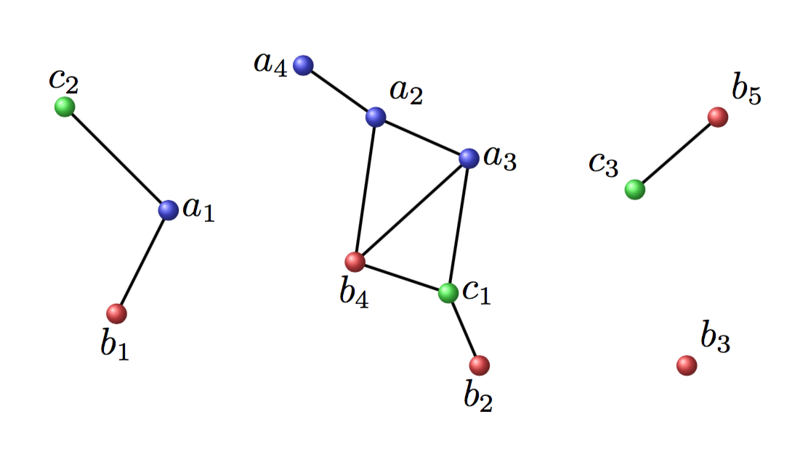

# 1 Introduction
During the last fornight, I have been spending most time in writing my graduation thesis using $\LaTeX$. From now, I'm addicted to it for its 
awesome beauty. I also recorded the tutorial video and uploaded to whe [web](https://v.qq.com/x/page/k0389nt7kls.html). 

# 2 SetBacks
+ lack of package 
When I followed the built-in manual step by step, it even cannot complie the source file. Being not familiar with $\TeX$ or $\LaTeX$ syntaxes, I have no idea to handle those errors. I even turn to the TaoBao where someone colud provide the $\LaTeX$ typeset services. Luckily, I found the email address and cell phone number of this template's author. He suggested that I unstall the ctex and use the Tex live 2016 instead. Thanks to his suggestion, I passed the compliation of souce file. Btw, why does the tex or latex package managers used like python's pakcage manager ? In python, the users merely use the `pip` tool to install, unstall, upgrade, and downgrade the packages, which also avoid the dependency of pakcages.

+ usage of the template 
Due to the careless comprehension of this manual, I did not notice the options of the source file. So that generated the thesis which differanted from what I wanted. As I re-read the manual, it came true.

# 3 Further Works
When I learn $\LaTeX$ just using its mathmatic symbols, equations and so on. The best way to learn something is using it in practice. It's convince that I will met quite a lot pf problems which I have never met.

# 4 Learning Notes
## 4.1 cross reference 
The biggest advantage of $LaTex()$ is cross reference which you may waste quite a lot of time in it. The main types of cross references in $LaTeX$ can be divided into `table`, `figure`, `equation` and `reference`.
### table
Insertting a table like that:
```TeX
\begin{table}
\label{tab:tabid}
\end{table}
```
Then you can use cross reference in your main text like that `you can see table \ref{tab:tabid}` 

### figure
Insertting a figure like that:
```TeX
\begin{figure}
\includegraphics[]{}
\label{fig:figid}
\end{figure}
```
Then you can use cross reference in your main text like that `like the figure \ref{fig:figid}` 

### equation
```TeX
\begin{equation}
\label{eq:equationid}
\end{equation}
```
Then you can use cross reference in your main text like that `like the equation \eqref{eq:equationid}`

### references
The references is the headache part of writing paper. Thank for [Google scholar](scholar.google.com) and [Baidu Xueshu](xueshu.baidu.com), you can export the reference paper in `Bib` format which can be used in $LaTeX$. And you just attach the reference where you want through `\cite{referenceid}`. Then, you should compile the $LaTeX$ source files in this order：
1. xelatex sourcefile.tex
2. bibtex sourcefile.aux
3. xelatex sourcefile.tex
4. xelatex sourcefile.tex 

## 4.2 code sinppet in VSC 
The codes are tedious when you just want to insert a figures in your paper. Yes, you can seperate the common code and fouce on the vital part by using code sinppet if you use `Visual Studio Code` as your editor. 
The code sinppet is easy customer designed. Let's take figure for example.
```JSON
"Inset a figure":{
    "prefix":"fig",
    "body":[
        "\\begin{figure}",
            "   \\centering",
            "   \\includegraphics[width=${1:8}cm]{${2}} \\ \\",
            "   \\caption{${4}}{${5}}",
            "   \\label{fig:${6}}",
        "\\end{figure}"
    ],
    "description":"Inset a figure into the latex source file"
}
```
Put the Json file into right place, and put your cursor where you want to insert a figure, and press the short cut key `command/ctrl + p`, then input the `fig` that we define the `prefix` for insertting a figure. 

## 4.3 tikz package 
The `tikz` is the famous package used in $LaTeX$ to draw the diagram. Unlike the    
`Visio` which is `What-You-See-Is-What-You-Get` software, the `tikz` draws diagram in the codes. As is very compatible with the $LaTeX$, many LaTeXer use `tikz` in their papers or thesises.And many journals require the authors provides the vector images which used their papers. Let's take an example.
```TeX
\begin{figure}
\centering
\begin{tikzpicture}
% the first group
\draw[thick, -] (-1, 1) -- (0,0);
\draw[thick, -] (-0.5, -1) -- (0,0);
\shade[shading=ball, ball color=blue!70]  (0,0) circle (.1)  node[right] {$a_1$};
\shade[shading=ball, ball color=green!70] (-1, 1) circle (.1) node[above]{$c_2$};
\shade[shading=ball, ball color=red!70] (-0.5, -1) circle (.1) node[below]{$b_1$};
% the second group
\draw[thick, -] (1.3,1.4) -- (2,0.9);
\draw[thick, -] (2,0.9) -- (1.8, -0.5);
\draw[thick, -] (2.9,0.5)  -- (2,0.9) ;
\draw[thick, -] (1.8, -0.5) -- (2.9,0.5);
\draw[thick, -] (1.8, -0.5) -- (2.7, -0.8);
\draw[thick, -] (3, -1.5) --(2.7, -0.8);
\draw[thick, -] (2.9,0.5) -- (2.7, -0.8);
\shade[shading=ball, ball color=blue!70]  (1.3,1.4) circle (.1)  node[left] {$a_4$};
\shade[shading=ball, ball color=blue!70]  (2.9,0.5) circle (.1)  node[right] {$a_3$};
\shade[shading=ball, ball color=blue!70]  (2,0.9) circle (.1)  node[above right] {$a_2$};
\shade[shading=ball, ball color=red!70] (1.8, -0.5) circle (.1) node[below]{$b_4$};
\shade[shading=ball, ball color=red!70] (3, -1.5) circle (.1) node[below]{$b_2$};
\shade[shading=ball, ball color=green!70] (2.7, -0.8) circle (.1) node[right]{$c_1$};

% the third group
\draw[thick, -] (4.5, 0.2) -- (5.3, 0.9);
\shade[shading=ball, ball color=green!70] (4.5, 0.2) circle (.1) node[above left]{$c_3$};
\shade[shading=ball, ball color=red!70] (5.3, 0.9) circle (.1) node[above right]{$b_5$};
\shade[shading=ball, ball color=red!70] (5.0, -1.5) circle (.1) node[above right]{$b_3$};
\end{tikzpicture}
\end{figure}
```
What the dazzy codes! the result image looks like that:


## 4.4 reference
When I used the .bst file in the template for generating the references, I found it was not right. So I download the least .bst file which write for the GB2015 from the [latexstudio.net](www.latexstudio.net). Fortunely, it worked.