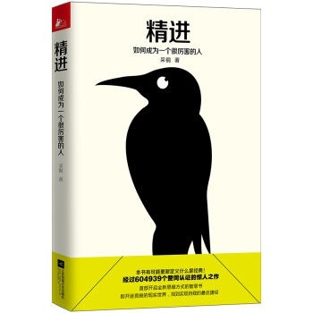

## 1 时间
1. 对待时间态度：郑重
> 不敷衍、不迟疑、不摇摆
2. 时间视角划分人群  
- 积极过去视角（√）
> 拥有的感恩之心，忽视当下的快乐
- ~~消极过去视角~~ （×）
> 沉浸在过去的伤害中无法自拔，容易出现心理问题
- 享乐主义视角 （√）
> 享受当下，幸福感较高，但容易成瘾
- ~~宿命论视角~~ （×）
> 认为一切都是命中注定，顺从和忍受外界的安排
- 未来视角 （√）
> 前瞻性，容易取得成就，但幸福感不高  

正确选择时间视角，而且“随机应变”

3. 对待时间的建议  
- [x] 不瞻前顾后，不左顾右盼，不患得患失
- [x] 找到自己的“独享时刻”，不要疲于奔命
- [x] 未来并非遥不可及，它就出现在即将到来的每一分每一秒

4. 未来视角  
- 远期目标（distant feature) 

    - 抽象、概括方式去思考，缺乏细节
    - 满足人生价值的期许，最自己的价值和意义

- 近期目标（near featrue)

    - 具体到情景，关注how to do
    - 副作用：倾向于可行性高、更容易实现的事情，回避更具有挑战性的事

5. 解决目标冲突  
> "远期目标“应该 **重战术、轻战略**，减少对价值和意义的强调，多思考目标实现的具体途径

6. 时间使用    
事情的两个维度:
- **收益值**
> 这件事在当下给“我”带来的的收益值，包含了心智、情感、身体、或者物质
- **收益半衰期**
> 收益时间随时间衰减的速度  

分类  | 举例
---|---
高收益、长半衰期事件 | 找到真爱；学会一种有效的思维技巧
高收益、短半衰期事件 | 买一件新衣服，玩手机游戏
低收益、长半衰期事件 | 练吉他、背诗歌
低收益、短半衰期事件 | 网络掐架，漫无目的刷微博

**总结**:   
少做短半衰期的事件，长半衰期事件的效益能够积累
- 收益值高低无关紧要，
- 不要只盯着那些“高大上”的事情

7. 判断“*噪音*”信息    

将原本追求“即时兴奋”的信息模式切换到“长久收益”的信息模式

8. 时间利用tips  
- 工作要快，生活要慢
- 提升时间的使用深度
- 找到一项长期的业余爱好（吉他？？） 

---

## 2 选择
1. 面对决策心理原则  
    - 满意原则
    - 最佳原则 
只有提高标准，才有更好的选择

2. 格局  
> 看自己，看天地，看众生
- 盲众：主要为流行文化，以及他人的观点
- 逐利者：精致或者粗放的利己主义者，需求自身利益的最大化，笃信丛林法则。
- 理念人：人生的价值追寻真理，内心保持真诚
- 至善之人：个人对整个社会具有责任

**tip**: 回想一周，最近做的最有意义的一件事

3. 困境选择  
> 困住我们的不仅有外界的客观现实，还有我们过去的经 历、习惯和思维惯性  

- 可见选项：个人经验和当前环境产生的
- 可能选项：尚未发现的潜在可能性，来自我们关联的未知世界或者已知事物的深层信息，这些往往会导致偏见

**解决困境**
+ 找出潜意识的隐含假设
+ 识别隐含假设中的不合理性，进行校正
+ 形成新的更灵活的思维框架 
4.  常见的隐含假设  

假设 | 举例
---|---
赛道假设 | 陷入竞争的焦虑和对失败的恐惧
低关联假设 | 认为人生的种种经历之间相互独立，不存在关联
僵固型心智 | 固定的眼光看待问题，失去了继续努力的动力，与之相关的为“成长型”心智
零和博弈 | 无法学会共赢  

5. 思维新框架  
- 目标悬置：暂时搁置目标，等待时机成熟
- 能力嫁接：能力能够迁移，并相互影响
- 特性改造：将消费型兴趣转换成生产型兴趣 

6. 选择弱势    
问题解决流程

```
graph TD
A(源头梳理)-->B(重新定义问题) 
B --> C(因素筛选)
C --> D(综合评判)
```
**拇指法则**  
由经验形成的，只考虑少数因素的简单规则  
*婚恋拇指法则*
> 生理上有冲动，精神上受鼓舞，沟通上很流畅

7. 职业生涯选择  
- 内职业生涯  
是一个人内在的兴趣、禀赋、动机和能力，一般来讲是联系发展的，绵延在人的一生中
- 外职业生涯  
包含人的职位、社会角色，往往受到外部机遇、生存境遇和其他环境因素的影响。

--- 

## 3行动
1. 任务的分类  

例子 | 完成难度 | 心理成本 
---|---|---
拿快递、洗碗等 | 小 | 大
求职、买房等 | 大 | 小  

> 即刻行动是第一法则 

2. 最小化可行产品（minimum viable product)  
对于个体而言最小化可行产品： 
> - 不是过程，而是结果
> - 不是对原料的加工和素材简单地堆砌和是对其结构性的整合和组织
> - 不是创作者闭门造车，而是能够被其他人使用和校验
> - 能够独立对世界产生影响，它应该能够创造正向的价值，使人受益
> - 是一种媒介

3. 精益创业的key  
- 克服“过度准备”的惯性，向前一步，把未完成的事情完成 
- 克服“自我防卫”的心态，乐于接受反面意见并加以慎重的审视
- 克服“沉没成本”的固执，有勇气否定自己并重新构造自己的产品

4. 分解任务    
在“多线程”工作中，如何做到更好的**任务转换**(task switching)?

- 将任务区分出“容忍中断”和“无法容忍中断”两个部分，保证相对完整的时间去进行“无法容忍中断”的部分
- 认知类型是我们头脑加工信息的不同方式，在不同认知之间转换成本较大。因此在任务工作中，优先将同种认知的部分完成
- 集中处理相同性质的任务  

5. 行动后复盘  
>牛人在前瞻性思维和总结性思维上非常出色

人在解决现实问题时，更依赖于隐性的知识和隐性的推理
行动中蕴含的知识属于**隐性知识**

- 通过实际练习来掌握书中的知识，类似知识的内化
```
graph LR
B(显性知识)-->A(隐性知识)
```

- 通过对行动进行细致的反思，把那些原本并非用语言承载的知识通过语言归纳和总结出来

```
graph LR
B(隐性知识)-->A(显性知识)  
```

6. 如何反思   
- **信息**：那些信息、那些关键信息、信息渠道、遗漏信息
- **预期**：是否达到，偏差原因，如何改进
- **结果**：如何描述和评价结果，指标如何，如何改进
- **进度**：进度是否合适，导致的原因
- **工具**：使用那些工具，哪些工具有用，哪些工具无用，是否有改进
- **情绪**：完成过程中的情绪，如何有意识地调整情绪
- **阻碍**：阻碍有哪些，最大的阻碍有哪些，如何应对阻碍，如何减少阻碍
- **优势**：发挥了什么优势，是否存在尚未发挥的优势，
- **缺憾**：有那些缺憾，最大的缺憾是什么，暴露了那些不足和缺点，有那些批评
- **意义**：对我来说最大的意义，是否有短期和长期影响，对周围的人的影响，是否发现意想不到的意义。

7. 反思的关键点  
- 及时性
- 梳理“反应链”
- 关注“意外现象”：如“证实偏见”


---
## 4学习
1. 问题   
> 问题像向导，引领我们去接近这座知识的高山。而引领的本身，又依赖于我们已经看到的、模糊的轮廓。问题并非空中阁楼，而是建立于我们已有的知识体系的地基。  

**如何思考**
- 我已经掌握哪些相关知识
- 我又学到了那些新的知识，对我原有的知识构成了何种补充或者挑战
- 那还哪些未知的东西，这些东西我能否通过简单地探索可以了解
- 哪些知识无法轻易的获得，同时有价值成为长期去探究的问题？
2. 基于探究的学习（inquiry-based learning)    
提出现实场景下的，可能具有开放性解答的问题，而非一个纯理性的，封闭性的问题

3. 解码    
解码不同于理解，而是更为主观和主动的过程，不同的人具有不同的解码方式，解码的三个层次：
 - 它说了什么，给了我什么感受
 - 它是什么，对我有什么价值
 - 他的内部是什么组成的，它的效果如是怎么实现的
 
4. 思维系统  
专长人士的分类
- 常规型专长（routine expertise)
具有固定的的知识系统，高效的将解除到的信息材料按照已有的框架进行分析
- 适应型专长(adaptive expertise)
通过对知识的广度和深度的扩展来适应解决的需要

5. 解码  
区分*了解(knowledge about)*和*知晓(knowledge of)*  

如何解码
- 不只要寻结论，还要去寻过程
- 不只要去做归纳，还要去做延展
- 不只要去比较相似，还要去比较不同

6. 学习方式  
> 你掌握了多少知识，并不取决于你记忆了多少知识以及知识的关联，而是取决于你能调用的多少知识以及知识的关联。  

反复练习的价值在于使某些认知活动可以自动化进行，而从为思考是所用的工作记忆腾出宝贵的空间，以用于更具策略性的活动。

7. 知识  
> 将知识当作一项技能来学习

```
graph LR
A(信息) -->B(知识)
B --> C(技能)
```

**知识技能化**
- 写作式操练
- 游戏式操练
- 设计式操练


---
## 5思维  
1. 信息过滤  
信息过载不是因为信息太多，而是我们*“过滤器”*失效了。如何修正我们的过滤器？
- 精选可信赖的信息源
- 不追逐当下流行或者过热的信息：可以避免大部分噪声，流行往往迎合猎奇心态，往往是人为制造的营销性话题
- 重事实信息，轻观点和评论：别人的评论往往会牵引我们的头脑
- 定期闭关，屏蔽外界纷扰：通过安静思考，整理信息

2. 简洁  
>有意识地培养自己简洁表达能力，是提升思维能力的一道法门  

- 基于深入了解的“删减”：把任何不必要的东西去掉
- 基于深入了解的“浓缩”：把丰富的信息浓缩并灌注进一个“小容器”中
- 基于深入了解的“模式化”：找到共通的模式在现象间建立联接，并加以压缩归并  

3. 潜意识  
>思维的发散和收敛

- 尽可能的收集原始资料
- 重复“咀嚼”原始材料，构思初始创意
- 中止有意识的的思考，启动无意识的思考
- 随时准备迎接“灵光咋现”时刻的来临
- 加以改造、完善，使之切实可行

4. 监控者  
生产者：负责干活的小人
监控者：监督生产者干活
> 把负责监控的小人关掉，让负责生产的小人自由发挥  
> 意外、混乱和随机性能够给我们带来灵感 

5. 思维转换 
图形化工具，分担了人脑中记忆的负荷，使得工作记忆有更大的活动空间参与更深更广的思考。用笔和纸构建探索空间的方式，构建平行思考的模式

6. 思考的周密性  
导致我们无法周密的思考原因：
- 偏好生动形象的具体事例而不是抽象的细节
- “证实偏差”（confirmation bias). 一旦形成某个问题的看法，就只是在佐证这个看法
- 每个人受自己的已有只是和经验的限制，存在思维中的盲区 

7.思维的脚手架   
- 简单地矩阵

“乔蛤里窗格”（Johari Window)

状态 | 我知道 | 我不知道
---|--- | ---
**别人知道**  | *公开区* | *盲区*
**别人不知道** | *隐秘区* | *未知区* 

理想的交流是：公开区越来越大，盲区和隐秘去越来越小，甚至未知区域随之减小。在交流中药关注盲区，才能获取新知识  

- 穷举法   

好的清单是经过提炼的智力框架，帮助我们思考至少达到基本的周密 

How to make list:
```
graph TD
A(不带有批判眼光,宁可冗余)-->B(对于所有选项进行筛选和合并)
```

---

## 6努力
1. 才能  
对待才能的四种观点

分类 | 发展 | 恒定
---|--- |---
**特有** | *选优培优* | *天才说*
**普遍** | *人的才能皆可成长* | *人皆有各自优势*

采用“普遍-发展”观==> 成长型心智

僵固型心智 ==> 成长型心智 转换

2. 发展优势  
> 突出的优点比没有明显的弱点重要的多  

木桶理论只适合团队，而并非人的发展。

发展自己的强项，并且寻找和结识与你能力互补的人

3. 发展极致  
*不苟且* 一丝一毫不草率不苟且的工作习惯 
> 互联网时代，信息爆炸，知识是过载，观点是鼓噪的，热点是速朽的。专注于一件事上，精益求精，持之以恒的态度和行动  

4. 选择策略  
“杠铃策略” 同时采用两种极端的行动，专注于一个既定的领域进行学习，另一方面，拿出小的一部分时间，进行积极大胆的探索和尝试，以博取迎接正面“黑天鹅”事件的机会

5. 挑战  
如果总是一帆风顺，就会一直待在自己的“舒适区”里不肯出来，潜能无法充分的激发。
> 学习的效果主要取决于你对知识和技能的“提取练习”，而”提取练习“的效果可以用”提取强度“来衡量。

构建个人挑战阶梯，避免停留在“comfort zone” 

6. 热爱  
意志力不靠谱，而因努力而热爱
- 放弃对“热爱”的执念，而是先努力做事而在过程中获得乐趣和热爱
- 提升“浸润”的深度，尽量让自己全身心投入到所做的事情里面
- 增加互动

7. 心理需要  
- 自主的需要（autonomy）
- 能力的需要（competence）
- 归属的需要（relatedness)


---

## 7成功
1. 标准化的危害  
- 教学内容更新速度赶不上社会整体的前进步伐
- 高校教授内容脱离应用环境，教师缺乏实际操作经验

2. 主动学习  
从学霸选择依从和学渣选择逃避，而是自主学习

how to :
- 利用好本校的平台资源
- 善用互联网的优质教育资源
- 主动试错
- 了解和评估自己智力和资产的价值
- 以完成目标具有的创造力的作品为目标

3. 荒野求生模式  
实践中产生的问题，从内心深处想解决的问题
- 正确认识问题
- 对问题进行完全独立的思考
- 结合知识以分析问题的过程中

4. 理论与现实联系  
- 广泛吸收多个学科的知识，吧这些学科基本的模型作为分析和批判现实问题的思维工具
- 从现实输入到理论输出亲自去观察、亲身去实践市场中的真实经济行为。
- 从理论到现实中交替学习
- 抽象的理论到生动的现实没有明显的边界
- 从现实中学习又反馈到现实中去
summary:
> 在现实世界中思考理论问题，在理论世界中思考现实问题

5. 与众不同  
- 在主流观点之外发现别人为曾发现的机会
- 形成个人核心竞争力，避免低层次的同质化竞争
- 拒绝他人和大众给自己贴上的标签
- 不必迎合社会主流而节约时间和精力
- 为大众带来新的见解和启发，形成公众影响力
- 具有更高的可辨识性，形成个人品牌
- 吸引到其他独特的优秀的人

6. Be cool  
- 抗拒自己的欲望，或者延迟满足欲望
- 质疑貌似可行的言论，不盲从
- 屏蔽流行信息
- 思考最不可能的事情
- 保留和发展自己的“怪癖”
- 为小事狂热
- 开展思想实验和行动实验