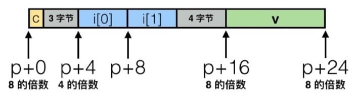

这段时间将那本著名的[深入理解计算机系统(Computer System A Programmer Perspective)](https://book.douban.com/subject/26912767/)看了一遍，作为一个半路出家的程序员，醍醐灌顶那种感觉，因此做一个简单的导读，作为简单的回顾。

# 1 导论
本章作为整本书导论，类似计算机系统漫游指南，并且是 *K&R* 那本 *The C Programming Language*中的HelloWorld简单的C语言程序剖析，讲述了如何编译、汇编、连接和执行一个计算机应用程序。

# 2 信息的表示和处理
数值计算是计算机中基本工作，那么计算机如何表示现实世界中的各种数值呢？为了计算机实现的简单，采用二进制表示数据，这些二进制既可以表示代码中整数、小数也可以表示字符。

## 2.1 整数表示
操作系统一般选择C语言作为开发语言，因为C语言与计算机底层有着很好的映射。 C语言包含整数类型有
*char, unsigned char, short, unsigned short, int , unsigned int, long , unsigned long*，不同操作系统和不同的位数的机器这些类型能够表示的范围也不尽相同，但是C语言规范规定了最小位数。C语言表示能够表示整数主要分为两种：无符号和有符号。

+ 无符号
无符号数字表示比较简单，直接将01组成的二进制数值与十进制之间进行相互转换。

+ 有符号
在计算机内部中，采用补码(Two's  Completion)的方式来表示有符号数，补码的最高为表示为负数，对于$w$为的的二进制数，最高位若，则表示的权重为$-2^{w-1}$，其余位仍然采用二进制表示方法，两部分之和作为该二进制表示的整数。

**Note：** C 语言中的有符号和无符号之间区别也是众多程序出现漏洞的原因，因为有符号中最高位表示一个负权，因此能够表示的数值也是范围也大概是无符号的一半。而C语言在将不同整数类型进行转换过程中，不做任何数值上变换，只对二进制表示进行不同的解释，因此像Java这样编程语言已经取消了无符号的整数类型。

## 2.2 浮点数表示
浮点数表示表示比较复杂，它将整个01序列划分为三个部分：


+ 符号位S
0：表示正数；1： 表示负数

+ 阶码E
阶码一般表示2的指数，float类型用8位表示阶码，
double类型用11位表示。

+ 小数部分M
小数分布表示的是$[1.0,2.0)$的小数，float类型用23位表示，double类型用52位表示。

那么完成浮点型数据表示为:
$$
(-1)^S \times M \times 2^E
$$
IEEE754 标准规定了规定了阶码为真实值减去一个偏移量$2^{w-1}-1$；规定了小数部分默认整数部分有个1，因此小数部分的最小值$1.00\ldots 0(B)$，而最大值为$1.11\ldots 11(B)$
**Notes：**浮点型表示的数字中还有一些非规则化的数字，当阶码域全为0，表示为零；当阶码域全为1，小数部分全为0，符号位为1表示$-\infty$，而符号位为0表示为$+\infty$；如果小数位非零表示为 *NaN(Not a Number)*

## 2.3 运算
### 2.3.1 位移运算
整数支持位移运算，分为左移和右移。

+ 左移

x<<k 表示将x二进值向左移动k位，丢弃掉最高位，低位补零。移动一位相当于乘以2。

+ 右移

x>>k 分为两种：一种是逻辑位移，x向右移动k位，低位舍弃，高位补零；另一种是算术位移，x向移动k位，低位舍弃，而高位补符号位。移动一位相等于除以2。

移位操作时间消耗为一个时钟周期，乘法和除法操作消耗时间很长，因此编译器一般会将程序中的乘除硬编码转换成位移操作。

### 2.3.2 算术操作
加减乘除操作都会引起**溢出**问题，一般而言使用目的数据类型能够保存的位数去**截断**结果数据，相当于取模操作。
在浮点型数据中，较大的数据与较小的数据进行计算的时候回出现**大数吃小数**的问题，因为计算机内部在计算的时候，首先对齐阶码，对小数分布进行相关计算，当阶对齐过程中，*小数* 的位数小数分布往往不能表示，出现精度丢失。

# 3 程序的机器表示
本章探讨了C语言程序如何与汇编语言对应起来，了解到汇编语言才能真正理解C语言各种操作。

## 3.1 数据格式
对于x86-64指令集,  C 语言中对应的数据类型在汇编语言中的表示

C声明 | Intel数据类型 | 汇编代码后缀  | 大小(字节)
--- | ---- | --- | ----
char | 字节 | b | 1 
short | 字 | w | 2 
int | 双字 | l | 4 
long | 四字 |  q | 8 
char* | 四字 | q | 8 
float | 单精度 | s | 4  
double | 双精度 | l | 8  

## 3.2 寄存器
寄存器是汇编语言的操作的主要对象 , 在 Intel x86-64处理器中，共有16个64位寄存器，通常来讲不同处理器有着不同的特定作用。


## 3.3 操作数指示符
大多数指令都有一个或者多个操作数(operand)，指出了在操作中的操作的源数据和目的位置。

+  **立即数** 

以常数的形式给出，以\$形式给出。
 
+ **寄存器**

使用16个寄存器存储的1字节、2字节、4字节或者8字节中的一个标准C表示法表示的整数。

+  **内存引用**  

计算出内存的地址，并进行引用，一般的*寻址模式*为$Imm(r_b, r_i, s)$，一个立即数偏移$Imm$, 一个基址寄存器$r_b$，一个变址寄存器$r_i$，一个比例因子$s$。有效的的地址计算为: $Imm+R[r_b]+R[r_i]\times s$

## 3.4 操作
### 3.4.1 mov
mov 操作是汇编语言中最常用的指令，通常将第一个操作数的内容传送到第二个操作数中，通常源操作数可以为立即数、寄存器和内存中数据，目的操作数可以是寄存器和内存，但是不能同时为内存位置。根据传送数据大小不同，可分为`movb`、`movw`、`movl`和`movq`。

### 3.4.2 push 和 pop
每个应用进程和线程都有一块连续区域表示栈数据结构，栈底在高地址，栈向低地址生长，栈顶由`%rsp`栈指针保存。

+ push  

`push S` 操作将操作数`S`进行入栈，栈顶位置减少相应的字节。

+ pop  

`pop D` 从栈中弹出相应大小的字节的数据至目的操作数`D` 

## 3.5 算术和逻辑操作

指令 | 效果 
---  | ---
leaq S,D | D $\leftarrow$ &S
INC D | D $\leftarrow$D+1 
DEC D | D $\leftarrow$D-1 
NEG D | D $\leftarrow$-D
NOT D | D $\leftarrow$ ~D
ADD S, D  |  D $\leftarrow$ D+S
SUB S, D | D $\leftarrow$ D-S
IMUL S,D  | D $\leftarrow$ D * S
XOR S, D | D $\leftarrow$ D / S
OR S, D |  D $\leftarrow$ D \| S
AND S,D | D $\leftarrow$ D & S 
SAL k, D |  D $\leftarrow$ D <<k
SHL  k, D | D $\leftarrow$ D<<k
SAR k, D | D $\leftarrow$ D$<<_A $k
SHR k, D | D $\leftarrow$ D$<<_L$k

## 3.6 控制语句
C 语言中除了按顺序执行的语句，还有些判断跳转的语句需要用到汇编程序的`jump`指令，而如何跳转需要进行相关的条件判断。
在机器中有四个标识符来控制程序条件跳转

+ CF：（Carray Flag）进位标志
+ ZF：（Zero Flag）零标志
+ SF： （Sign Flag）符号标志
+ OF：（Overflow Flag）溢出标志

通过与这些标识符的`大于`,`不大于`，`等于`，`小于`和`不小于`的逻辑判断来进行跳转。
跳转指令通过指定跳转的`Label`实现跳转。

```
    movq $0, %rax
    jmp .L1
    movq (%rax), %rdx
.L1
    popq %rdx
```
借助跳转语句可以实现C语言程序中的所有循环操作，比如`for`循环，`while`循环，`do-while`循环。

**Note**
在跳转中，出现了优化程序性能的一个重要的方法，使用条件传送比条件判断的性能更优，因为现代处理器采用了更加先进的流水线技术，比如下面的两个C语言程序， function #2 将所有可能的结果计算出来，根据比较的结果，返回正确的结果。
```C
// function #1
int absdiff(long x , long y){
    long result;
    if(x<=y)
        result = y-x;
    else
        result =x-y;
    return result
}
//function #2
int cmovdiff(long x, long y){
    long rval = y -x;
    long eval = x-y;
    long nresult = x>=y;
    if (nresult) rval = eval;
    return rval
}
```
## 3.7 过程调用
函数封装是C语言中的抽象，当函数中出现了其他函数的调用，采用的方法是将当前过程调用的下一个PC（Program Counter）地址入栈，在调用完其他函数返回后，将PC计数器出栈实现程序继续执行。
在函数调用过程中，需要进行参数传递，参数的传递一般在通过寄存器和栈保存，被调用的函数将返回值存储在 `%rax`寄存器中


## 3.8 数据存储
每一个数据类型占用不同的字节大小，将内存当做一个很大的字节数组，每个数据类型的变量代表了其在内存中起始的位置。
### 3.8.1 大端和小段
不同的平台下，数据存放的字节顺序还是不一样，主要分为`大端法`和`小端法`

+ 大端法： 数据的高字节存放在内存字节的高地址
+ 小端法： 数据的高字节存放在内存字节的低地址

### 3.8.2 字节对齐
struct 结构体是C语言中常用的数据类型，将不同的基础数据类型组合起来，他们在内存中是连续存放的，但是现代操作系统(windows)要求，每个数据类型存放的起始位置必须是其所占的整数倍，否则必须空开若干字节以满足要求。
```C
struct S1
{
    char c;
    int i[2];
    double v;
} *p;
```
上述结构在内存中安排是这样的


中间空出4个字节以满足字节对齐需求。

# 4 处理器体系构造
改造通过设计一个机器语言指令集Y86，简单实现现代处理器机器语言。该章涉及计算器硬件、难度大，故在此不表。

# 5 优化程序性能
程序的运行的性能主要有三个方面

+ 使用的数据结构
+ 编写编译能够优化更好的源代码
+ 并行计算

## 5.1 编译器优化的能力与局限性
一般来讲比编译器会对程序进行优化，但是有些程序是具有副作用（Side effect）
```C
void twiddle1(long* xp, long *yp){
    *xp += *yp;
    *xp += *yp;
}
void twiddle2(long* xp, long* yp){
    *xp += 2 * *yp;
}
```
对于程序`twiddle1`和`twiddle2`字面上都是讲第一个参数加上两倍的第一个参数，但是如果 `xp`和`yp`都是指向同一个地址，那么`twiddle1`变成*6倍*，而`twiddle2`变成原来的3倍。所以编译器在优化的过程中，通常不会第一个函数优化到到第二个函数。
## 5.2 程序优化的方法
### 5.2.1 代码移动
将循环语句中不变量移动到循环的外部，除非循环内部出现副作用，一般的编译器会优化这部分代码
### 5.2.2 避免内存引用
从汇编语言角度来看，内存数据的读写一般要经历
从内存中读入到寄存器中，计算和从寄存器写入内存中，这些事程序性能瓶颈。优化的做法是用保存在寄存器中的临时变量中，最后再保存在内存中。
## 5.3 流水线
现代处理通常有多个功能单元，以 Intel Core i7 Haswell处理器为例

+ 整数运算，浮点乘，整数和浮点数除法，分支
+ 整数运算，浮点家，整数乘、浮点乘
+ 加载，地址计算
+ 加载，地址计算
+ 存储
+ 整数运算
+ 整数运算，分支
+ 村粗，分支计算

所以处理器可以同时进行多个计算，通过流水线技术可能提高程序的性能。
当程序遇到分支判断的时候，采用分支预测的方式，选择其中一个分支进行计算，如果分支预测正确，则继续执行下去，否则丢弃。使用分支预测的方式可能很好的利用流水线技术。在编写程序的时候，可以尽可能的使用条件转移，而不是条件判断。
## 5.4 循环展开
在一些遍历数组的程序中，除了依次进行迭代以外，还可以2或者更高阶进行数据迭代，此方法可以很好的利用处理流水线技术。

# 6