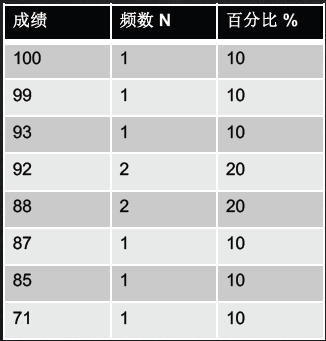
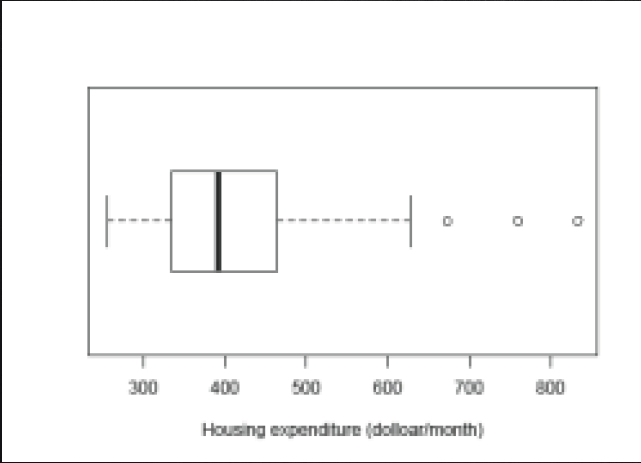

课程为学堂在线MOOC课程，[点击链接](http://www.xuetangx.com/courses/course-v1:TsinghuaX+70612463X+2016_T2/about)。
**课程大纲**
##绪论
1. Concepts
    + Population(总体)  
    The total set of the subjects of interest in a study.
    +  Sample(样本)  
    The subset of the population on which the study collects data. 
    + Parameter(参数)  
    A numerical summary of a population characteristic. 
    + Statistics(统计量)
    A numberical summary of the sample data. 
2. 统计软件
    Stata，SPSS
3. Simple Random Sample (简单随机抽样)    
## 描述统计  
1. variable
    + quantitative (定量型)
        + continuous (连续)
        + discrete(离散)
    + qualitative (定性型)
        + ordinal variable(定序变量)
        + Nominal variable(名义变量)
2. 描述
    + Tabular method  
    频数分布表，并给出百分比。

    + Graphical method  
        + 柱状图（Bar chart）
        +  饼状图（Pie chart）  
        + 直方图（Histogram)
    + Numerical method
        主要关注的特征：
        + 集中程度（Center）   
            + $\mu$ 总体均值  
            $\mu=\frac{\sum_{i=1}^{N}X_{i}}{N}$  
            + $\bar{X}$ 样本均值  
            $\bar{X}=\frac{\sum_{i=1}^{n}x_{i}}{n}$   
            + Median (M) 中位数  
            不受异常值影响
        + 离散程度（Spread）
            + Range （极差）
            + Interquartile range (四分卫差)
            + Standard deviation (标准差）
                + Population standard  deviation  
                $\sigma = \sqrt{\frac{\sum_{i=1}^{N}(X_{i}-\mu)^{2}}{N}}$
                + Sample standard deviation   
                $s=\sqrt{\frac{\sum_{i=1}^{n}(x_{i}-\bar{X})^{2}}{n-1}}$
        + 位置的测量（Position）
            + Z-score  
            $Z-score=\frac{x_{i}-\bar{X}}{s}$  
    + BoxPlot  

        + Lower Bound: Q1-1.5IQR
        + Upper Bound: Q3+1.5IQR  
            
##概率分布  
+ Gaussian Distribution probability  
$f(x)=\frac{1}{\sqrt{2\pi\sigma^{2}}}e^{\frac{-(x-\mu)^{2}}{2\sigma^{2}}}$   
if $\mu=0$ and $\sigma=1$ : normal  distribution  

##统计推断-估计 
+ 样本统计量与总体参数的关系   
$\mu_{\bar{X}}=E(\bar{X})=\mu$    
$\sigma_{\bar{X}}=\frac{\sigma}{\sqrt(n)}$    
+ Central Limit Theorem  
对于一个样本足够大的随机抽样，样本均值$\bar{X}$的抽样分布服从正态分布。
    + 多数情况下样本量大于30即可
    + 样本均值落在总体均值的三倍标准误 
    
+ Point Estimation 
要求：
    + Unbiasness   
        $\mu_{\hat{\theta}}=E(\hat{\theta})=\theta$  
    + Efficiency  
        标准误越小越好  
        
##统计推断-区间估计
1. 置信区间  
    + 点估计的精度有参数区间估计的宽度确定  
    + 区间估计是以点估计为中心的区间
    + 概率为我们信息的大小
2. 置信区间的构建   
    $点估计\pm边际误差$  
    
    说明  | 倍数 | 置信区间 | 精确性
    ---|---|---|---
    置信水平低  | 大 | 宽 | 点估计精度低
    置信水平高  | 小 | 窄 | 点估计精度高

3. 离散型二分变量（比例的置信区间）
    + 样本置信区间构建 
    如果样本的比例为$\hat{\pi}$，那么总体的真实值落入$\hat{\pi}-1.96\sigma_{\hat{\pi}}$ 到$\hat{\pi}+1.96\sigma_{\hat{\pi}}$的概率为95%。
    样本比例标准误$se=\sqrt{\frac{\hat{\pi}(1-\hat{\pi})}{n}}$ 所以样本比例的95%的置信区间为$\hat{\{\pi}}\pm1.96\sqrt{\frac{\hat{\pi}(1-\hat{\pi})}{n}}$  
    + 总体置信区间构建
    样本均值的标准误为$\sigma_{\hat{X}}=\frac{\sigma}{\sqrt{n}}$，而总体的标准差未知，用样本$s$代替。*估计标准误*(estimated standard error),$se=\frac{s}{\sqrt{n}}$  
4. t-分布 
    增加一个假设，总体服从正态分布
    用样本的标准差代替总体的标准差。当t>30时，t-分布与正态分布一致

## 显著性检验
1. Significance Test   
    + Assumptions
    + Hypothesis
    *Null hypothesis* and *Alternative hypothesis*  
    原假设是原始状态的继承，而备择假设是对原假设的挑战
    + Test Statistic
    点估计    
    + P-Value
    在原假设为真的情况下，得到该样本统计量的概率是多少。P值越小，反对原假设的证据越强。
    + 结论
2. 均值显著性检验
    数据类型为数值型  
    检验统计量  
    $$t=\frac{\bar{X}-\mu_{0}}{s/\sqrt{n}}$$   
3. 比例显著性
    数据类型为分类型  
    检验统计量   
    $$z=\frac{\hat{\pi}-\pi_{0}}{\sqrt{\frac{\pi_{0}(1-\pi_{0})}{n}}}$$  
    
##关联分析  
1. 两组数据比较
    + 对于数值型变量，研究两组**均值**的区别
    + 对于比例型变量，研究两组**比例**的区别 
    + 比较相依样本比例：Mcnemar test
    + 小样本比例：Fisher's exact test
    + 小样本均值比较：wilcoxon-mann whitney test
2. 多组比较：方差分析
    + 目的： 检验总体间的均值是否相同
    + 手段： 对方差分析
    一元方差分析，指定一个定类的自变量，因变量是数值型变量  
    样本1和样本2的均值分别为
    $$\bar{y_{1}}=\frac{1}{n_{1}}\sum_{i=1}^{n_{1}}y_{1i},\bar{y_{2}}=\frac{1}{n_{2}}\sum_{i=1}^{n_{2}}y_{2i}$$
    那么$(\bar{y_{1}}-\bar{y_{2}})$构成了总体差异的$(\mu_{1}-\mu_{2})$的点估计，而估计标准误
    $$se_{12}=\sqrt{(se_{1})^{2}+(se_{2})^{2}}=\sqrt{\frac{s_{1}^{2}}{n_{1}}+\frac{s_{2}^{2}}{n_{2}}}$$  
3. 定量数据：比较均值
    从服从正态分布的两个组抽取两个随机独立样本，$\mu_{1}-\mu_{2}$的置信区间为
    $$(\bar{y_{2}}-\bar{y_{1}})\pm t(se)$$
4. Comparing Means with dependent samples 
    比较相依样本的均值
    方差分析的检验：总体自变量$A$有$m$类：$A_{1},A_{2},...,A_{m}$，现从$A_{1}$类中抽取$n_{1}$个，$A_{2}$类中抽取$n_{2}$个,$A_{m}$类中抽取$n_{m}$个。
    + 假设检验原假设$H_{0}$和备择假设$H_{1}$为：
        $H_{0}:\mu_{1}=\mu_{2}=\mu_{3}=...=\mu_{m}$  
        $H_{1}$:有一个以上的类别其均值不等
    + 构建统计量
        + 观测总数：$n=\sum_{i=1}^{m}n_{i}$
        + 第i类样本的组平均值：$\bar{y_{i}}=\frac{1}{n_{i}}\sum_{j=1}^{n_{i}}y_{ij}$
        + 总平均值：$\bar{y}=\frac{1}{n}\sum_{i=1}^{m}\sum_{j=1}^{n_{i}}y_{ij}$ 
        + 总平方和（SST）: $SST=\sum_{i=1}^{m}\sum_{j=1}^{n_{i}}(y_{ij}-\bar{y})^{2}$ 
        + 组内平方和SSE：$SSE=\sum_{i=1}^{m}\sum_{j=1}^{n_{i}}(y_{ij}-\bar{y_{i}})$ 
        + 组间平方和SSB：$SSB=\sum_{i=1}^{m}\sum_{j=1}^{n_{i}}(\bar{y_{i}-\bar{y}})^{2}$
    + 检验统计量
        $F=\frac{SSB/(m-1)}{SSE/(n-m)}\sim F(m-1,n-m)$  
        
        $F>F_{\alpha}$:拒绝原假设
        $F<F_{\alpha}$:不拒绝原假设
                  
##线性回归
1. 简单线性回归
假设$X$和$Y$之间呈线性关系 $Y=\beta_{0}+\beta_{1}X+\varepsilon$
    + intercept:$\beta_{0}$
    + slope:$\beta_{1}$
2. Least square cirterion
    令$\hat{y_{i}}=\hat{\beta_{0}}+\hat{\beta_{1}}x_{i}$ 代表为预测值，那么残差$e_{i}=y_{i}-\hat{y_{i}}$
    + Reidual sum of squares
    $$RSS=\sum_{i}^{i=n}e_{i}^{2}=\sum_{i}^{i=n}(y_{i}-\hat{\beta_{0}}-\hat{\beta_{1}}x_{i})^{2}$$
    对其求偏导数，等于
    $$\hat{\beta_{1}}=\frac{\sum_{i=1}^{n}(x_{i}-\bar{x})(y_{i}-\bar{y})}{\sum_{i}^{n}(x_{i}-\bar{x})^2}$$
    $$\hat{\beta_{1}}=\bar{y}-\hat{\beta_{1}}\bar{x}$$  
3. Assessing the accurancy of the coefficient Esimates
    + 样本均值$\hat{\mu}$的方差为$Var(\hat{\mu})=SE(\hat{\mu})^{2}=\frac{\sigma^{2}}{n}$
    + $SE(\hat{\beta_{0}})^{2}=\sigma^{2}[\frac{1}{n}+\frac{\bar{x}^{2}}{\sum_{i=1}^{n}(x_{i}-\bar{x})^{2}}$
        $SE(\hat{\beta_{1}})^{2}=\frac{\sigma^{2}}{\sum_{i=1}^{n}(x_{i}-\bar{x})^{2}}$    
        其中$\sigma^{2}=Var(\varepsilon)^{2}$
    + residual standard error: $RSE=\sqrt{RSS/(n-2)}$
4. 回归系数假设检验
    + $H_{0}: \beta_{1}=0$
      $H_{1}:\beta_{1}\ne0$    
    + $t=\frac{\hat{\beta_{1}-0}}{SE(\hat{\beta_{1}})}$  
5. $R^{2} statistic$
    + Total sum of the suqares: $TSS=\sum{}^{}(y_{i}-bar{y})^{2}$
    $$R_{2}=\frac{TSS-RSS}{TSS}=1-\frac{RSS}{TSS}$$ 

##多元回归
1. 估计回归系数 
  + $\hat{y}=\hat{\beta_{0}}+\hat{\beta_{1}}x_{1}+...+\hat{\beta_{p}}x_{p}$
  使得参差平方和最小值
  $RSS=\sum_{i=1}^{n}(y_{i}-\hat{y_{i}})^{2}$  
2. 自变量与响应变量是否有关系
    + 假设检验
    $H_{0}:\beta_{1}=\beta_{2}=...=\beta{p}=0$ 
    $H_{1}:$至少有非0
    + 检验统计量：
        $$F=\frac{(TSS-RSS)/p}{RSS/(n-p-1)}$$ 
3. 选择重要变量  
    + 不同的统计量评价
        + Mallow's Cp
        + Akaike information criterion
        + Bayesian information criterion
        + adjusted $R^{2}$
    + 变量选择方法
        + Forward selection
        + Backword selection
        + Mixed selection
4. 非线性问题
    在模型中对自变量进行非线性变换：$logX,\sqrt{X},X^{2}$
5. Non-constant variance of Error Terms
    参差图是否有漏斗型（funnel shape)
    用concave function 对进行变换
6. 强杠杆作用点（自变量$x_{i}$)上不寻常的店 
    leverage statistic $h_{i}>(p+1)/n$ 其中：
    $$h_{i}=\frac{1}{n}+\frac{(x_{i}-x)^{2}}{\sum_{i^{'}=1}^{n}(x_{i^{'}}-x)^{2}}$$
7. Collinearity
    variance inflation factor: VIF>10
    $$VIF(\hat{\beta_{j}})=\frac{1}{1-R_{X_{i}|X_{-j}}^{2}}$$