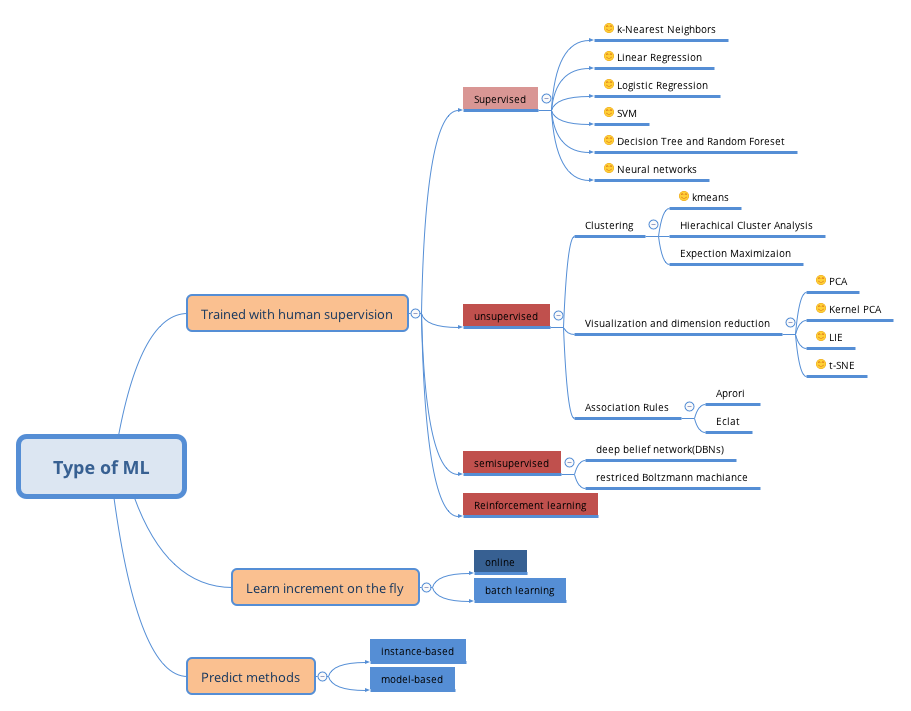
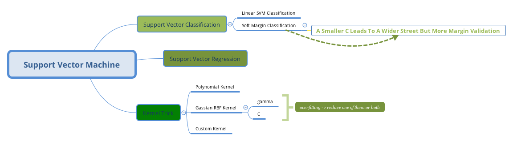
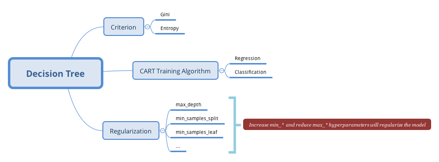
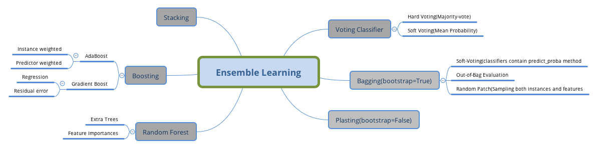
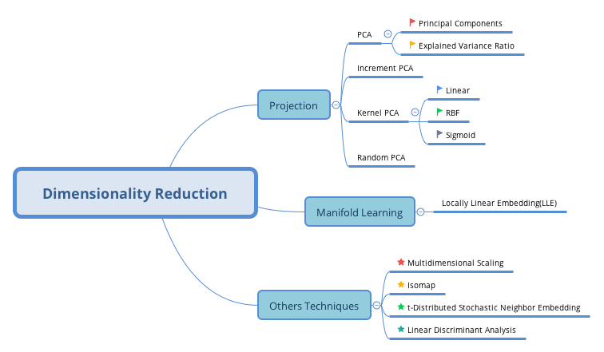

最近阅读了 [Hands-On Machine Learning with Scikit-Learn & TesorFlow](https://book.douban.com/subject/26840215/) 前半部分，也就是`Sciki-Learn`传统机器学习部分，查看[阅读笔记](https://github.com/gaufung/Handon-ml)。

# 1 Overview
整个机器学习概览如下图所示，从不同角度将整个机器学习划分为若干不同部分。

# 2 Data Preprocessing
对于机器学习而言，选择哪一个模型并不是问题的难点，而是如何对`“脏”`数据进行有效的预处理。
### 缺失值
如果某些`feature`存在缺失值，主要有三种方式处理
- 删除该`feature`；
- 删除缺失的数据实例；
- 替换缺失值。
对于前两种解决方案，存在明显的缺陷，`Scikit-Learn`提供了第三种解决方案，对于类型的`feature`, `sklearn.preprocessing.Imputer`类解决上述问题，函数原型:
```python
class Imputer(missing_values=’NaN’, strategy=’mean’, axis=0, verbose=0, copy=True)
    pass
```
其中`strategy`参数为替换策略，主要有
- mean: 平均值
- median: 中位数
- most\_frequent: 众数
该类使用方法也非常简单，只要调用`fit`和`transform`两个方法即可。

### 类别变量
在一些回归类机器学习算法中，一些 `feature` 为类别变量通常无法进行计算，也不能使用简单的`0, 1, 2 ...`等方法，最好的做法将这些`feature`进行向量化处理。
```python
from sklearn.preprocessing import LabelBinarizer
encoder = LabelBinarizer()
X_1hot = encoder.fit_transform(X_cat)
```
### 统一化
除了`决策树`模型，几乎所有机器学习算法对`feature`的单位尺度特别敏感，因此有必要所有的定量的`feature`进行统一化处理，方法主要有两种
- 规范化
 $$x_{new} = \frac{x-x_{min}}{x_{max}-x_{min}}$$ 
 `Scikit-Learn`中`MinMaxScaler`类扮演此功能；
- 标准化
$$x_{new}=\frac{x-x_{mean}}{\sigma_x}$$
`Scikit-Learn`中`Standardization`类扮演此功能。

### 管道化
`Scikit-learn`中最为值得称赞的部分为`Pipeline`，通过类别管道，将数据处理流程连接起来，因此非常适合数据预处理部分。典型的处理流程如下:
```python
pre_pipeline = Pipeline([
    ('imputer', Imputer()),
    ('std_sacler', StandardScaler()),
])
X = pre_pipeline.fit_transform(X)
```
# 2 Cross Validation
在机器学习中，对于数据集而言，测试数据非常重要，不能用来调试模型。通常将训练数据划分为 $k$ 个部分，使用 $k-1$ 数据集进行训练，剩余的$1$部分为测试集。使用方法: `cross_val_score(estimator, X, y, scoring='neg_mean_square_error', cv=10)`。

 **超参数**
在机器学习模型中，超参数(Hyperparameters)也是模型的一部分，`Scikit-Learn`  提供了 `GridSeachCV` 遍历所有可能的超参数组合，然后使用 `Cross Validation`方法选择损失函数最小的模型。以随机森林为例，使用方法如下：
```python
from sklearn.model_selection import GridSearchCV
para_grid = [
    {'n_estimatros':[3, 10, 30], 'max_features':[2,4,6,8]},
    {'booststrap':[True, Flase], 'n_estimatros':[3, 10, 30], 'max_features':[2,4,6,8]}
]
forest_reg = RandomForestRegression()
grid_search = GridSearchCV(forest_reg, para_grid, cv=5
                                    scoring='neg_mean_squared_error')
grid_search.fit(X, y)
grid_search.best_estimator_
```
# 3 Regularization
### Precision/Recall Tradeoff
对于二分类模型，预测结果可以用`Confusion Matrix`表示：

|  | Postive | Negative
----- | :-----: | :----:
Postive | TP | FN
Negative | FP | TN

上表中，行为预测结果，列为实际结果。
- 准确率
$$precision = \frac{TP}{TP+FP}$$
- 召回率
$$recall = \frac{TP}{TP+FN}$$
一般而言，准确率高的模型，召回率低，反之同样成立。通过设定模型的分类的判断的阈值，可以控制准确率和召回率，满足现实模型需要。
```python
from sklearn.metrics import precision_score, recall_score
precision_score(y_pred, y_test)
recall_score(y_pred, y_test)
```
分类模型中，提供`decsion_function`可以获得每个分类的得分：
```python
y_score = cross_val_predict(clf, X_train, y_train, cv=3, method='decsion_function')
from sklearn.metrics import precision_recall_curve
precisions, recalls, thresholds = precision_recall_curve(y_train, y_score)
```
### Bias/Variance Tradeoff
偏差(Bias)指的是模型在训练集表现，而方差(Variance)指的是模型在测试集上表现。一般而言，如果`Bias`比较小的话，`Variance`很有可能比较大，因此需要将模型进行限制，称之为正则化
- $\ell_1$正则化
$J(\theta)=MSE(\theta)+\alpha \sum_{i=1}^{n}|\theta_i|$
- $\ell_2$正则化
$J(\theta)=MSE(\theta)+\alpha \sum_{i=1}^{n}\theta_i^2$
$\ell_1$正则化通常将不重要的参数趋近于零，而$\ell_2$正则化将所有参数趋近于零。
```python
# l2正则化
from sklearn.linear_model import Ridge
ridge_reg = Ridge(alpha=1, solver='cholesky')
ridge_reg.fit(X, y)
# l1正则化
from sklearn.linear_model import Lasso
lasso_reg = Lasso(alpha=1)
lasso_reg.fit(X, y)
```
# 4 Models
## 4.1 SVM

## 4.2 Decision Tree

## 4.3 Random Forest

## 4.4 Dimensionality Reduction
